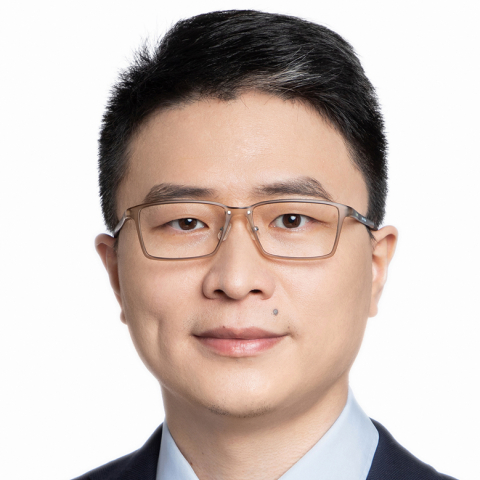

<!-- AUTO-GENERATED-BY: work/generate_obsidian_profiles.py -->

<!-- TEMPLATE: D:\workspace\信息收集整理\医生画像仓库\模板\医生画像模板.md -->

# 赵志强

## 基础信息

| 字段 | 内容 |
|---|---|
| 姓名 | 赵志强 |
| 医院 | 中山大学附属第一医院 |
| 科室 | 骨肿瘤科 |
| 职称/身份 | 副主任医师 |
| 来源链接 | [官网原文](https://www.fahsysu.org.cn/node/29124) |
| 采集日期 | 2026-08-13 |

## 简介/擅长

秉承骨与软组织肿瘤领域的先进理念以及规范化诊治和精细化手术原则，致力于： 1. 脊柱和四肢骨转移癌的微创手术及综合治疗； 2. 脊柱和骶骨肿瘤的切除与重建； 3. 四肢和骨盆恶性骨肿瘤保肢治疗（儿童骨肿瘤精细化保肢）； 4. 软组织肉瘤的手术及综合治疗。 研究方向： 主持国家自然科学基金（青年基金、面上项目）2项； 临床研究：恶性骨肿瘤保肢及脊柱转移癌的微创治疗； 基础研究：骨肉瘤及软组织肉瘤的发病和转移机制研究。 主要教育和工作经历： 1. 2021/12-至今 中山大学附属第一医院，副主任医师 2. 2018/12-2021-12， 中山大学附属第一医院，主治医师 3. 2015/07-2018/12， 中山大学附属第一医院，住院医师 4. 2014/05-2015/04, Cedars-Sinai Medical Center, University of California, School of Medicine, LA, USA. (联培博士) 5. 2013/10-2014/05, Huntsman Cancer Institute, University of Utah, USA. (联培博士) 6. ...

## 科研项目与成果

- 研究方向： 主持国家自然科学基金（青年基金、面上项目）2项；

## 可包装亮点

- 研究方向： 主持国家自然科学基金（青年基金、面上项目）2项；
- 主要教育和工作经历： 1. 2021/12-至今 中山大学附属第一医院，副主任医师 2. 2018/12-2021-12， 中山大学附属第一医院，主治医师 3. 2015/07-2018/12， 中山大学附属第一医院，住院医师 4. 2014/05-2015/04, Cedars-Sinai Medical Center, University of Ca…

## 重点疾病/人群标签

- 慢性病：
- 肿瘤：肿瘤、癌、瘤
- 生殖疾病：
- 免疫/风湿：
- 术后恢复/康复：
- 疑难重症：

## 证据摘录

> 只摘录官网公开信息中的短句或关键字段，不复制大段原文。

- 官网身份字段：副主任医师
- 官网简介/擅长：秉承骨与软组织肿瘤领域的先进理念以及规范化诊治和精细化手术原则，致力于： 1. 脊柱和四肢骨转移癌的微创手术及综合治疗； 2. 脊柱和骶骨肿瘤的切除与重建； 3. 四肢和骨盆恶性骨肿瘤保肢治疗（儿童骨肿瘤精细化保肢）； 4. 软组织肉瘤的手术及综合治疗。 研究方向： 主持国家自然科学基金（青年基金、面上项目）2项； 临床研究：恶性骨肿瘤保肢及脊柱转移癌的微创治疗； 基础研究：骨肉瘤及软组织肉瘤的发病和转移机制研究。 主要教育和工作经历…
- 官网亮眼经历线索：研究方向： 主持国家自然科学基金（青年基金、面上项目）2项； 主要教育和工作经历： 1. 2021/12-至今 中山大学附属第一医院，副主任医师 2. 2018/12-2021-12， 中山大学附属第一医院，主治医师 3. 2015/07-2018/12， 中山大学附属第一医院，住院医师 4. 2014/05-2015/04, Cedars-Sinai Medical Center, University of California,…
- 来源链接：https://www.fahsysu.org.cn/node/29124

## BD 画像摘要

赵志强医生可作为肿瘤方向的基础画像候选。后续 BD 使用应继续以官网来源和人工复核为准，不添加疗效承诺或无来源包装。

## 合规边界

- 仅使用医院官网、官方公众号、官方小程序等公开渠道。
- 不采集私人电话、私人微信、家庭住址、患者隐私或非公开排班信息。
- 不写“保证治愈”“疗效第一”“包治疑难杂症”等无法由官网证明的表述。
