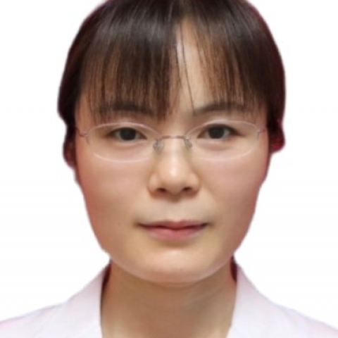

<!-- AUTO-GENERATED-BY: work/generate_obsidian_profiles.py -->

<!-- TEMPLATE: D:\workspace\信息收集整理\医生画像仓库\模板\医生画像模板.md -->

# 赵江莉

## 基础信息

| 字段 | 内容 |
|---|---|
| 姓名 | 赵江莉 |
| 医院 | 中山大学附属第一医院 |
| 科室 | 康复医学科 |
| 职称/身份 | 主任技师 |
| 来源链接 | [官网原文](https://www.fahsysu.org.cn/node/38214) |
| 采集日期 | 2026-08-13 |

## 简介/擅长

2005年开始从事康复治疗医、教、研工作，在康复治疗方面具有丰富的临床经验。 熟练掌握运动治疗、物理因子治疗、手法治疗等治疗技术，尤其是PNF等神经肌肉促通技术。 擅长脑卒中、脑外伤、脊髓损伤、周围神经损伤、骨关节炎、关节置换术后、运动损伤等疾病的康复治疗。 研究方向： 神经康复，脑卒中运动功能重建。 教育背景： 2001年09月—2005年07月 南京医科大学 康复治疗学 学士 2004年06月—2005年06月 中国康复研究中心 实习 2010年09月—2014年12月 中山大学 康复医学与理疗学 硕士 工作经历： 2005年07月至今 中山大学附属第一医院康复医学科 治疗师，主管治疗师，副主任治疗师，主任治疗师 2007年09月—2008年01月 香港理工大学康复科学系 交流学习 科研情况： 主持国家自然科学基金青年项目1项、省级课题2项、校级课题1项，参与国家重点研发计划项目、国自然、省、市重点项目等多项； 发表中英文论文40余篇； 参编专著数部。 社会兼职： 广东省医学会物理医学与康复学分会物理治疗学组副组长

## 科研项目与成果

- 教育背景： 2001年09月—2005年07月 南京医科大学 康复治疗学 学士 2004年06月—2005年06月 中国康复研究中心 实习 2010年09月—2014年12月 中山大学 康复医学与理疗学 硕士 工作经历： 2005年07月至今 中山大学附属第一医院康复医学科 治疗师，主管治疗师，副主任治疗师，主任治疗师 2007年09月—2008年01月 香港理工大学康复科学系 交流学习 科研情况： 主持国家自然科学基金青年项目1项、省级课题2项、校级课题1项，参与国家重点研发计划项目、国自然、省、市重点项目等多…

## 论文与学术产出

- 发表中英文论文40余篇；
- 参编专著数部。

## 可包装亮点

- 教育背景： 2001年09月—2005年07月 南京医科大学 康复治疗学 学士 2004年06月—2005年06月 中国康复研究中心 实习 2010年09月—2014年12月 中山大学 康复医学与理疗学 硕士 工作经历： 2005年07月至今 中山大学附属第一医院康复医学科 治疗师，主管治疗师，副主任治疗师，主任治疗师 2007年09月—2008年01月…
- 发表中英文论文40余篇；
- 社会兼职： 广东省医学会物理医学与康复学分会物理治疗学组副组长

## 重点疾病/人群标签

- 慢性病：
- 肿瘤：
- 生殖疾病：
- 免疫/风湿：
- 术后恢复/康复：
- 疑难重症：

## 证据摘录

> 只摘录官网公开信息中的短句或关键字段，不复制大段原文。

- 官网身份字段：主任技师
- 官网简介/擅长：2005年开始从事康复治疗医、教、研工作，在康复治疗方面具有丰富的临床经验。 熟练掌握运动治疗、物理因子治疗、手法治疗等治疗技术，尤其是PNF等神经肌肉促通技术。 擅长脑卒中、脑外伤、脊髓损伤、周围神经损伤、骨关节炎、关节置换术后、运动损伤等疾病的康复治疗。 研究方向： 神经康复，脑卒中运动功能重建。 教育背景： 2001年09月—2005年07月 南京医科大学 康复治疗学 学士 2004年06月—2005年06月 中国康复研究中心…
- 官网亮眼经历线索：教育背景： 2001年09月—2005年07月 南京医科大学 康复治疗学 学士 2004年06月—2005年06月 中国康复研究中心 实习 2010年09月—2014年12月 中山大学 康复医学与理疗学 硕士 工作经历： 2005年07月至今 中山大学附属第一医院康复医学科 治疗师，主管治疗师，副主任治疗师，主任治疗师 2007年09月—2008年01月 香港理工大学康复科学系 交流学习 科研情况： 主持国家自然科学基金青年项目1项…
- 异常提示：职称/身份需人工复核
- 来源链接：https://www.fahsysu.org.cn/node/38214

## BD 画像摘要

赵江莉医生可作为中山大学附属第一医院康复医学科的基础医生资料入库。当前重点方向以总底表标签为准，官网未展示的信息保持空白。

## 合规边界

- 仅使用医院官网、官方公众号、官方小程序等公开渠道。
- 不采集私人电话、私人微信、家庭住址、患者隐私或非公开排班信息。
- 不写“保证治愈”“疗效第一”“包治疑难杂症”等无法由官网证明的表述。
