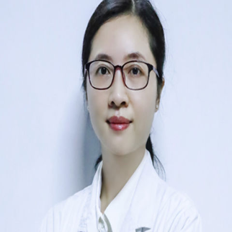

<!-- AUTO-GENERATED-BY: work/generate_obsidian_profiles.py -->

<!-- TEMPLATE: D:\workspace\信息收集整理\医生画像仓库\模板\医生画像模板.md -->

# 赵玉昆

## 基础信息

| 字段 | 内容 |
|---|---|
| 姓名 | 赵玉昆 |
| 医院 | 中山大学附属第一医院 |
| 科室 | 皮肤科 |
| 职称/身份 | 副主任医师 |
| 来源链接 | [官网原文](https://www.fahsysu.org.cn/node/34932) |
| 采集日期 | 2026-08-13 |

## 简介/擅长

损容性皮肤病的诊治，包括痤疮、敏感肌、色斑、瘢痕等问题肌肤的综合性治疗与健康管理； 擅长色素痣、色斑、浅表血管瘤、毛细血管扩张、痘坑、面部皱纹、面部年轻化等皮肤问题的光电治疗、肉毒素美容注射治疗与光动力治疗； 对银屑病、慢性荨麻疹、特应性皮炎、湿疹、带状疱疹、体表真菌感染等常见皮肤病以及疑难性皮肤病有丰富的临床诊治经验。 社会兼职 广东省药学会皮肤病专家委员会秘书 广州市医师协会激光美容与整形专业医师分会常务委员 广东省医学美容学会修复委员会委员 广东省皮肤性病管理协会委员 广东省自然医学皮肤管理协会委员 广东省整形美容协会面部年轻化分会委员 广东省整形美容协会皮肤美容分会会委员 科研情况 发表NEJM杂志在内的10余篇SCI收录论文，主持省级科学研究基金一项，主持国家自然科学青年基金一项。 主要研究方向是面部年轻化、损容性皮肤病与瘢痕的治疗新技术与新手段。

## 科研项目与成果

- 社会兼职 广东省药学会皮肤病专家委员会秘书 广州市医师协会激光美容与整形专业医师分会常务委员 广东省医学美容学会修复委员会委员 广东省皮肤性病管理协会委员 广东省自然医学皮肤管理协会委员 广东省整形美容协会面部年轻化分会委员 广东省整形美容协会皮肤美容分会会委员 科研情况 发表NEJM杂志在内的10余篇SCI收录论文，主持省级科学研究基金一项，主持国家自然科学青年基金一项。

## 论文与学术产出

- 社会兼职 广东省药学会皮肤病专家委员会秘书 广州市医师协会激光美容与整形专业医师分会常务委员 广东省医学美容学会修复委员会委员 广东省皮肤性病管理协会委员 广东省自然医学皮肤管理协会委员 广东省整形美容协会面部年轻化分会委员 广东省整形美容协会皮肤美容分会会委员 科研情况 发表NEJM杂志在内的10余篇SCI收录论文，主持省级科学研究基金一项，主持国家自然科学青年基金一项。

## 可包装亮点

- 对银屑病、慢性荨麻疹、特应性皮炎、湿疹、带状疱疹、体表真菌感染等常见皮肤病以及疑难性皮肤病有丰富的临床诊治经验。
- 社会兼职 广东省药学会皮肤病专家委员会秘书 广州市医师协会激光美容与整形专业医师分会常务委员 广东省医学美容学会修复委员会委员 广东省皮肤性病管理协会委员 广东省自然医学皮肤管理协会委员 广东省整形美容协会面部年轻化分会委员 广东省整形美容协会皮肤美容分会会委员 科研情况 发表NEJM杂志在内的10余篇SCI收录论文，主持省级科学研究基金一项，主持国家自然…

## 重点疾病/人群标签

- 慢性病：慢性、瘤、感染、疑难
- 肿瘤：慢性、瘤、感染、疑难
- 生殖疾病：
- 免疫/风湿：慢性、瘤、感染、疑难
- 术后恢复/康复：
- 疑难重症：慢性、瘤、感染、疑难

## 证据摘录

> 只摘录官网公开信息中的短句或关键字段，不复制大段原文。

- 官网身份字段：副主任医师
- 官网简介/擅长：损容性皮肤病的诊治，包括痤疮、敏感肌、色斑、瘢痕等问题肌肤的综合性治疗与健康管理； 擅长色素痣、色斑、浅表血管瘤、毛细血管扩张、痘坑、面部皱纹、面部年轻化等皮肤问题的光电治疗、肉毒素美容注射治疗与光动力治疗； 对银屑病、慢性荨麻疹、特应性皮炎、湿疹、带状疱疹、体表真菌感染等常见皮肤病以及疑难性皮肤病有丰富的临床诊治经验。 社会兼职 广东省药学会皮肤病专家委员会秘书 广州市医师协会激光美容与整形专业医师分会常务委员 广东省医学美容学会修…
- 官网亮眼经历线索：对银屑病、慢性荨麻疹、特应性皮炎、湿疹、带状疱疹、体表真菌感染等常见皮肤病以及疑难性皮肤病有丰富的临床诊治经验。 对银屑病、慢性荨麻疹、特应性皮炎、湿疹、带状疱疹、体表真菌感染等常见皮肤病以及疑难性皮肤病有丰富的临床诊治经验。 社会兼职 广东省药学会皮肤病专家委员会秘书 广州市医师协会激光美容与整形专业医师分会常务委员 广东省医学美容学会修复委员会委员 广东省皮肤性病管理协会委员 广东省自然医学皮肤管理协会委员 广东省整形美容协会面部…
- 来源链接：https://www.fahsysu.org.cn/node/34932

## BD 画像摘要

赵玉昆医生可作为慢性病、肿瘤、免疫/风湿/感染、疑难重症方向的基础画像候选。后续 BD 使用应继续以官网来源和人工复核为准，不添加疗效承诺或无来源包装。

## 合规边界

- 仅使用医院官网、官方公众号、官方小程序等公开渠道。
- 不采集私人电话、私人微信、家庭住址、患者隐私或非公开排班信息。
- 不写“保证治愈”“疗效第一”“包治疑难杂症”等无法由官网证明的表述。
