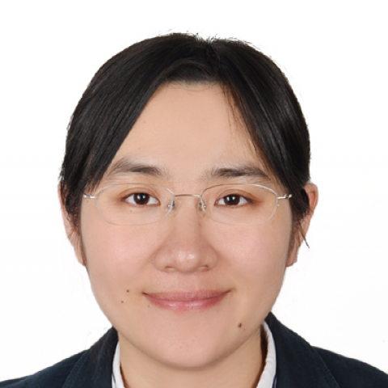

<!-- AUTO-GENERATED-BY: work/generate_obsidian_profiles.py -->

<!-- TEMPLATE: D:\workspace\信息收集整理\医生画像仓库\模板\医生画像模板.md -->

# 赵静

## 基础信息

| 字段 | 内容 |
|---|---|
| 姓名 | 赵静 |
| 医院 | 中山大学附属第一医院 |
| 科室 | 放射诊断专科 |
| 职称/身份 | 副主任医师 |
| 来源链接 | [官网原文](https://www.fahsysu.org.cn/node/31688) |
| 采集日期 | 2026-08-13 |

## 简介/擅长

## 教育与进修经历

- 德国Heidelberg university和荷兰Erasmus MC访问学者，擅长中枢神经系统影像诊断和鉴别诊断，包括脑肿瘤，神经变性，脑血管病及脱髓鞘疾病。

## 科研项目与成果

- 主持省市级基金各一项；

## 论文与学术产出

- 围绕脑胶质瘤、缺血性脑血管病及神经变性病等展开科学研究，共发表SCI论文20篇，其中中科院1区2篇，2区11篇；

## 可包装亮点

- 德国Heidelberg university和荷兰Erasmus MC访问学者，擅长中枢神经系统影像诊断和鉴别诊断，包括脑肿瘤，神经变性，脑血管病及脱髓鞘疾病。
- 围绕脑胶质瘤、缺血性脑血管病及神经变性病等展开科学研究，共发表SCI论文20篇，其中中科院1区2篇，2区11篇；
- 目前担任中国抗癌协会肿瘤影像与大数据青年学组委员及广东省放射影像质量控制中心头颈组秘书。

## 重点疾病/人群标签

- 慢性病：
- 肿瘤：肿瘤、癌、瘤
- 生殖疾病：
- 免疫/风湿：
- 术后恢复/康复：
- 疑难重症：

## 证据摘录

> 只摘录官网公开信息中的短句或关键字段，不复制大段原文。

- 官网身份字段：副主任医师
- 官网亮眼经历线索：德国Heidelberg university和荷兰Erasmus MC访问学者，擅长中枢神经系统影像诊断和鉴别诊断，包括脑肿瘤，神经变性，脑血管病及脱髓鞘疾病。 围绕脑胶质瘤、缺血性脑血管病及神经变性病等展开科学研究，共发表SCI论文20篇，其中中科院1区2篇，2区11篇； 目前担任中国抗癌协会肿瘤影像与大数据青年学组委员及广东省放射影像质量控制中心头颈组秘书。
- 来源链接：https://www.fahsysu.org.cn/node/31688

## BD 画像摘要

赵静医生可作为肿瘤方向的基础画像候选。后续 BD 使用应继续以官网来源和人工复核为准，不添加疗效承诺或无来源包装。

## 合规边界

- 仅使用医院官网、官方公众号、官方小程序等公开渠道。
- 不采集私人电话、私人微信、家庭住址、患者隐私或非公开排班信息。
- 不写“保证治愈”“疗效第一”“包治疑难杂症”等无法由官网证明的表述。
