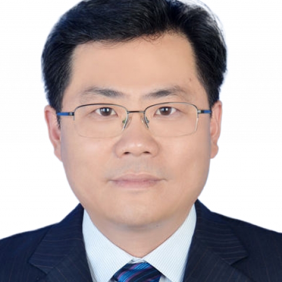

<!-- AUTO-GENERATED-BY: work/generate_obsidian_profiles.py -->

<!-- TEMPLATE: D:\workspace\信息收集整理\医生画像仓库\模板\医生画像模板.md -->

# 邢世会

## 基础信息

| 字段 | 内容 |
|---|---|
| 姓名 | 邢世会 |
| 医院 | 中山大学附属第一医院 |
| 科室 | 神经二科（脑血管病专科） |
| 职称/身份 | 主任医师/教授 |
| 来源链接 | [官网原文](https://www.fahsysu.org.cn/node/877) |
| 采集日期 | 2026-08-13 |

## 简介/擅长

长期从事神经科医疗、教学和科研工作，在神经系统常见疾病诊疗方面有丰富的临床经验，擅长脑血管病临床与神经介入诊疗工作。 研究方向： 脑血管病临床与神经介入 主要教育与工作经历： 2006.09-2009.07：中山大学附属第一医院神经病学 博士学位 2009.07-2019.12：中山大学附属第一医院神经科 住院/主治/副主任医师 2013.12-2016.05：国家公派美国乔治城大学医学中心 博士后 2019.06-2020.08：广东省第九批援藏医疗专家 2019.12至今：中山大学附属第一医院神经科 主任医师、教授 社会兼职： 广东省医学会脑血管病学分会候任主任委员及介入学组组长 广东省医学会神经病学分会缺血性脑血管病介入学组副组长 广东省脑科学应用学会常务理事 广东省卒中学会常务理事 科研情况： 主持国家科技重大专项课题、国家自然科学基金等国家级课题4项，省市级科研项目10余项； 发表论文50余篇，其中以第一或通讯作者在Brain、Autophagy、Neurology、Stroke等国际期刊发表论文20余篇。 研究成果以第二完成人获教育部科技进步一等奖。 Xiao P, Gu J, Xu W, Niu X, Z...

## 教育与进修经历

- 研究方向： 脑血管病临床与神经介入 主要教育与工作经历： 2006.09-2009.07：中山大学附属第一医院神经病学 博士学位 2009.07-2019.12：中山大学附属第一医院神经科 住院/主治/副主任医师 2013.12-2016.05：国家公派美国乔治城大学医学中心 博士后 2019.06-2020.08：广东省第九批援藏医疗专家 2019.12至今：中山大学附属第一医院神经科 主任医师、教授 社会兼职： 广东省医学会脑血管病学分会候任主任委员及介入学组组长 广东省医学会神经病学分会缺血性脑血管病介入学…

## 科研项目与成果

- 长期从事神经科医疗、教学和科研工作，在神经系统常见疾病诊疗方面有丰富的临床经验，擅长脑血管病临床与神经介入诊疗工作。
- 医疗特长：长期从事神经科医疗、教学和科研工作，在神经系统常见疾病诊疗方面有丰富的临床经验，擅长脑血管病临床与神经介入诊疗工作。
- 研究成果以第二完成人获教育部科技进步一等奖。

## 论文与学术产出

- 发表论文50余篇，其中以第一或通讯作者在Brain、Autophagy、Neurology、Stroke等国际期刊发表论文20余篇。

## 可包装亮点

- 研究方向： 脑血管病临床与神经介入 主要教育与工作经历： 2006.09-2009.07：中山大学附属第一医院神经病学 博士学位 2009.07-2019.12：中山大学附属第一医院神经科 住院/主治/副主任医师 2013.12-2016.05：国家公派美国乔治城大学医学中心 博士后 2019.06-2020.08：广东省第九批援藏医疗专家 2019.12…
- 发表论文50余篇，其中以第一或通讯作者在Brain、Autophagy、Neurology、Stroke等国际期刊发表论文20余篇。
- 研究成果以第二完成人...

## 重点疾病/人群标签

- 慢性病：
- 肿瘤：
- 生殖疾病：
- 免疫/风湿：
- 术后恢复/康复：
- 疑难重症：

## 证据摘录

> 只摘录官网公开信息中的短句或关键字段，不复制大段原文。

- 官网身份字段：主任医师/教授
- 官网简介/擅长：长期从事神经科医疗、教学和科研工作，在神经系统常见疾病诊疗方面有丰富的临床经验，擅长脑血管病临床与神经介入诊疗工作。 研究方向： 脑血管病临床与神经介入 主要教育与工作经历： 2006.09-2009.07：中山大学附属第一医院神经病学 博士学位 2009.07-2019.12：中山大学附属第一医院神经科 住院/主治/副主任医师 2013.12-2016.05：国家公派美国乔治城大学医学中心 博士后 2019.06-2020.08：广…
- 官网亮眼经历线索：研究方向： 脑血管病临床与神经介入 主要教育与工作经历： 2006.09-2009.07：中山大学附属第一医院神经病学 博士学位 2009.07-2019.12：中山大学附属第一医院神经科 住院/主治/副主任医师 2013.12-2016.05：国家公派美国乔治城大学医学中心 博士后 2019.06-2020.08：广东省第九批援藏医疗专家 2019.12至今：中山大学附属第一医院神经科 主任医师、教授 社会兼职： 广东省医学会脑血管…
- 来源链接：https://www.fahsysu.org.cn/node/877

## BD 画像摘要

邢世会医生可作为中山大学附属第一医院神经二科（脑血管病专科）的基础医生资料入库。当前重点方向以总底表标签为准，官网未展示的信息保持空白。

## 合规边界

- 仅使用医院官网、官方公众号、官方小程序等公开渠道。
- 不采集私人电话、私人微信、家庭住址、患者隐私或非公开排班信息。
- 不写“保证治愈”“疗效第一”“包治疑难杂症”等无法由官网证明的表述。
