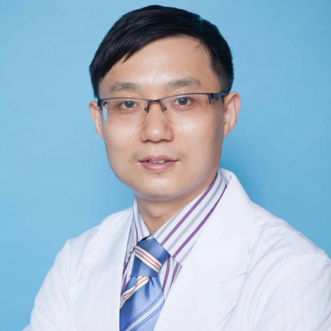

<!-- AUTO-GENERATED-BY: work/generate_obsidian_profiles.py -->

<!-- TEMPLATE: D:\workspace\信息收集整理\医生画像仓库\模板\医生画像模板.md -->

# 邢象斌

## 基础信息

| 字段 | 内容 |
|---|---|
| 姓名 | 邢象斌 |
| 医院 | 中山大学附属第一医院 |
| 科室 | 消化内科 |
| 职称/身份 | 主任医师 |
| 来源链接 | [官网原文](https://www.fahsysu.org.cn/node/795) |
| 采集日期 | 2026-08-13 |

## 简介/擅长

熟练操作消化内镜，擅长消化道早癌（包括食管早癌、胃早癌、十二指肠早癌、结直肠早癌）的ESD治疗、胆结石及胰腺炎和胰腺癌的ERCP/EUS、胃肠道间质瘤及神经内分泌肿瘤的ESD治疗、贲门失弛缓症的POEM治疗、术后胃轻瘫及糖尿病胃轻瘫的G-POEM治疗、反流性食管炎的抗反流手术、难治性消化道狭窄的内镜治疗、食管胃静脉曲张的内镜治疗、胃造瘘等 研究方向： 消化道早期肿瘤、肝胆胰疾病、贲门失弛缓症及胃轻瘫、难治性消化道狭窄等 主要教育和工作经历： 2008年博士毕业后在中山大学附属第一医院消化内科工作。 曾于2006-2008年赴德国慕尼黑Klinikum rechts der Isar医院消化内科做访问学者。 社会兼职： 中华消化内镜学会NOTES学组委员，广东省消化内镜学会委员/ERCP学组委员，广东省抗癌协会肿瘤内镜分会NOTES学组副组长，广东省肝脏病学会EUS专业委员会副主任委员，广东省医疗行业协会消化内科/消化内镜专业委员会副主任委员，广东省健康管理学会消化内镜MDT专业委员会副主任委员，广东省中西医结合学会消化内镜专业委员会常委，广东省胸部疾病学会食管疾病MDT专委会常委 论著： 有多篇中英文章发表在消化和消化...

## 教育与进修经历

- 曾于2006-2008年赴德国慕尼黑Klinikum rechts der Isar医院消化内科做访问学者。

## 科研项目与成果

- 其他主要工作成绩（比如获奖情况）： 广东省高等学校“千百十工程”校级培养对象 中山大学附属第一医院优秀青年人才支持计划 主持国家自然科学基金等多项基金 教育部自然科学奖二等奖（参与），2009年 广东省科技奖二等奖（参与），2012年

## 论文与学术产出

- 社会兼职： 中华消化内镜学会NOTES学组委员，广东省消化内镜学会委员/ERCP学组委员，广东省抗癌协会肿瘤内镜分会NOTES学组副组长，广东省肝脏病学会EUS专业委员会副主任委员，广东省医疗行业协会消化内科/消化内镜专业委员会副主任委员，广东省健康管理学会消化内镜MDT专业委员会副主任委员，广东省中西医结合学会消化内镜专业委员会常委，广东省胸部疾病学会食管疾病MDT专委会常委 论著： 有多篇中英文章发表在消化和消化内镜领域的顶级杂志上。

## 可包装亮点

- 曾于2006-2008年赴德国慕尼黑Klinikum rechts der Isar医院消化内科做访问学者。
- 社会兼职： 中华消化内镜学会NOTES学组委员，广东省消化内镜学会委员/ERCP学组委员，广东省抗癌协会肿瘤内镜分会NOTES学组副组长，广东省肝脏病学会EUS专业委员会副主任委员，广东省医疗行业协会消化内科/消化内镜专业委员会副主任委员，广东省健康管理学会消化内镜MDT专业委员会副主任委员，广东省中西医结合学会消化内镜专业委员会常委，广东省胸部疾病学会食…
- 其他主要工作成绩（比如获奖情况）： 广东省高等学校“千百十工程”校级培养对象 中山大学附属第一医院优秀青年人才支持计划 主持国家自然科学基金等多项基金 教育部自然科学奖二等奖（参与），2009年 广东省科技奖二等奖（参与），2012年

## 重点疾病/人群标签

- 慢性病：糖尿病、肿瘤、癌、瘤、术后、难治、MDT
- 肿瘤：糖尿病、肿瘤、癌、瘤、术后、难治、MDT
- 生殖疾病：
- 免疫/风湿：
- 术后恢复/康复：糖尿病、肿瘤、癌、瘤、术后、难治、MDT
- 疑难重症：糖尿病、肿瘤、癌、瘤、术后、难治、MDT

## 证据摘录

> 只摘录官网公开信息中的短句或关键字段，不复制大段原文。

- 官网身份字段：主任医师
- 官网简介/擅长：熟练操作消化内镜，擅长消化道早癌（包括食管早癌、胃早癌、十二指肠早癌、结直肠早癌）的ESD治疗、胆结石及胰腺炎和胰腺癌的ERCP/EUS、胃肠道间质瘤及神经内分泌肿瘤的ESD治疗、贲门失弛缓症的POEM治疗、术后胃轻瘫及糖尿病胃轻瘫的G-POEM治疗、反流性食管炎的抗反流手术、难治性消化道狭窄的内镜治疗、食管胃静脉曲张的内镜治疗、胃造瘘等 研究方向： 消化道早期肿瘤、肝胆胰疾病、贲门失弛缓症及胃轻瘫、难治性消化道狭窄等 主要教育和工作…
- 官网亮眼经历线索：曾于2006-2008年赴德国慕尼黑Klinikum rechts der Isar医院消化内科做访问学者。 社会兼职： 中华消化内镜学会NOTES学组委员，广东省消化内镜学会委员/ERCP学组委员，广东省抗癌协会肿瘤内镜分会NOTES学组副组长，广东省肝脏病学会EUS专业委员会副主任委员，广东省医疗行业协会消化内科/消化内镜专业委员会副主任委员，广东省健康管理学会消化内镜MDT专业委员会副主任委员，广东省中西医结合学会消化内镜专业委…
- 来源链接：https://www.fahsysu.org.cn/node/795

## BD 画像摘要

邢象斌医生可作为慢性病、肿瘤、术后恢复/康复、疑难重症方向的基础画像候选。后续 BD 使用应继续以官网来源和人工复核为准，不添加疗效承诺或无来源包装。

## 合规边界

- 仅使用医院官网、官方公众号、官方小程序等公开渠道。
- 不采集私人电话、私人微信、家庭住址、患者隐私或非公开排班信息。
- 不写“保证治愈”“疗效第一”“包治疑难杂症”等无法由官网证明的表述。
