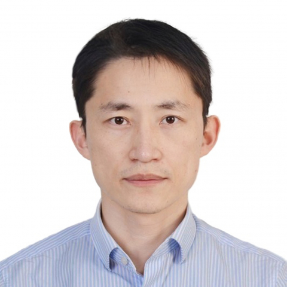

<!-- AUTO-GENERATED-BY: work/generate_obsidian_profiles.py -->

<!-- TEMPLATE: D:\workspace\信息收集整理\医生画像仓库\模板\医生画像模板.md -->

# 邬培慧

## 基础信息

| 字段 | 内容 |
|---|---|
| 姓名 | 邬培慧 |
| 医院 | 中山大学附属第一医院 |
| 科室 | 运动医学科 |
| 职称/身份 | 主任医师 |
| 来源链接 | [官网原文](https://www.fahsysu.org.cn/node/5626) |
| 采集日期 | 2026-08-13 |

## 简介/擅长

肩，膝，足踝，髋，肘关节的关节镜微创手术治疗及康复指导。 肩关节： 肩袖损伤、复发性肩关节脱位、SLAP损伤、肩周炎、肩峰撞击等； 膝关节： 韧带损伤与撕裂、半月板病变、髌骨复发性脱位、软骨损伤等，特色技术：前十字韧带双束修补技术和改良前外侧架构加强，髌骨脱位四联手术 足踝： 足踝扭伤、距骨软骨损伤、后足痛等，特色技术：全镜下距腓前韧带修补术 髋关节： 髋关节撞击、盂唇撕裂、早期股骨头坏死、髋关节滑膜病变等； 肘关节： 肘关节撞击、滑膜病变等。 曾以访问学者身份公派前往韩国梨花女子大学首尔医院肩关节中心，日本足踝研究中心CARIFAS，香港玛丽医院关节外科临床进修学习，以及获得中山一院菁英计划支持。 主持国家级项目2项、省部级课题3项，专利5项，PCT专利1项，软件著作权3项 学会任职： 广东省医师协会运动医学分会常委 广东省医学会运动医学分会委员 广东省临床医学会运动医学分会青年学会副主任委员 广东省医师协会运动医学分会下肢学组副组长 广东省医师协会运动医学医师分会运动康复专业组副组长 广东省康复医学会科普工作委员会副组长 广东省医师协会骨关节外科医师分会微创与快速康复学组秘书 广东省健康管理学会食品安全与营养健康专...

## 教育与进修经历

- 曾以访问学者身份公派前往韩国梨花女子大学首尔医院肩关节中心，日本足踝研究中心CARIFAS，香港玛丽医院关节外科临床进修学习，以及获得中山一院菁英计划支持。

## 科研项目与成果

- 主持国家级项目2项、省部级课题3项，专利5项，PCT专利1项，软件著作权3项 学会任职： 广东省医师协会运动医学分会常委 广东省医学会运动医学分会委员 广东省临床医学会运动医学分会青年学会副主任委员 广东省医师协会运动医学分会下肢学组副组长 广东省医师协会运动医学医师分会运动康复专业组副组长 广东省康复医学会科普工作委员会副组长 广东省医师协会骨关节外科医师分会微创与快速康复学组秘书 广东省健康管理学会食品安全与营养健康专业委员会常委委员 中国社区卫生协会骨关节炎社区防治专家委员会委员

## 论文与学术产出

- 主持国家级项目2项、省部级课题3项，专利5项，PCT专利1项，软件著作权3项 学会任职： 广东省医师协会运动医学分会常委 广东省医学会运动医学分会委员 广东省临床医学会运动医学分会青年学会副主任委员 广东省医师协会运动医学分会下肢学组副组长 广东省医师协会运动医学医师分会运动康复专业组副组长 广东省康复医学会科普工作委员会副组长 广东省医师协会骨关节外科医师分会微创与快速康复学组秘书 广东省健康管理学会食品安全与营养健康专业委员会常委委员 中国社区卫生协会骨关节炎社区防治专家委员会委员

## 可包装亮点

- 曾以访问学者身份公派前往韩国梨花女子大学首尔医院肩关节中心，日本足踝研究中心CARIFAS，香港玛丽医院关节外科临床进修学习，以及获得中山一院菁英计划支持。
- 主持国家级项目2项、省部级课题3项，专利5项，PCT专利1项，软件著作权3项 学会任职： 广东省医师协会运动医学分会常委 广东省医学会运动医学分会委员 广东省临床医学会运动医学分会青年学会副主任委员 广东省医师协会运动医学分会下肢学组副组长 广东省医师协会运动医学医师分会运动康复专业组副组长 广东省康复医学会科普工作委员会副组长 广东省医师协会骨关节外科医…

## 重点疾病/人群标签

- 慢性病：
- 肿瘤：
- 生殖疾病：
- 免疫/风湿：
- 术后恢复/康复：康复、营养
- 疑难重症：

## 证据摘录

> 只摘录官网公开信息中的短句或关键字段，不复制大段原文。

- 官网身份字段：主任医师
- 官网简介/擅长：肩，膝，足踝，髋，肘关节的关节镜微创手术治疗及康复指导。 肩关节： 肩袖损伤、复发性肩关节脱位、SLAP损伤、肩周炎、肩峰撞击等； 膝关节： 韧带损伤与撕裂、半月板病变、髌骨复发性脱位、软骨损伤等，特色技术：前十字韧带双束修补技术和改良前外侧架构加强，髌骨脱位四联手术 足踝： 足踝扭伤、距骨软骨损伤、后足痛等，特色技术：全镜下距腓前韧带修补术 髋关节： 髋关节撞击、盂唇撕裂、早期股骨头坏死、髋关节滑膜病变等； 肘关节： 肘关节撞击、滑…
- 官网亮眼经历线索：曾以访问学者身份公派前往韩国梨花女子大学首尔医院肩关节中心，日本足踝研究中心CARIFAS，香港玛丽医院关节外科临床进修学习，以及获得中山一院菁英计划支持。 主持国家级项目2项、省部级课题3项，专利5项，PCT专利1项，软件著作权3项 学会任职： 广东省医师协会运动医学分会常委 广东省医学会运动医学分会委员 广东省临床医学会运动医学分会青年学会副主任委员 广东省医师协会运动医学分会下肢学组副组长 广东省医师协会运动医学医师分会运动康复…
- 来源链接：https://www.fahsysu.org.cn/node/5626

## BD 画像摘要

邬培慧医生可作为术后恢复/康复方向的基础画像候选。后续 BD 使用应继续以官网来源和人工复核为准，不添加疗效承诺或无来源包装。

## 合规边界

- 仅使用医院官网、官方公众号、官方小程序等公开渠道。
- 不采集私人电话、私人微信、家庭住址、患者隐私或非公开排班信息。
- 不写“保证治愈”“疗效第一”“包治疑难杂症”等无法由官网证明的表述。
