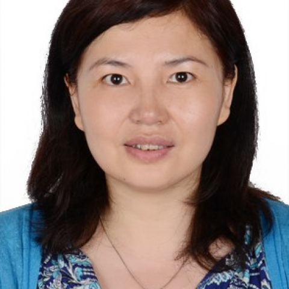

<!-- AUTO-GENERATED-BY: work/generate_obsidian_profiles.py -->

<!-- TEMPLATE: D:\workspace\信息收集整理\医生画像仓库\模板\医生画像模板.md -->

# 邵兰

## 基础信息

| 字段 | 内容 |
|---|---|
| 姓名 | 邵兰 |
| 医院 | 中山大学附属第一医院 |
| 科室 | 转化医学研究中心 |
| 职称/身份 | 研究员 |
| 来源链接 | [官网原文](https://www.fahsysu.org.cn/node/5822) |
| 采集日期 | 2026-08-13 |

## 简介/擅长

长期从事慢性免疫病研究，在艾默里大学和斯坦福大学工作期间，发现了自身免疫病病人免疫细胞中ATM蛋白主导的DNA 损伤修复通路的缺陷可导致免疫细胞修复功能的缺失,免疫系统长期处于增殖压力下，最终导致免疫衰老和自身免疫识别的异常。 此发现从一定程度改变了传统上人们对自身免疫病的认识。 在美国耶鲁大学医学院工作期间，深入研究了表观遗传修饰酶--SUMO特异性蛋白酶（SENP1），并首次证明了NEMO的SUMO化特异性增强胰岛脂肪细胞炎性细胞介素的分泌，进而导致自发性糖尿病，从而首次揭示SENP1作为敏感基因在糖尿病发病中的作用。 相关结果分别发表在 J .Exp Med.，Nature Communication，Nature Review Rheumatology，PNAS，EMBO MM, Journal of Autoimmunity. Arthritis & rheumatism., Frontiers in Immunology 等国际著名的医学杂志。 并被美国临床免疫学会（FOCIS），美国免疫学会（AAI），美国类风湿学会（ACR）邀请作大会报告。 此外还拥有斯坦福大学技术许可证明1项，美国专利1项及国内专利2...

## 教育与进修经历

- 研究方向：临床免疫学及肿瘤免疫 主要教育和工作经历： 沈阳药科大学 药学 学士 沈阳药科大学 药理 硕士 中科院研究生院 细胞生物学 博士 2002.8-2007.3 中科院动物所 助理研究员 2006.4-2009.12 艾默里大学（Emory） 博士后 2009.12-2011.6 斯坦福大学（Stanford）博士后 2011.4-2012.4 斯坦福大学（Stanford）研究助理 2012.8-2016.3 耶鲁大学（Yale） 副研究员 2016.4-至今 中山大学 研究员 社会兼职： 论著： 1 Q…

## 科研项目与成果

- 此外还拥有斯坦福大学技术许可证明1项，美国专利1项及国内专利2项。
- 医疗/科研特长： 长期从事慢性免疫病研究，在艾默里大学和斯坦福大学工作期间，发现了自身免疫病病人免疫细胞中ATM蛋白主导的DNA 损伤修复通路的缺陷可导致免疫细胞修复功能的缺失,免疫系统长期处于增殖压力下，最终导致免疫衰老和自身免疫识别的异常。

## 论文与学术产出

- 相关结果分别发表在J .Exp Med.，Nature Communication，Nature Review Rheumatology，PNAS，EMBO MM, Journal of Autoimmunity. Arthritis & rheumatism., Frontiers in Immunology等国际著名的医学杂志。

## 可包装亮点

- 在美国耶鲁大学医学院工作期间，深入研究了表观遗传修饰酶--SUMO特异性蛋白酶（SENP1），并首次证明了NEMO的SUMO化特异性增强胰岛脂肪细胞炎性细胞介素的分泌，进而导致自发性糖尿病，从而首次揭示SENP1作为敏感基因在糖尿病发病中的作用。
- 相关结果分别发表在J .Exp Med.，Nature Communication，Nature Review Rheumatology，PNAS，EMBO MM, Journal of Autoimmunity. Arthritis & rheumatism., Frontiers in Immunology等国际著名的医学杂志。
- 并被美国临床免疫学会（FOCIS），美国免疫学会（AAI），美国类风湿学会（ACR）邀请作大会报告。
- 此外还拥有斯坦福大学技术许可证明1项，美国专利1项及国内专利2项。

## 重点疾病/人群标签

- 慢性病：糖尿病、慢性、代谢、肿瘤、风湿、免疫、类风湿
- 肿瘤：糖尿病、慢性、代谢、肿瘤、风湿、免疫、类风湿
- 生殖疾病：
- 免疫/风湿：糖尿病、慢性、代谢、肿瘤、风湿、免疫、类风湿
- 术后恢复/康复：
- 疑难重症：

## 证据摘录

> 只摘录官网公开信息中的短句或关键字段，不复制大段原文。

- 官网身份字段：研究员
- 官网简介/擅长：长期从事慢性免疫病研究，在艾默里大学和斯坦福大学工作期间，发现了自身免疫病病人免疫细胞中ATM蛋白主导的DNA 损伤修复通路的缺陷可导致免疫细胞修复功能的缺失,免疫系统长期处于增殖压力下，最终导致免疫衰老和自身免疫识别的异常。 此发现从一定程度改变了传统上人们对自身免疫病的认识。 在美国耶鲁大学医学院工作期间，深入研究了表观遗传修饰酶--SUMO特异性蛋白酶（SENP1），并首次证明了NEMO的SUMO化特异性增强胰岛脂肪细胞炎性细胞…
- 官网亮眼经历线索：在美国耶鲁大学医学院工作期间，深入研究了表观遗传修饰酶--SUMO特异性蛋白酶（SENP1），并首次证明了NEMO的SUMO化特异性增强胰岛脂肪细胞炎性细胞介素的分泌，进而导致自发性糖尿病，从而首次揭示SENP1作为敏感基因在糖尿病发病中的作用。 相关结果分别发表在J .Exp Med.，Nature Communication，Nature Review Rheumatology，PNAS，EMBO MM, Journal of A…
- 来源链接：https://www.fahsysu.org.cn/node/5822

## BD 画像摘要

邵兰医生可作为慢性病、肿瘤、免疫/风湿/感染方向的基础画像候选。后续 BD 使用应继续以官网来源和人工复核为准，不添加疗效承诺或无来源包装。

## 合规边界

- 仅使用医院官网、官方公众号、官方小程序等公开渠道。
- 不采集私人电话、私人微信、家庭住址、患者隐私或非公开排班信息。
- 不写“保证治愈”“疗效第一”“包治疑难杂症”等无法由官网证明的表述。
