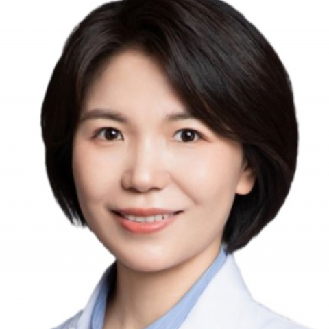

<!-- AUTO-GENERATED-BY: work/generate_obsidian_profiles.py -->

<!-- TEMPLATE: D:\workspace\信息收集整理\医生画像仓库\模板\医生画像模板.md -->

# 邵奕嘉

## 基础信息

| 字段 | 内容 |
|---|---|
| 姓名 | 邵奕嘉 |
| 医院 | 中山大学附属第一医院 |
| 科室 | 特需一科（老年病科） |
| 职称/身份 | 副主任医师 |
| 来源链接 | [官网原文](https://www.fahsysu.org.cn/node/35681) |
| 采集日期 | 2026-08-13 |

## 简介/擅长

长期从事老年医学及心血管临床一线工作，擅长心血管内科如高血压、冠心病、心力衰竭、心律失常等常见病的诊疗策略及老年慢性疾病的综合管理。 致力于为患者提供个体化、科学的长期管理方案。 副主任医师，硕士研究生导师，2018年于中山大学附属第一医院心血管内科博士毕业，留院工作至今。 2018-2020年中山一院心血管内科博士后。 社会兼职：担任广东省健康管理学会老年医学专委会委员兼秘书长； 广东省中西医结合学会心血管专业委员会青年委员； 广东省精准医学应用学会老年慢病分会委员。 研究方向：主要开展血管内皮损伤及修复的基础及临床转化研究，在国内外期刊上发表SCI论文及中文论著20余篇，主持国家自然科学青年基金项目，参与国家自然科学基金重点项目、面上项目及省部级项目多项。

## 教育与进修经历

- 副主任医师，硕士研究生导师，2018年于中山大学附属第一医院心血管内科博士毕业，留院工作至今。
- 2018-2020年中山一院心血管内科博士后。

## 科研项目与成果

- 研究方向：主要开展血管内皮损伤及修复的基础及临床转化研究，在国内外期刊上发表SCI论文及中文论著20余篇，主持国家自然科学青年基金项目，参与国家自然科学基金重点项目、面上项目及省部级项目多项。

## 论文与学术产出

- 研究方向：主要开展血管内皮损伤及修复的基础及临床转化研究，在国内外期刊上发表SCI论文及中文论著20余篇，主持国家自然科学青年基金项目，参与国家自然科学基金重点项目、面上项目及省部级项目多项。

## 可包装亮点

- 副主任医师，硕士研究生导师，2018年于中山大学附属第一医院心血管内科博士毕业，留院工作至今。
- 社会兼职：担任广东省健康管理学会老年医学专委会委员兼秘书长；
- 广东省中西医结合学会心血管专业委员会青年委员；
- 广东省精准医学应用学会老年慢病分会委员。

## 重点疾病/人群标签

- 慢性病：高血压、冠心病、心力衰竭、慢性
- 肿瘤：
- 生殖疾病：
- 免疫/风湿：
- 术后恢复/康复：
- 疑难重症：

## 证据摘录

> 只摘录官网公开信息中的短句或关键字段，不复制大段原文。

- 官网身份字段：副主任医师
- 官网简介/擅长：长期从事老年医学及心血管临床一线工作，擅长心血管内科如高血压、冠心病、心力衰竭、心律失常等常见病的诊疗策略及老年慢性疾病的综合管理。 致力于为患者提供个体化、科学的长期管理方案。 副主任医师，硕士研究生导师，2018年于中山大学附属第一医院心血管内科博士毕业，留院工作至今。 2018-2020年中山一院心血管内科博士后。 社会兼职：担任广东省健康管理学会老年医学专委会委员兼秘书长； 广东省中西医结合学会心血管专业委员会青年委员； 广东…
- 官网亮眼经历线索：副主任医师，硕士研究生导师，2018年于中山大学附属第一医院心血管内科博士毕业，留院工作至今。 社会兼职：担任广东省健康管理学会老年医学专委会委员兼秘书长； 广东省中西医结合学会心血管专业委员会青年委员； 广东省精准医学应用学会老年慢病分会委员。
- 来源链接：https://www.fahsysu.org.cn/node/35681

## BD 画像摘要

邵奕嘉医生可作为慢性病方向的基础画像候选。后续 BD 使用应继续以官网来源和人工复核为准，不添加疗效承诺或无来源包装。

## 合规边界

- 仅使用医院官网、官方公众号、官方小程序等公开渠道。
- 不采集私人电话、私人微信、家庭住址、患者隐私或非公开排班信息。
- 不写“保证治愈”“疗效第一”“包治疑难杂症”等无法由官网证明的表述。
