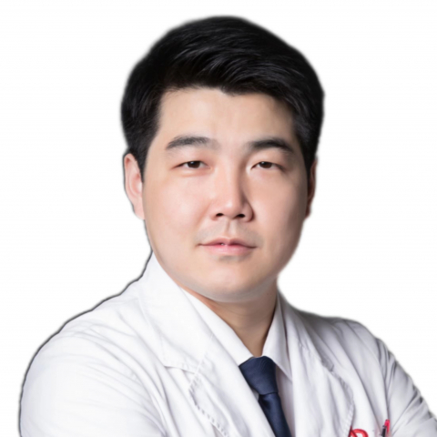

<!-- AUTO-GENERATED-BY: work/generate_obsidian_profiles.py -->

<!-- TEMPLATE: D:\workspace\信息收集整理\医生画像仓库\模板\医生画像模板.md -->

# 邵楠

## 基础信息

| 字段 | 内容 |
|---|---|
| 姓名 | 邵楠 |
| 医院 | 中山大学附属第一医院 |
| 科室 | 乳腺外科 |
| 职称/身份 | 副主任医师 |
| 来源链接 | [官网原文](https://www.fahsysu.org.cn/node/727) |
| 采集日期 | 2026-08-13 |

## 简介/擅长

1.乳腺癌保留乳房手术，尤其擅长利用容积移位和替代肿瘤整形技术对常规手术无法保乳者行保乳手术。 2.乳房假体和自体组织乳房再造术 1）经乳晕小切口行保留乳头乳晕和皮肤的乳腺切除同时行乳房重建 2）已行乳房全切有再造需求行二期乳房重建 3）同时对侧乳房缩乳或隆乳达到形态对称 4）乳头再造 3.早期和晚期乳腺癌化疗、免疫治疗、靶向治疗和内分泌治疗等综合治疗和全程管理。 4.有乳腺癌家族史的健康人群或乳腺癌患者的随访、管理和治疗。 研究方向： 临床研究方向：乳腺肿瘤整形和乳房重建手术 基础研究方向：胆固醇代谢在乳腺癌复发转移和耐药过程中的作用机制 教育经历： 2010年9月-2013年6月 中山大学附属第一医院 外科学 博士研究生 导师：王深明教授 2008年9月-2010年6月 中山大学附属第一医院 外科学 硕士研究生 导师：林颖教授 工作经历： 2013年获得中山大学临床医学博士学位，曾作为访问学者前往美国国家癌症中心进行乳腺癌流行病和基因组学研究。 2013年在中山大学外科学专业博士毕业后一直在中山大学附属第一医院乳腺外科从事乳腺癌综合治疗、乳房重建和保乳手术以及乳腺癌耐药机制等方向的医疗、教学和科研工作。 社会兼职：...

## 教育与进修经历

- 研究方向： 临床研究方向：乳腺肿瘤整形和乳房重建手术 基础研究方向：胆固醇代谢在乳腺癌复发转移和耐药过程中的作用机制 教育经历： 2010年9月-2013年6月 中山大学附属第一医院 外科学 博士研究生 导师：王深明教授 2008年9月-2010年6月 中山大学附属第一医院 外科学 硕士研究生 导师：林颖教授 工作经历： 2013年获得中山大学临床医学博士学位，曾作为访问学者前往美国国家癌症中心进行乳腺癌流行病和基因组学研究。
- 2013年在中山大学外科学专业博士毕业后一直在中山大学附属第一医院乳腺外科从事乳腺癌综合治疗、乳房重建和保乳手术以及乳腺癌耐药机制等方向的医疗、教学和科研工作。

## 科研项目与成果

- 2013年在中山大学外科学专业博士毕业后一直在中山大学附属第一医院乳腺外科从事乳腺癌综合治疗、乳房重建和保乳手术以及乳腺癌耐药机制等方向的医疗、教学和科研工作。
- 其他主要工作成绩（比如获奖情况） ： 主持国家自然科学基金1项，广东省自然科学基金1项，横向课题2项。

## 论文与学术产出

- 社会兼职： 广东省抗癌协会肿瘤整形外科专业委员会 常务委员 广东省预防医学会乳腺癌防治专业委员会 常务委员 广东省健康管理学会肿瘤防治专业委员会 常务委员 广东省中医药学会乳腺病专业委员会 委员 广东省健康管理学会乳房重建再造及美学专业委员会 委员 广州抗癌协会乳腺癌专业委员会 委员 论著： 截止2024年12月，在 Int J Biol Sci 、 Cancer Manag Res 、 Cancer Cell Int 、 J Cell Mol Med 、 Technol Cancer Res Treat 、 W…

## 可包装亮点

- 研究方向： 临床研究方向：乳腺肿瘤整形和乳房重建手术 基础研究方向：胆固醇代谢在乳腺癌复发转移和耐药过程中的作用机制 教育经历： 2010年9月-2013年6月 中山大学附属第一医院 外科学 博士研究生 导师：王深明教授 2008年9月-2010年6月 中山大学附属第一医院 外科学 硕士研究生 导师：林颖教授 工作经历： 2013年获得中山大学临床医学博士…
- 社会兼职： 广东省抗癌协会肿瘤整形外科专业委员会 常务委员 广东省预防医学会乳腺癌防治专业委员会 常务委员 广东省健康管理学会肿瘤防治专业委员会 常务委员 广东省中医药学会乳腺病专业委员会 委员 广东省健康管理学会乳房重建再造及美学专业委员会 委员 广州抗癌协会乳腺癌专业委员会 委员 论著： 截止2024年12月，在 Int J Biol Sci 、 Ca…

## 重点疾病/人群标签

- 慢性病：代谢、肿瘤、癌、化疗、靶向、乳腺癌、免疫
- 肿瘤：代谢、肿瘤、癌、化疗、靶向、乳腺癌、免疫
- 生殖疾病：
- 免疫/风湿：代谢、肿瘤、癌、化疗、靶向、乳腺癌、免疫
- 术后恢复/康复：
- 疑难重症：

## 证据摘录

> 只摘录官网公开信息中的短句或关键字段，不复制大段原文。

- 官网身份字段：副主任医师
- 官网简介/擅长：1.乳腺癌保留乳房手术，尤其擅长利用容积移位和替代肿瘤整形技术对常规手术无法保乳者行保乳手术。 2.乳房假体和自体组织乳房再造术 1）经乳晕小切口行保留乳头乳晕和皮肤的乳腺切除同时行乳房重建 2）已行乳房全切有再造需求行二期乳房重建 3）同时对侧乳房缩乳或隆乳达到形态对称 4）乳头再造 3.早期和晚期乳腺癌化疗、免疫治疗、靶向治疗和内分泌治疗等综合治疗和全程管理。 4.有乳腺癌家族史的健康人群或乳腺癌患者的随访、管理和治疗。 研究方向…
- 官网亮眼经历线索：研究方向： 临床研究方向：乳腺肿瘤整形和乳房重建手术 基础研究方向：胆固醇代谢在乳腺癌复发转移和耐药过程中的作用机制 教育经历： 2010年9月-2013年6月 中山大学附属第一医院 外科学 博士研究生 导师：王深明教授 2008年9月-2010年6月 中山大学附属第一医院 外科学 硕士研究生 导师：林颖教授 工作经历： 2013年获得中山大学临床医学博士学位，曾作为访问学者前往美国国家癌症中心进行乳腺癌流行病和基因组学研究。 社会兼…
- 来源链接：https://www.fahsysu.org.cn/node/727

## BD 画像摘要

邵楠医生可作为慢性病、肿瘤、免疫/风湿/感染方向的基础画像候选。后续 BD 使用应继续以官网来源和人工复核为准，不添加疗效承诺或无来源包装。

## 合规边界

- 仅使用医院官网、官方公众号、官方小程序等公开渠道。
- 不采集私人电话、私人微信、家庭住址、患者隐私或非公开排班信息。
- 不写“保证治愈”“疗效第一”“包治疑难杂症”等无法由官网证明的表述。
