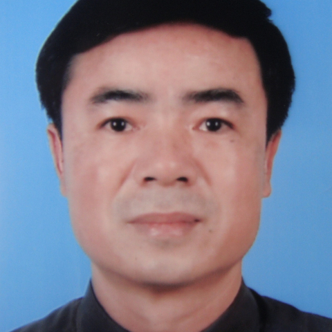

<!-- AUTO-GENERATED-BY: work/generate_obsidian_profiles.py -->

<!-- TEMPLATE: D:\workspace\信息收集整理\医生画像仓库\模板\医生画像模板.md -->

# 郑可国

## 基础信息

| 字段 | 内容 |
|---|---|
| 姓名 | 郑可国 |
| 医院 | 中山大学附属第一医院 |
| 科室 | 放射诊断专科 |
| 职称/身份 | 主任医师 |
| 来源链接 | [官网原文](https://www.fahsysu.org.cn/node/5571) |
| 采集日期 | 2026-08-13 |

## 简介/擅长

从事放射影像诊断工作28年，擅长于全身各部位疾病的影像诊断，尤其对腹部疾病的影像诊断有较深造诣，对肝胆胰和胃肠道疾病的影像诊断有较深入的研究，对肝脏肿瘤、胆系肿瘤、胰腺肿瘤、胃肠道肿瘤、急腹症等的影像诊断有独特的见解与丰富的临床经验。 研究方向： 1． 肝脏疾病的影像学诊断及治疗后疗效的判断 2． 胰腺疾病的影像学诊断 3． 消化道疾病的影像学诊断 4． 胆系疾病的影像学诊断 5． 急腹症的影像学诊断 主要教育和工作经历： 1984年中山医学院本科毕业，1993年中山医科大学研究生毕业，毕业后一直在中山大学附属第一医院放射科从事医疗、教学和科研工作，历任助教、讲师、副教授和主任医师。 社会兼职： ①广东省肝脏病学会影像诊断专业委员会常委 ②广东省医师协会放射科医师分会第二届委员会委员 ③广东省抗癌协会肿瘤影像与介入诊治专业委员会委员 ④影像诊断与介入放射学杂志编委 ⑤广州市医学会医疗事故技术鉴定专家库成员 论著： 在国内外专业杂志发表论文50多篇。 专著： 主编、参编的专著有20本，其中主编和副主编的专著有： ①主编. 医学影像学（卫生部十一五规划教材、全国高等医药教材建设研究会规划教材、全国高等学校医学成人学历教育专...

## 教育与进修经历

- 研究方向： 1． 肝脏疾病的影像学诊断及治疗后疗效的判断 2． 胰腺疾病的影像学诊断 3． 消化道疾病的影像学诊断 4． 胆系疾病的影像学诊断 5． 急腹症的影像学诊断 主要教育和工作经历： 1984年中山医学院本科毕业，1993年中山医科大学研究生毕业，毕业后一直在中山大学附属第一医院放射科从事医疗、教学和科研工作，历任助教、讲师、副教授和主任医师。

## 科研项目与成果

- 研究方向： 1． 肝脏疾病的影像学诊断及治疗后疗效的判断 2． 胰腺疾病的影像学诊断 3． 消化道疾病的影像学诊断 4． 胆系疾病的影像学诊断 5． 急腹症的影像学诊断 主要教育和工作经历： 1984年中山医学院本科毕业，1993年中山医科大学研究生毕业，毕业后一直在中山大学附属第一医院放射科从事医疗、教学和科研工作，历任助教、讲师、副教授和主任医师。
- 人民卫生出版社 2003年1月第1版 其他主要工作成绩（比如获奖情况）： 获省厅级科技成果进步奖2项，省部级优秀教材和图书奖2项，校级医疗和科技成果奖6项，院级教材建设奖2项，全国腹部影像学学术大会中青年优秀论文三等奖和优秀奖。

## 论文与学术产出

- 社会兼职： ①广东省肝脏病学会影像诊断专业委员会常委 ②广东省医师协会放射科医师分会第二届委员会委员 ③广东省抗癌协会肿瘤影像与介入诊治专业委员会委员 ④影像诊断与介入放射学杂志编委 ⑤广州市医学会医疗事故技术鉴定专家库成员 论著： 在国内外专业杂志发表论文50多篇。
- 专著： 主编、参编的专著有20本，其中主编和副主编的专著有： ①主编. 医学影像学（卫生部十一五规划教材、全国高等医药教材建设研究会规划教材、全国高等学校医学成人学历教育专科起点升本科教材）。
- 人民卫生出版社 2007年8月第2版 ②主编.肝细胞癌临床CT诊断。
- 世界图书出版社 2003年9月第1版 ③副主编.临床疑难病例影像诊断及解析。

## 可包装亮点

- 研究方向： 1． 肝脏疾病的影像学诊断及治疗后疗效的判断 2． 胰腺疾病的影像学诊断 3． 消化道疾病的影像学诊断 4． 胆系疾病的影像学诊断 5． 急腹症的影像学诊断 主要教育和工作经历： 1984年中山医学院本科毕业，1993年中山医科大学研究生毕业，毕业后一直在中山大学附属第一医院放射科从事医疗、教学和科研工作，历任助教、讲师、副教授和主任医师。
- 社会兼职： ①广东省肝脏病学会影像诊断专业委员会常委 ②广东省医师协会放射科医师分会第二届委员会委员 ③广东省抗癌协会肿瘤影像与介入诊治专业委员会委员 ④影像诊断与介入放射学杂志编委 ⑤广州市医学会医疗事故技术鉴定专家库成员 论著： 在国内外专业杂志发表论文50多篇。
- 专著： 主编、参编的专著有20本，其中主编和副主编的专著有： ①主编. 医学影像学（卫生部十一五规划教材、全国高等医药教材建设研究会规划教材、全国高等学校医学成人学历教育专科起点升本科教材）。
- 世界图书出版社...

## 重点疾病/人群标签

- 慢性病：
- 肿瘤：肿瘤、癌、疑难
- 生殖疾病：
- 免疫/风湿：
- 术后恢复/康复：
- 疑难重症：肿瘤、癌、疑难

## 证据摘录

> 只摘录官网公开信息中的短句或关键字段，不复制大段原文。

- 官网身份字段：主任医师
- 官网简介/擅长：从事放射影像诊断工作28年，擅长于全身各部位疾病的影像诊断，尤其对腹部疾病的影像诊断有较深造诣，对肝胆胰和胃肠道疾病的影像诊断有较深入的研究，对肝脏肿瘤、胆系肿瘤、胰腺肿瘤、胃肠道肿瘤、急腹症等的影像诊断有独特的见解与丰富的临床经验。 研究方向： 1． 肝脏疾病的影像学诊断及治疗后疗效的判断 2． 胰腺疾病的影像学诊断 3． 消化道疾病的影像学诊断 4． 胆系疾病的影像学诊断 5． 急腹症的影像学诊断 主要教育和工作经历： 1984年…
- 官网亮眼经历线索：研究方向： 1． 肝脏疾病的影像学诊断及治疗后疗效的判断 2． 胰腺疾病的影像学诊断 3． 消化道疾病的影像学诊断 4． 胆系疾病的影像学诊断 5． 急腹症的影像学诊断 主要教育和工作经历： 1984年中山医学院本科毕业，1993年中山医科大学研究生毕业，毕业后一直在中山大学附属第一医院放射科从事医疗、教学和科研工作，历任助教、讲师、副教授和主任医师。 社会兼职： ①广东省肝脏病学会影像诊断专业委员会常委 ②广东省医师协会放射科医师分…
- 来源链接：https://www.fahsysu.org.cn/node/5571

## BD 画像摘要

郑可国医生可作为肿瘤、疑难重症方向的基础画像候选。后续 BD 使用应继续以官网来源和人工复核为准，不添加疗效承诺或无来源包装。

## 合规边界

- 仅使用医院官网、官方公众号、官方小程序等公开渠道。
- 不采集私人电话、私人微信、家庭住址、患者隐私或非公开排班信息。
- 不写“保证治愈”“疗效第一”“包治疑难杂症”等无法由官网证明的表述。
