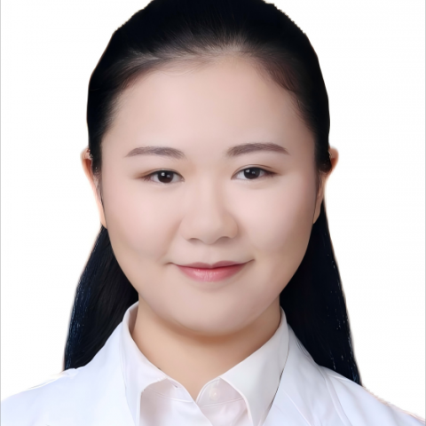

<!-- AUTO-GENERATED-BY: work/generate_obsidian_profiles.py -->

<!-- TEMPLATE: D:\workspace\信息收集整理\医生画像仓库\模板\医生画像模板.md -->

# 郑巧

## 基础信息

| 字段 | 内容 |
|---|---|
| 姓名 | 郑巧 |
| 医院 | 中山大学附属第一医院 |
| 科室 | 超声医学科 |
| 职称/身份 | 副主任医师 |
| 来源链接 | [官网原文](https://www.fahsysu.org.cn/node/36784) |
| 采集日期 | 2026-08-13 |

## 简介/擅长

主要从事妇产科相关疾病的超声诊断及介入治疗，擅长胎儿先天畸形产前超声筛查及诊断、妇科疑难疾病超声诊断、子宫输卵管超声造影以及超声引导下盆腔病变介入治疗（穿刺活检、抽液等）。 教育及工作经历： 2025.01-至今 中山大学附属第一医院超声医学科 副主任医师 2021.01-2024.12 中山大学附属第一医院超声医学科 主治医师 2017.07-2020.12 中山大学附属第一医院超声医学科 住院医师 2009.09-2017.06 中山大学 临床医学八年制（博士） 社会兼职： 广东省医学会产前诊断学分会 常务委员 科研及教学情况： 以第一/共同第一作者发表SCI论文十余篇，主持国家自然科学基金青年科学基金项目，参与多项国家级、省级科研项目。 主持、参与校级高等教育教学改革项目，任《产科超声规范化培训考核标准中国专家共识（2022版）》及《中国医师协会超声医师分会指南丛书——中国妇科超声检查指南（第二版）》编写组秘书，多次获评超声医学科住院医师年度优秀带教老师。

## 教育与进修经历

- 主持、参与校级高等教育教学改革项目，任《产科超声规范化培训考核标准中国专家共识（2022版）》及《中国医师协会超声医师分会指南丛书——中国妇科超声检查指南（第二版）》编写组秘书，多次获评超声医学科住院医师年度优秀带教老师。

## 科研项目与成果

- 教育及工作经历： 2025.01-至今 中山大学附属第一医院超声医学科 副主任医师 2021.01-2024.12 中山大学附属第一医院超声医学科 主治医师 2017.07-2020.12 中山大学附属第一医院超声医学科 住院医师 2009.09-2017.06 中山大学 临床医学八年制（博士） 社会兼职： 广东省医学会产前诊断学分会 常务委员 科研及教学情况： 以第一/共同第一作者发表SCI论文十余篇，主持国家自然科学基金青年科学基金项目，参与多项国家级、省级科研项目。
- 主持、参与校级高等教育教学改革项目，任《产科超声规范化培训考核标准中国专家共识（2022版）》及《中国医师协会超声医师分会指南丛书——中国妇科超声检查指南（第二版）》编写组秘书，多次获评超声医学科住院医师年度优秀带教老师。

## 论文与学术产出

- 教育及工作经历： 2025.01-至今 中山大学附属第一医院超声医学科 副主任医师 2021.01-2024.12 中山大学附属第一医院超声医学科 主治医师 2017.07-2020.12 中山大学附属第一医院超声医学科 住院医师 2009.09-2017.06 中山大学 临床医学八年制（博士） 社会兼职： 广东省医学会产前诊断学分会 常务委员 科研及教学情况： 以第一/共同第一作者发表SCI论文十余篇，主持国家自然科学基金青年科学基金项目，参与多项国家级、省级科研项目。

## 可包装亮点

- ） 主要从事妇产科相关疾病的超声诊断及介入治疗，擅长胎儿先天畸形产前超声筛查及诊断、妇科疑难疾病超声诊断、子宫输卵管超声造影以及超声引导下盆腔病变介入治疗（穿刺活检、抽液等）。
- ） 医疗特长：主要从事妇产科相关疾病的超声诊断及介入治疗，擅长胎儿先天畸形产前超声筛查及诊断、妇科疑难疾病超声诊断、子宫输卵管超声造影以及超声引导下盆腔病变介入治疗（穿刺活检、抽液等）。
- 教育及工作经历： 2025.01-至今 中山大学附属第一医院超声医学科 副主任医师 2021.01-2024.12 中山大学附属第一医院超声医学科 主治医师 2017.07-2020.12 中山大学附属第一医院超声医学科 住院医师 2009.09-2017.06 中山大学 临床医学八年制（博士） 社会兼职： 广东省医学会产前诊断学分会 常务委员 科研及教学…

## 重点疾病/人群标签

- 慢性病：
- 肿瘤：
- 生殖疾病：
- 免疫/风湿：
- 术后恢复/康复：
- 疑难重症：疑难

## 证据摘录

> 只摘录官网公开信息中的短句或关键字段，不复制大段原文。

- 官网身份字段：副主任医师
- 官网简介/擅长：主要从事妇产科相关疾病的超声诊断及介入治疗，擅长胎儿先天畸形产前超声筛查及诊断、妇科疑难疾病超声诊断、子宫输卵管超声造影以及超声引导下盆腔病变介入治疗（穿刺活检、抽液等）。 教育及工作经历： 2025.01-至今 中山大学附属第一医院超声医学科 副主任医师 2021.01-2024.12 中山大学附属第一医院超声医学科 主治医师 2017.07-2020.12 中山大学附属第一医院超声医学科 住院医师 2009.09-2017.06…
- 官网亮眼经历线索：） 主要从事妇产科相关疾病的超声诊断及介入治疗，擅长胎儿先天畸形产前超声筛查及诊断、妇科疑难疾病超声诊断、子宫输卵管超声造影以及超声引导下盆腔病变介入治疗（穿刺活检、抽液等）。 ） 医疗特长：主要从事妇产科相关疾病的超声诊断及介入治疗，擅长胎儿先天畸形产前超声筛查及诊断、妇科疑难疾病超声诊断、子宫输卵管超声造影以及超声引导下盆腔病变介入治疗（穿刺活检、抽液等）。 教育及工作经历： 2025.01-至今 中山大学附属第一医院超声医学科…
- 来源链接：https://www.fahsysu.org.cn/node/36784

## BD 画像摘要

郑巧医生可作为疑难重症方向的基础画像候选。后续 BD 使用应继续以官网来源和人工复核为准，不添加疗效承诺或无来源包装。

## 合规边界

- 仅使用医院官网、官方公众号、官方小程序等公开渠道。
- 不采集私人电话、私人微信、家庭住址、患者隐私或非公开排班信息。
- 不写“保证治愈”“疗效第一”“包治疑难杂症”等无法由官网证明的表述。
