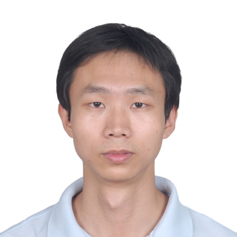

<!-- AUTO-GENERATED-BY: work/generate_obsidian_profiles.py -->

<!-- TEMPLATE: D:\workspace\信息收集整理\医生画像仓库\模板\医生画像模板.md -->

# 郑灿镔

## 基础信息

| 字段 | 内容 |
|---|---|
| 姓名 | 郑灿镔 |
| 医院 | 中山大学附属第一医院 |
| 科室 | 显微创伤外手科 |
| 职称/身份 | 主任医师 |
| 来源链接 | [官网原文](https://www.fahsysu.org.cn/node/23551) |
| 采集日期 | 2026-08-13 |

## 简介/擅长

医疗专长是四肢骨折、软组织创伤的修复以及功能的重建、手与上肢疾患以及四肢神经损伤和病变的外科治疗。 擅长对四肢骨折和软组织创伤进行规范化治疗，利用显微外科的独特优势治疗肢体创伤及其并发症与后遗症、四肢周围神经伤病以及四肢先天性畸形以及利用内镜技术进行手腕关节内疾患的微创诊疗。 研究方向： 肢体软组织修复与再生研究 周围神经损伤修复与再生研究 干细胞与组织工程研究 主要教育和工作经历： 本科就读于中山大学中山医学院临床医学七年制，获硕士学位后，在我院完成骨科学博士学位培养并留院工作至今； 2015年在美国德州医学中心赫曼纪念医院骨创伤中心从事AO Fellow； 2017年至2020年在美国德克萨斯州大学西南医学中心开展博士后研究工作。 历任显微创伤手外科住院医师、主治医师、副主任医师。 获授权发明专利6项。 作为项目负责人先后主持国家自然科学青年基金，广东省自然科学基金面上项目，广东省科技厅公益研究与能力建设专项资金和广东省医学科研基金。 专著： 参编，显微骨科学，人民卫生出版社 参编，再生医学：转化与应用， 湖北科学技术出版社 参编，周围神经损伤性缺损修复材料生物制造与临床评估，中山大学出版社 其他主要工作成绩（比如...

## 教育与进修经历

- 研究方向： 肢体软组织修复与再生研究 周围神经损伤修复与再生研究 干细胞与组织工程研究 主要教育和工作经历： 本科就读于中山大学中山医学院临床医学七年制，获硕士学位后，在我院完成骨科学博士学位培养并留院工作至今；
- 2017年至2020年在美国德克萨斯州大学西南医学中心开展博士后研究工作。

## 科研项目与成果

- 获授权发明专利6项。
- 作为项目负责人先后主持国家自然科学青年基金，广东省自然科学基金面上项目，广东省科技厅公益研究与能力建设专项资金和广东省医学科研基金。
- 专著： 参编，显微骨科学，人民卫生出版社 参编，再生医学：转化与应用， 湖北科学技术出版社 参编，周围神经损伤性缺损修复材料生物制造与临床评估，中山大学出版社 其他主要工作成绩（比如获奖情况）： 2015年中国产学研合作创新成果一等奖（第6完成人） 2014年中山一院青年教师授课大赛(全英组)优胜奖 2010年中华医学会显微外科分会年会青年论文竞赛二等奖 2014年广东省显微外科分会青年论文竞赛一等奖 2014年中华医学会显微外科分会年会青年论文竞赛二等奖

## 论文与学术产出

- 专著： 参编，显微骨科学，人民卫生出版社 参编，再生医学：转化与应用， 湖北科学技术出版社 参编，周围神经损伤性缺损修复材料生物制造与临床评估，中山大学出版社 其他主要工作成绩（比如获奖情况）： 2015年中国产学研合作创新成果一等奖（第6完成人） 2014年中山一院青年教师授课大赛(全英组)优胜奖 2010年中华医学会显微外科分会年会青年论文竞赛二等奖 2014年广东省显微外科分会青年论文竞赛一等奖 2014年中华医学会显微外科分会年会青年论文竞赛二等奖

## 可包装亮点

- 2015年在美国德州医学中心赫曼纪念医院骨创伤中心从事AO Fellow；
- 2017年至2020年在美国德克萨斯州大学西南医学中心开展博士后研究工作。
- 历任显微创伤手外科住院医师、主治医师、副主任医师。
- 获授权发明专利6项。

## 重点疾病/人群标签

- 慢性病：
- 肿瘤：
- 生殖疾病：
- 免疫/风湿：
- 术后恢复/康复：
- 疑难重症：

## 证据摘录

> 只摘录官网公开信息中的短句或关键字段，不复制大段原文。

- 官网身份字段：主任医师
- 官网简介/擅长：医疗专长是四肢骨折、软组织创伤的修复以及功能的重建、手与上肢疾患以及四肢神经损伤和病变的外科治疗。 擅长对四肢骨折和软组织创伤进行规范化治疗，利用显微外科的独特优势治疗肢体创伤及其并发症与后遗症、四肢周围神经伤病以及四肢先天性畸形以及利用内镜技术进行手腕关节内疾患的微创诊疗。 研究方向： 肢体软组织修复与再生研究 周围神经损伤修复与再生研究 干细胞与组织工程研究 主要教育和工作经历： 本科就读于中山大学中山医学院临床医学七年制，获硕士…
- 官网亮眼经历线索：2015年在美国德州医学中心赫曼纪念医院骨创伤中心从事AO Fellow； 2017年至2020年在美国德克萨斯州大学西南医学中心开展博士后研究工作。 历任显微创伤手外科住院医师、主治医师、副主任医师。 获授权发明专利6项。
- 来源链接：https://www.fahsysu.org.cn/node/23551

## BD 画像摘要

郑灿镔医生可作为中山大学附属第一医院显微创伤外手科的基础医生资料入库。当前重点方向以总底表标签为准，官网未展示的信息保持空白。

## 合规边界

- 仅使用医院官网、官方公众号、官方小程序等公开渠道。
- 不采集私人电话、私人微信、家庭住址、患者隐私或非公开排班信息。
- 不写“保证治愈”“疗效第一”“包治疑难杂症”等无法由官网证明的表述。
