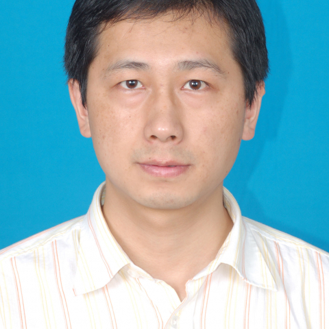

<!-- AUTO-GENERATED-BY: work/generate_obsidian_profiles.py -->

<!-- TEMPLATE: D:\workspace\信息收集整理\医生画像仓库\模板\医生画像模板.md -->

# 郭俊兵

## 基础信息

| 字段 | 内容 |
|---|---|
| 姓名 | 郭俊兵 |
| 医院 | 中山大学附属第一医院 |
| 科室 | 口腔科 |
| 职称/身份 | 副主任医师 |
| 来源链接 | [官网原文](https://www.fahsysu.org.cn/node/5710) |
| 采集日期 | 2026-08-13 |

## 简介/擅长

郭俊兵，男，副主任医师，口腔颌面外科学硕士，口腔种植学博士。 擅长各类微创牙种植手术及种植后修复，尤其对上颌窦提升术后牙种植及下牙槽神经移位术后牙种植有独到见解和有丰富的临床经验。 对口腔颌面外科的各类常见病和多发病（如：颌面部感染、颌面部创伤骨折、口腔颌面部良恶性肿瘤、正颌外科及牙槽外科）有丰富的临床经验，擅长各类颌面外科手术。 研究方向： 主要研究方向口腔颌面部肿瘤、创伤、畸形的预防和治疗，牙种植上颌窦黏膜的成骨机制，口腔黏膜的放射性损伤与癌变等。 主要教育和工作经历： 1998年本科毕业于中国口腔医学的发源地-四川大学华西口腔医学院，就职于湖北十堰郧阳医学院附属太和医院口腔科（国内首批三甲医院），2003-2006在中山大学附属第一医院攻读口腔颌面外科硕士学位，毕业后以优异成绩留院工作至今。 2004获中级资格，2015年获口腔种植学博士学位。 社会兼职： 中华口腔医学会会员，中华口腔医学会牙周专委会会员，广东省牙周专委会委员，广东省医学会颌面-头颈外科学会委员。 论著： 1. Scientific Reports，2015.06，Investigation of multipotent postnatal st...

## 教育与进修经历

- 主要教育和工作经历： 1998年本科毕业于中国口腔医学的发源地-四川大学华西口腔医学院，就职于湖北十堰郧阳医学院附属太和医院口腔科（国内首批三甲医院），2003-2006在中山大学附属第一医院攻读口腔颌面外科硕士学位，毕业后以优异成绩留院工作至今。
- 2004获中级资格，2015年获口腔种植学博士学位。

## 论文与学术产出

- 论著： 1. Scientific Reports，2015.06，Investigation of multipotent postnatal stem cells from human maxillary sinus membrane （第一作者，IF:5.578） 2. Journal of cranio-maxillo-facial surgery，2015.01，Treatment of a subtype of trigeminal neuralgia with descending palatine…

## 可包装亮点

- 郭俊兵，男，副主任医师，口腔颌面外科学硕士，口腔种植学博士。
- 医疗特长： 郭俊兵，男，副主任医师，口腔颌面外科学硕士，口腔种植学博士。
- 社会兼职： 中华口腔医学会会员，中华口腔医学会牙周专委会会员，广东省牙周专委会委员，广东省医学会颌面-头颈外科学会委员。
- 论著： 1. Scientific Reports，2015.06，Investigation of multipotent postnatal stem cells from human maxillary sinus membrane （第一作者，IF:5.578） 2. Journal of cranio-maxillo-facial surgery…

## 重点疾病/人群标签

- 慢性病：
- 肿瘤：肿瘤、癌、感染、术后
- 生殖疾病：
- 免疫/风湿：肿瘤、癌、感染、术后
- 术后恢复/康复：肿瘤、癌、感染、术后
- 疑难重症：

## 证据摘录

> 只摘录官网公开信息中的短句或关键字段，不复制大段原文。

- 官网身份字段：副主任医师
- 官网简介/擅长：郭俊兵，男，副主任医师，口腔颌面外科学硕士，口腔种植学博士。 擅长各类微创牙种植手术及种植后修复，尤其对上颌窦提升术后牙种植及下牙槽神经移位术后牙种植有独到见解和有丰富的临床经验。 对口腔颌面外科的各类常见病和多发病（如：颌面部感染、颌面部创伤骨折、口腔颌面部良恶性肿瘤、正颌外科及牙槽外科）有丰富的临床经验，擅长各类颌面外科手术。 研究方向： 主要研究方向口腔颌面部肿瘤、创伤、畸形的预防和治疗，牙种植上颌窦黏膜的成骨机制，口腔黏膜的放…
- 官网亮眼经历线索：郭俊兵，男，副主任医师，口腔颌面外科学硕士，口腔种植学博士。 医疗特长： 郭俊兵，男，副主任医师，口腔颌面外科学硕士，口腔种植学博士。 社会兼职： 中华口腔医学会会员，中华口腔医学会牙周专委会会员，广东省牙周专委会委员，广东省医学会颌面-头颈外科学会委员。 论著： 1. Scientific Reports，2015.06，Investigation of multipotent postnatal stem cells from h…
- 来源链接：https://www.fahsysu.org.cn/node/5710

## BD 画像摘要

郭俊兵医生可作为肿瘤、免疫/风湿/感染、术后恢复/康复方向的基础画像候选。后续 BD 使用应继续以官网来源和人工复核为准，不添加疗效承诺或无来源包装。

## 合规边界

- 仅使用医院官网、官方公众号、官方小程序等公开渠道。
- 不采集私人电话、私人微信、家庭住址、患者隐私或非公开排班信息。
- 不写“保证治愈”“疗效第一”“包治疑难杂症”等无法由官网证明的表述。
