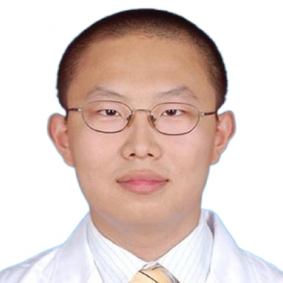

<!-- AUTO-GENERATED-BY: work/generate_obsidian_profiles.py -->

<!-- TEMPLATE: D:\workspace\信息收集整理\医生画像仓库\模板\医生画像模板.md -->

# 郭宇

## 基础信息

| 字段 | 内容 |
|---|---|
| 姓名 | 郭宇 |
| 医院 | 中山大学附属第一医院 |
| 科室 | 普通外科 |
| 职称/身份 | 主任医师 |
| 来源链接 | [官网原文](https://www.fahsysu.org.cn/node/620) |
| 采集日期 | 2026-08-13 |

## 简介/擅长

①肝脏良、恶性病变的外科和综合治疗：原发性肝癌、转移性肝癌、肝血管瘤、肝囊肿、肝脓肿、Caroli病等； ②胆道良恶性病变的外科治疗：胆囊癌、胆管癌、壶腹癌、胆总管囊肿等； ③胰腺疾病的外科治疗：胰腺癌、胰腺炎、胰腺假性囊肿等； ④肝胆管结石的外科治疗：肝内胆管结石、胆总管结石、胆囊结石等； ⑤门静脉高压症、脾脏良恶性疾病的外科治疗。

## 教育与进修经历

- 【工作经历】 2022年~ 至 今 中山大学 主任医师 2010年～2022年 中山大学 副主任医师， 副研究员，博士后 【社会兼职】 国家自然科学基金、教育部博士学位论文、中国博士后科学基金、广东省自然/省人才重大项目、广东省科技计划及其重点项目等评审专家。
- 广东省卫健委“广东省医学杰出青年人才”、广东省人社厅“广东省100个博士博士后创新人物”、中国科协卓越行动计划（首届）“优秀审稿人奖”、国家卫健委2021年度“现代医院管理典型案例”“最佳案例奖”。

## 科研项目与成果

- 【工作经历】 2022年~ 至 今 中山大学 主任医师 2010年～2022年 中山大学 副主任医师， 副研究员，博士后 【社会兼职】 国家自然科学基金、教育部博士学位论文、中国博士后科学基金、广东省自然/省人才重大项目、广东省科技计划及其重点项目等评审专家。
- 【科研情况】 主要研究方向为复发性肝癌早期诊断和免疫治疗，在Adv Sci、Redox Biol、Biomaterials、Hepatology、Nat Commun、ACS Nano等权威期刊，以通讯/第一作者发表影响因子>10的论文十余篇、授权第一发明人发明专利8项。
- 主持国家自然科学基金项目3项，省部级科研项目9项。
- 获得“广东省杰青”、“广东特支计划-科技创新青年拔尖人才”、“珠江科技新星”等人才项目5项。

## 论文与学术产出

- 【工作经历】 2022年~ 至 今 中山大学 主任医师 2010年～2022年 中山大学 副主任医师， 副研究员，博士后 【社会兼职】 国家自然科学基金、教育部博士学位论文、中国博士后科学基金、广东省自然/省人才重大项目、广东省科技计划及其重点项目等评审专家。
- 中国病理生理杂志、中华细胞与干细胞杂志、新医学、Mil Med Res（IF 34.9）、FMB (IF 5.2) 、FBL (IF 4.0) 、CCRT (IF 3.8) 、JoVE (IF 1.3) 等核心/SCI期刊编委任职 8 项。
- 【科研情况】 主要研究方向为复发性肝癌早期诊断和免疫治疗，在Adv Sci、Redox Biol、Biomaterials、Hepatology、Nat Commun、ACS Nano等权威期刊，以通讯/第一作者发表影响因子>10的论文十余篇、授权第一发明人发明专利8项。

## 可包装亮点

- 【工作经历】 2022年~ 至 今 中山大学 主任医师 2010年～2022年 中山大学 副主任医师， 副研究员，博士后 【社会兼职】 国家自然科学基金、教育部博士学位论文、中国博士后科学基金、广东省自然/省人才重大项目、广东省科技计划及其重点项目等评审专家。
- 中国病理生理杂志、中华细胞与干细胞杂志、新医学、Mil Med Res（IF 34.9）、FMB (IF 5.2) 、FBL (IF 4.0) 、CCRT (IF 3.8) 、JoVE (IF 1.3) 等核心/SCI期刊编委任职 8 项。
- 中国病理生理学会、广东肝脏病学会、广东省健康管理学会等学术组织任职多项。
- 【科研情况】 主要研究方向为复发性肝癌早期诊断和免疫治疗，在Adv Sci、Redox Biol、Biomaterials、Hepatology、Nat Commun、ACS Nano等权威期刊，以通讯/第一作者发表影响因子>10的论文十余篇、授权第一发明...

## 重点疾病/人群标签

- 慢性病：
- 肿瘤：癌、瘤、肝癌、免疫
- 生殖疾病：
- 免疫/风湿：癌、瘤、肝癌、免疫
- 术后恢复/康复：
- 疑难重症：

## 证据摘录

> 只摘录官网公开信息中的短句或关键字段，不复制大段原文。

- 官网身份字段：主任医师
- 官网简介/擅长：①肝脏良、恶性病变的外科和综合治疗：原发性肝癌、转移性肝癌、肝血管瘤、肝囊肿、肝脓肿、Caroli病等； ②胆道良恶性病变的外科治疗：胆囊癌、胆管癌、壶腹癌、胆总管囊肿等； ③胰腺疾病的外科治疗：胰腺癌、胰腺炎、胰腺假性囊肿等； ④肝胆管结石的外科治疗：肝内胆管结石、胆总管结石、胆囊结石等； ⑤门静脉高压症、脾脏良恶性疾病的外科治疗。
- 官网亮眼经历线索：【工作经历】 2022年~ 至 今 中山大学 主任医师 2010年～2022年 中山大学 副主任医师， 副研究员，博士后 【社会兼职】 国家自然科学基金、教育部博士学位论文、中国博士后科学基金、广东省自然/省人才重大项目、广东省科技计划及其重点项目等评审专家。 中国病理生理杂志、中华细胞与干细胞杂志、新医学、Mil Med Res（IF 34.9）、FMB (IF 5.2) 、FBL (IF 4.0) 、CCRT (IF 3.8)…
- 来源链接：https://www.fahsysu.org.cn/node/620

## BD 画像摘要

郭宇医生可作为肿瘤、免疫/风湿/感染方向的基础画像候选。后续 BD 使用应继续以官网来源和人工复核为准，不添加疗效承诺或无来源包装。

## 合规边界

- 仅使用医院官网、官方公众号、官方小程序等公开渠道。
- 不采集私人电话、私人微信、家庭住址、患者隐私或非公开排班信息。
- 不写“保证治愈”“疗效第一”“包治疑难杂症”等无法由官网证明的表述。
