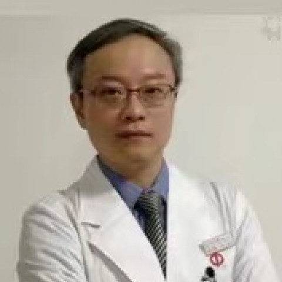

<!-- AUTO-GENERATED-BY: work/generate_obsidian_profiles.py -->

<!-- TEMPLATE: D:\workspace\信息收集整理\医生画像仓库\模板\医生画像模板.md -->

# 郭少雷

## 基础信息

| 字段 | 内容 |
|---|---|
| 姓名 | 郭少雷 |
| 医院 | 中山大学附属第一医院 |
| 科室 | 神经外科 |
| 职称/身份 | 主任医师 |
| 来源链接 | [官网原文](https://www.fahsysu.org.cn/node/641) |
| 采集日期 | 2026-08-13 |

## 简介/擅长

中山大学附属第一医院神经外科工作20余年，擅长脑膜瘤和以听瘤为主的桥小脑脚区肿瘤的外科治疗及神经损伤的综合康复治疗； 主刀或参加各类手术近3000台，取得良好的临床疗效。 社会兼职： 广东省医学教育协会神经外科专业委员会 副主任委员 广东省生物医学工程学会医疗机器人与人工智能分会 常务委员 广东省精准医学应用学会神经肿瘤分会 常务委员 广东省医学会神经肿瘤学分会 委员 广东省抗癌协会神经肿瘤专业委员会 青年委员 论著： 在SCI及国内各级杂志参与发表论文专著近百篇。

## 论文与学术产出

- 社会兼职： 广东省医学教育协会神经外科专业委员会 副主任委员 广东省生物医学工程学会医疗机器人与人工智能分会 常务委员 广东省精准医学应用学会神经肿瘤分会 常务委员 广东省医学会神经肿瘤学分会 委员 广东省抗癌协会神经肿瘤专业委员会 青年委员 论著： 在SCI及国内各级杂志参与发表论文专著近百篇。

## 可包装亮点

- 社会兼职： 广东省医学教育协会神经外科专业委员会 副主任委员 广东省生物医学工程学会医疗机器人与人工智能分会 常务委员 广东省精准医学应用学会神经肿瘤分会 常务委员 广东省医学会神经肿瘤学分会 委员 广东省抗癌协会神经肿瘤专业委员会 青年委员 论著： 在SCI及国内各级杂志参与发表论文专著近百篇。

## 重点疾病/人群标签

- 慢性病：
- 肿瘤：肿瘤、癌、瘤、康复
- 生殖疾病：
- 免疫/风湿：
- 术后恢复/康复：肿瘤、癌、瘤、康复
- 疑难重症：

## 证据摘录

> 只摘录官网公开信息中的短句或关键字段，不复制大段原文。

- 官网身份字段：主任医师
- 官网简介/擅长：中山大学附属第一医院神经外科工作20余年，擅长脑膜瘤和以听瘤为主的桥小脑脚区肿瘤的外科治疗及神经损伤的综合康复治疗； 主刀或参加各类手术近3000台，取得良好的临床疗效。 社会兼职： 广东省医学教育协会神经外科专业委员会 副主任委员 广东省生物医学工程学会医疗机器人与人工智能分会 常务委员 广东省精准医学应用学会神经肿瘤分会 常务委员 广东省医学会神经肿瘤学分会 委员 广东省抗癌协会神经肿瘤专业委员会 青年委员 论著： 在SCI及国内…
- 官网亮眼经历线索：社会兼职： 广东省医学教育协会神经外科专业委员会 副主任委员 广东省生物医学工程学会医疗机器人与人工智能分会 常务委员 广东省精准医学应用学会神经肿瘤分会 常务委员 广东省医学会神经肿瘤学分会 委员 广东省抗癌协会神经肿瘤专业委员会 青年委员 论著： 在SCI及国内各级杂志参与发表论文专著近百篇。
- 来源链接：https://www.fahsysu.org.cn/node/641

## BD 画像摘要

郭少雷医生可作为肿瘤、术后恢复/康复方向的基础画像候选。后续 BD 使用应继续以官网来源和人工复核为准，不添加疗效承诺或无来源包装。

## 合规边界

- 仅使用医院官网、官方公众号、官方小程序等公开渠道。
- 不采集私人电话、私人微信、家庭住址、患者隐私或非公开排班信息。
- 不写“保证治愈”“疗效第一”“包治疑难杂症”等无法由官网证明的表述。
