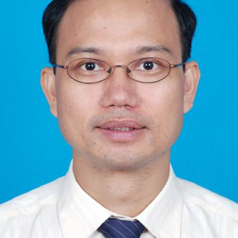

<!-- AUTO-GENERATED-BY: work/generate_obsidian_profiles.py -->

<!-- TEMPLATE: D:\workspace\信息收集整理\医生画像仓库\模板\医生画像模板.md -->

# 郭洁波

## 基础信息

| 字段 | 内容 |
|---|---|
| 姓名 | 郭洁波 |
| 医院 | 中山大学附属第一医院 |
| 科室 | 鼻专科 |
| 职称/身份 | 副主任医师 |
| 来源链接 | [官网原文](https://www.fahsysu.org.cn/node/5692) |
| 采集日期 | 2026-08-13 |

## 简介/擅长

近三十年的医生生涯，长期从事临床工作，做了3~4千例鼻内窥镜手术，具有丰富的临床经验，擅长对耳鼻咽喉炎症性疾病及肿瘤性疾病的诊断及治疗。 炎症性疾病：擅长以微创技术手段治疗鼻窦炎，鼻息肉； 对变应性鼻炎(过敏性鼻炎)的诊治积累了丰富的临床经验，此外，对急慢性咽喉炎，扁桃体炎，声带息肉； 儿童扁桃体及腺样体肥大，儿童分泌性中耳炎； 成人鼾症(OSAHD)等常见疾病的诊疗亦具较深造诣。 肿瘤疾病：擅长对鼻腔鼻窦肿瘤，颅底肿瘤的诊断及鼻内镜微创手术； 对腮腺及颌下腺肿瘤的诊断及手术具有丰富的临床经验，对鼻咽癌的早期诊断，以及其他颈部肿块的诊断及治疗亦有独到的理念。 研究方向：鼻腔鼻窦颅底恶性肿瘤的诊断及治疗 主要教育和工作经历：1988年毕业于中山医科大学临床医学专业，分配在本院耳鼻咽喉科，从事耳鼻咽喉科临床工作，至今已24年。 2003年12月起至今任副主任医师。 前期曾在中山大学肿瘤医院学习进修； 多次参加国际及国内各种学术交流活动。

## 教育与进修经历

- 研究方向：鼻腔鼻窦颅底恶性肿瘤的诊断及治疗 主要教育和工作经历：1988年毕业于中山医科大学临床医学专业，分配在本院耳鼻咽喉科，从事耳鼻咽喉科临床工作，至今已24年。
- 前期曾在中山大学肿瘤医院学习进修；

## 可包装亮点

- 2003年12月起至今任副主任医师。
- 前期曾在中山大学肿瘤医院学习进修；

## 重点疾病/人群标签

- 慢性病：慢性、肿瘤、鼻咽癌
- 肿瘤：慢性、肿瘤、鼻咽癌
- 生殖疾病：
- 免疫/风湿：
- 术后恢复/康复：
- 疑难重症：

## 证据摘录

> 只摘录官网公开信息中的短句或关键字段，不复制大段原文。

- 官网身份字段：副主任医师
- 官网简介/擅长：近三十年的医生生涯，长期从事临床工作，做了3~4千例鼻内窥镜手术，具有丰富的临床经验，擅长对耳鼻咽喉炎症性疾病及肿瘤性疾病的诊断及治疗。 炎症性疾病：擅长以微创技术手段治疗鼻窦炎，鼻息肉； 对变应性鼻炎(过敏性鼻炎)的诊治积累了丰富的临床经验，此外，对急慢性咽喉炎，扁桃体炎，声带息肉； 儿童扁桃体及腺样体肥大，儿童分泌性中耳炎； 成人鼾症(OSAHD)等常见疾病的诊疗亦具较深造诣。 肿瘤疾病：擅长对鼻腔鼻窦肿瘤，颅底肿瘤的诊断及鼻内镜…
- 官网亮眼经历线索：2003年12月起至今任副主任医师。 前期曾在中山大学肿瘤医院学习进修；
- 来源链接：https://www.fahsysu.org.cn/node/5692

## BD 画像摘要

郭洁波医生可作为慢性病、肿瘤方向的基础画像候选。后续 BD 使用应继续以官网来源和人工复核为准，不添加疗效承诺或无来源包装。

## 合规边界

- 仅使用医院官网、官方公众号、官方小程序等公开渠道。
- 不采集私人电话、私人微信、家庭住址、患者隐私或非公开排班信息。
- 不写“保证治愈”“疗效第一”“包治疑难杂症”等无法由官网证明的表述。
