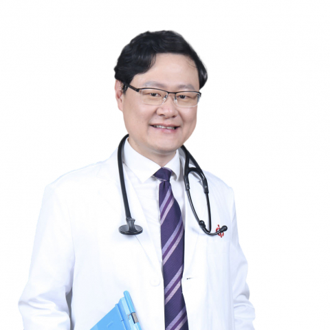

<!-- AUTO-GENERATED-BY: work/generate_obsidian_profiles.py -->

<!-- TEMPLATE: D:\workspace\信息收集整理\医生画像仓库\模板\医生画像模板.md -->

# 郭禹标

## 基础信息

| 字段 | 内容 |
|---|---|
| 姓名 | 郭禹标 |
| 医院 | 中山大学附属第一医院 |
| 科室 | 呼吸与危重症医学科 |
| 职称/身份 | 主任医师/教授 |
| 来源链接 | [官网原文](https://www.fahsysu.org.cn/node/798) |
| 采集日期 | 2026-08-13 |

## 简介/擅长

从事呼吸与危重症医学科临床工作二十余年，对呼吸系统常见病和危急重症有丰富的临床经验，擅长诊治气道炎症性疾病(哮喘/COPD/支扩），肺癌，肺部感染性疾病，特发性肺纤维化、进行性纤维化性间质性肺疾病，肺栓塞和胸膜疾病等，并精通呼吸内科多项高尖技术的临床操作技能。 曾在美国田纳西州范德比尔大学医学中心呼吸与危重症医学科行博士后研究。 其他情况： 全国高等医学院校教材8年制及5年制《内科学》编委，参与并获AMEE- ESME Course临床医师培训资格证书。 主要教育和工作经历： 1996年7月毕业于中山医科大学临床医学系，获得硕士学位； 2001年7月获得中山医科大学临床医学博士学位； 2002年～2003年在美国田纳西州范德比尔大学医学中心及附属圣托马斯医院(Pulmonary & Critical Care Medicine)行博士后研究； 1996年7月至今就职于中山大学附属第一医院，长期致力于内科呼吸系病的临床、教学及科研工作，从事呼吸与危重症医学科临床工作二十余年，对呼吸系统常见病和危急重症有丰富的临床经验。 社会兼职： 现任第五届中国医师协会呼吸病学分会常务委员，第十一届中华医学会呼吸病学分会全国委员兼哮喘学...

## 教育与进修经历

- 曾在美国田纳西州范德比尔大学医学中心呼吸与危重症医学科行博士后研究。
- 其他情况： 全国高等医学院校教材8年制及5年制《内科学》编委，参与并获AMEE- ESME Course临床医师培训资格证书。
- 主要教育和工作经历： 1996年7月毕业于中山医科大学临床医学系，获得硕士学位；
- 2001年7月获得中山医科大学临床医学博士学位；

## 科研项目与成果

- 1996年7月至今就职于中山大学附属第一医院，长期致力于内科呼吸系病的临床、教学及科研工作，从事呼吸与危重症医学科临床工作二十余年，对呼吸系统常见病和危急重症有丰富的临床经验。
- 社会兼职： 现任第五届中国医师协会呼吸病学分会常务委员，第十一届中华医学会呼吸病学分会全国委员兼哮喘学组委员，广东省医学会内科学分会主任委员，广东省医师协会呼吸病学分会副主委，广东省医学会呼吸病学分会常委，吴阶平医学基金会模拟医学部常务委员，《中山大学学报（医学版）》、《Chest》中文版执行编委等职务。
- 其他主要工作成绩（比如获奖情况）： 主持和参加多项国家自然科学基金和省、市级科研课题，发表高影响因子文章三十余篇（lF ＞200）。

## 论文与学术产出

- 其他主要工作成绩（比如获奖情况）： 主持和参加多项国家自然科学基金和省、市级科研课题，发表高影响因子文章三十余篇（lF ＞200）。

## 可包装亮点

- 从事呼吸与危重症医学科临床工作二十余年，对呼吸系统常见病和危急重症有丰富的临床经验，擅长诊治气道炎症性疾病(哮喘/COPD/支扩），肺癌，肺部感染性疾病，特发性肺纤维化、进行性纤维化性间质性肺疾病，肺栓塞和胸膜疾病等，并精通呼吸内科多项高尖技术的临床操作技能。
- 曾在美国田纳西州范德比尔大学医学中心呼吸与危重症医学科行博士后研究。
- 医疗特长： 从事呼吸与危重症医学科临床工作二十余年，对呼吸系统常见病和危急重症有丰富的临床经验，擅长诊治气道炎症性疾病(哮喘/COPD/支扩），肺癌，肺部感染性疾病，特发性肺纤维化、进行性纤维化性间质性肺疾病，肺栓塞和胸膜疾病等，并精通呼吸内科多项高尖技术的临床操作技能。

## 重点疾病/人群标签

- 慢性病：
- 肿瘤：肺癌、感染、危重、重症
- 生殖疾病：
- 免疫/风湿：肺癌、感染、危重、重症
- 术后恢复/康复：
- 疑难重症：肺癌、感染、危重、重症

## 证据摘录

> 只摘录官网公开信息中的短句或关键字段，不复制大段原文。

- 官网身份字段：主任医师/教授
- 官网简介/擅长：从事呼吸与危重症医学科临床工作二十余年，对呼吸系统常见病和危急重症有丰富的临床经验，擅长诊治气道炎症性疾病(哮喘/COPD/支扩），肺癌，肺部感染性疾病，特发性肺纤维化、进行性纤维化性间质性肺疾病，肺栓塞和胸膜疾病等，并精通呼吸内科多项高尖技术的临床操作技能。 曾在美国田纳西州范德比尔大学医学中心呼吸与危重症医学科行博士后研究。 其他情况： 全国高等医学院校教材8年制及5年制《内科学》编委，参与并获AMEE- ESME Course临…
- 官网亮眼经历线索：从事呼吸与危重症医学科临床工作二十余年，对呼吸系统常见病和危急重症有丰富的临床经验，擅长诊治气道炎症性疾病(哮喘/COPD/支扩），肺癌，肺部感染性疾病，特发性肺纤维化、进行性纤维化性间质性肺疾病，肺栓塞和胸膜疾病等，并精通呼吸内科多项高尖技术的临床操作技能。 曾在美国田纳西州范德比尔大学医学中心呼吸与危重症医学科行博士后研究。 医疗特长： 从事呼吸与危重症医学科临床工作二十余年，对呼吸系统常见病和危急重症有丰富的临床经验，擅长诊治气…
- 来源链接：https://www.fahsysu.org.cn/node/798

## BD 画像摘要

郭禹标医生可作为肿瘤、免疫/风湿/感染、疑难重症方向的基础画像候选。后续 BD 使用应继续以官网来源和人工复核为准，不添加疗效承诺或无来源包装。

## 合规边界

- 仅使用医院官网、官方公众号、官方小程序等公开渠道。
- 不采集私人电话、私人微信、家庭住址、患者隐私或非公开排班信息。
- 不写“保证治愈”“疗效第一”“包治疑难杂症”等无法由官网证明的表述。
