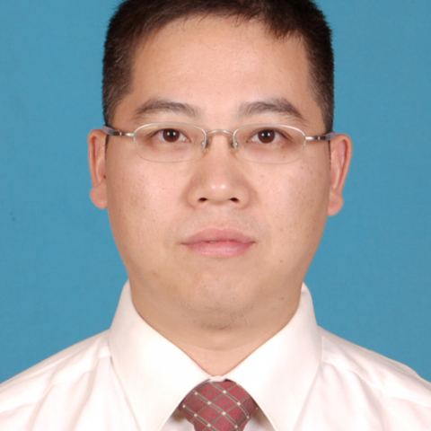

<!-- AUTO-GENERATED-BY: work/generate_obsidian_profiles.py -->

<!-- TEMPLATE: D:\workspace\信息收集整理\医生画像仓库\模板\医生画像模板.md -->

# 金华伟

## 基础信息

| 字段 | 内容 |
|---|---|
| 姓名 | 金华伟 |
| 医院 | 中山大学附属第一医院 |
| 科室 | 神经外科 |
| 职称/身份 | 副主任医师 |
| 来源链接 | [官网原文](https://www.fahsysu.org.cn/node/642) |
| 采集日期 | 2026-08-13 |

## 简介/擅长

对各种脑肿瘤和脊髓肿瘤、颅脑外伤、脑积水等神经外科常见病和多发病有丰富的诊治经验，特别擅长胶质瘤、各种类型的脑膜瘤和听神经瘤的显微手术治疗，以及颅脑外伤和脑出血疾病的外科手术治疗。 研究方向：脑肿瘤和脊髓肿瘤的基础和临床研究，颅脑外伤的基础和临床研究。 主要教育和工作经历： 1989.9-1996.7 中山医科大学临床医学七年制学习 1996.7 -1999.12 中山医科大学附属第一医院神经外科住院医生 1999.12-2008.12 中山大学附属第一医院神经外科主治医生 2003.6 获外科学临床医学博士学位 2008.12-至今 中山大学附属第一医院神经外科副主任医生 社会兼职：无 论著： 1. 金华伟 ,黄权,余振华,等.D型连头婴头颅缺损一期重建相关问题探讨. 中华显微外科杂志. 2002,25(2):92-94. 2. 金华伟 ,黄正松,吴新建,等听神经瘤显微手术保留听神经功能及影响因素分析.中国神经精神疾病杂志.2002,28(5)345-347. 3. 金华伟, 王晓丹,余振华,等.听神经瘤显微手术治疗和面听神经功能保护的探讨.中华显微外科杂志.2005,28(4)：320-321. 4. 金华伟, 余...

## 教育与进修经历

- 主要教育和工作经历： 1989.9-1996.7 中山医科大学临床医学七年制学习 1996.7 -1999.12 中山医科大学附属第一医院神经外科住院医生 1999.12-2008.12 中山大学附属第一医院神经外科主治医生 2003.6 获外科学临床医学博士学位 2008.12-至今 中山大学附属第一医院神经外科副主任医生 社会兼职：无 论著： 1. 金华伟 ,黄权,余振华,等.D型连头婴头颅缺损一期重建相关问题探讨. 中华显微外科杂志. 2002,25(2):92-94. 2. 金华伟 ,黄正松,吴新建,等听…

## 可包装亮点

- 对各种脑肿瘤和脊髓肿瘤、颅脑外伤、脑积水等神经外科常见病和多发病有丰富的诊治经验，特别擅长胶质瘤、各种类型的脑膜瘤和听神经瘤的显微手术治疗，以及颅脑外伤和脑出血疾病的外科手术治疗。
- 研究方向：脑肿瘤和脊髓肿瘤的基础和临床研究，颅脑外伤的基础和临床研究。
- 主要教育和工作经历： 1989.9-1996.7 中山医科大学临床医学七年制学习 1996.7 -1999.12 中山医科大学附属第一医院神经外科住院医生 1999.12-2008.12 中山大学附属第一医院神经外科主治医生 2003.6 获外科学临床医学博士学位 2008.12-至今 中山大学附属第一医院神经外科副主任医生 社会兼职：无 论著： 1. 金…

## 重点疾病/人群标签

- 慢性病：
- 肿瘤：肿瘤、瘤
- 生殖疾病：
- 免疫/风湿：
- 术后恢复/康复：
- 疑难重症：

## 证据摘录

> 只摘录官网公开信息中的短句或关键字段，不复制大段原文。

- 官网身份字段：副主任医师
- 官网简介/擅长：对各种脑肿瘤和脊髓肿瘤、颅脑外伤、脑积水等神经外科常见病和多发病有丰富的诊治经验，特别擅长胶质瘤、各种类型的脑膜瘤和听神经瘤的显微手术治疗，以及颅脑外伤和脑出血疾病的外科手术治疗。 研究方向：脑肿瘤和脊髓肿瘤的基础和临床研究，颅脑外伤的基础和临床研究。 主要教育和工作经历： 1989.9-1996.7 中山医科大学临床医学七年制学习 1996.7 -1999.12 中山医科大学附属第一医院神经外科住院医生 1999.12-2008.1…
- 来源链接：https://www.fahsysu.org.cn/node/642

## BD 画像摘要

金华伟医生可作为肿瘤方向的基础画像候选。后续 BD 使用应继续以官网来源和人工复核为准，不添加疗效承诺或无来源包装。

## 合规边界

- 仅使用医院官网、官方公众号、官方小程序等公开渠道。
- 不采集私人电话、私人微信、家庭住址、患者隐私或非公开排班信息。
- 不写“保证治愈”“疗效第一”“包治疑难杂症”等无法由官网证明的表述。
