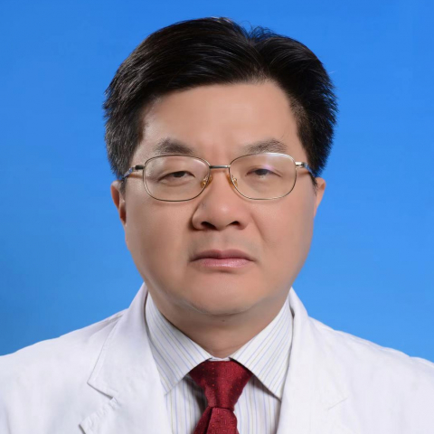

<!-- AUTO-GENERATED-BY: work/generate_obsidian_profiles.py -->

<!-- TEMPLATE: D:\workspace\信息收集整理\医生画像仓库\模板\医生画像模板.md -->

# 钟依平

## 基础信息

| 字段 | 内容 |
|---|---|
| 姓名 | 钟依平 |
| 医院 | 中山大学附属第一医院 |
| 科室 | 生殖医学中心 |
| 职称/身份 | 主任医师 |
| 来源链接 | [官网原文](https://www.fahsysu.org.cn/node/604) |
| 采集日期 | 2026-08-13 |

## 简介/擅长

体外受精与胚胎移植，宫腔内人工授精，女性不孕症诊治、生殖内分泌、生殖免疫、自身免疫抗体异常。 在不孕不育的诊治领域有丰富的临床经验。 尤其擅长:体外受精与胚胎移植、反复胚胎移植失败及疑难复杂患者的诊治,并研究改善治疗方案，提高“试管婴儿”的妊娠率。 研究方向：研究总结女性自身免疫异常、输卵管病变、生殖内分泌激素变化及促超排卵方案对体外受精与胚胎移植的影响，并研究改善治疗方案，提高“试管婴儿”的妊娠率。 主要教育和工作经历： 1987年中山医科大学本科毕业，2001年中山医科大学研究生毕业。 2002年开始在中山大学附属第一医院生殖医学中心出教授门诊至今。 20多年以来，长期从事生殖医学(人类辅助生殖技术)的临床、科研和教学工作。 在女性不孕症诊治、人类辅助生殖技术、生殖内分泌、生殖免疫及不孕不育领域有丰富的临床经验。 主持过多项基金项目。 《American Journal of Reproductive Immunology》及中山大学学报(医学版) 等杂志审校人。 广东省人类辅助生殖技术管理专家成员。 社会兼职： 国家妇幼健康研究会生殖免疫学专业委员会 常委， 广东省医疗行业协会 生殖医学管理委员会 副主任委员， ...

## 教育与进修经历

- 主要教育和工作经历： 1987年中山医科大学本科毕业，2001年中山医科大学研究生毕业。

## 科研项目与成果

- 20多年以来，长期从事生殖医学(人类辅助生殖技术)的临床、科研和教学工作。
- 主持过多项基金项目。

## 论文与学术产出

- 论著：在国内、外期刊发表论文50多篇，其中SCi论文20篇。

## 可包装亮点

- 尤其擅长:体外受精与胚胎移植、反复胚胎移植失败及疑难复杂患者的诊治,并研究改善治疗方案，提高“试管婴儿”的妊娠率。
- 社会兼职： 国家妇幼健康研究会生殖免疫学专业委员会 常委， 广东省医疗行业协会 生殖医学管理委员会 副主任委员， 广东省保健协会 生殖健康分会 副主任委员， 广东省医学会 生殖免疫与优生学分会 第二届委员会常委， 广东省免疫学会 生殖免疫学专业委员会 常委。
- 论著：在国内、外期刊发表论文50多篇，其中SCi论文20篇。

## 重点疾病/人群标签

- 慢性病：
- 肿瘤：
- 生殖疾病：生殖、不孕、辅助生殖、试管、胚胎、免疫、疑难、复杂
- 免疫/风湿：生殖、不孕、辅助生殖、试管、胚胎、免疫、疑难、复杂
- 术后恢复/康复：
- 疑难重症：生殖、不孕、辅助生殖、试管、胚胎、免疫、疑难、复杂

## 证据摘录

> 只摘录官网公开信息中的短句或关键字段，不复制大段原文。

- 官网身份字段：主任医师
- 官网简介/擅长：体外受精与胚胎移植，宫腔内人工授精，女性不孕症诊治、生殖内分泌、生殖免疫、自身免疫抗体异常。 在不孕不育的诊治领域有丰富的临床经验。 尤其擅长:体外受精与胚胎移植、反复胚胎移植失败及疑难复杂患者的诊治,并研究改善治疗方案，提高“试管婴儿”的妊娠率。 研究方向：研究总结女性自身免疫异常、输卵管病变、生殖内分泌激素变化及促超排卵方案对体外受精与胚胎移植的影响，并研究改善治疗方案，提高“试管婴儿”的妊娠率。 主要教育和工作经历： 1987年…
- 官网亮眼经历线索：尤其擅长:体外受精与胚胎移植、反复胚胎移植失败及疑难复杂患者的诊治,并研究改善治疗方案，提高“试管婴儿”的妊娠率。 尤其擅长:体外受精与胚胎移植、反复胚胎移植失败及疑难复杂患者的诊治,并研究改善治疗方案，提高“试管婴儿”的妊娠率。 社会兼职： 国家妇幼健康研究会生殖免疫学专业委员会 常委， 广东省医疗行业协会 生殖医学管理委员会 副主任委员， 广东省保健协会 生殖健康分会 副主任委员， 广东省医学会 生殖免疫与优生学分会 第二届委员会…
- 来源链接：https://www.fahsysu.org.cn/node/604

## BD 画像摘要

钟依平医生可作为生殖疾病、免疫/风湿/感染、疑难重症方向的基础画像候选。后续 BD 使用应继续以官网来源和人工复核为准，不添加疗效承诺或无来源包装。

## 合规边界

- 仅使用医院官网、官方公众号、官方小程序等公开渠道。
- 不采集私人电话、私人微信、家庭住址、患者隐私或非公开排班信息。
- 不写“保证治愈”“疗效第一”“包治疑难杂症”等无法由官网证明的表述。
