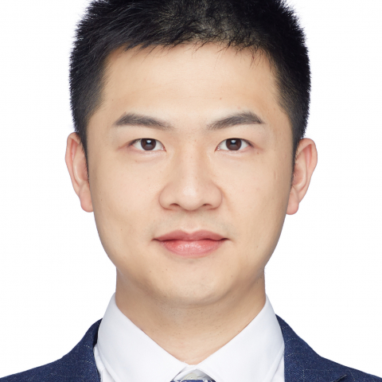

<!-- AUTO-GENERATED-BY: work/generate_obsidian_profiles.py -->

<!-- TEMPLATE: D:\workspace\信息收集整理\医生画像仓库\模板\医生画像模板.md -->

# 钟华

## 基础信息

| 字段 | 内容 |
|---|---|
| 姓名 | 钟华 |
| 医院 | 中山大学附属第一医院 |
| 科室 | 鼻专科 |
| 职称/身份 | 副主任医师 |
| 来源链接 | [官网原文](https://www.fahsysu.org.cn/node/33070) |
| 采集日期 | 2026-08-13 |

## 简介/擅长

专注并擅长于嗅觉功能障碍相关性疾病的诊治：如慢性鼻窦炎（伴或不伴鼻息肉）的药物/手术/生物靶向（单克隆抗体）治疗、难治性鼻窦炎鼻息肉（合并哮喘、多发过敏、气道高反应等）、真菌性鼻窦炎以及变应性鼻炎（药物、脱敏免疫治疗和生物靶向治疗）的精准诊治。 对鼻部良恶性肿瘤（鼻血管瘤/鼻咽纤维血管瘤/乳头状瘤/骨化纤维瘤/鳞癌/腺样囊性癌/嗅神经母细胞瘤等）、鼻眼/鼻颅底相关疾病进行规范综合治疗。 耳鼻咽喉科日间手术绿色通道：为耳鼻咽喉科日间病种，如小儿鼾症（腺样体肥大/扁桃体肥大）、声带息肉/囊肿，咽喉乳头状瘤，头颈颌面小肿物切除、鼻前庭囊肿/肿物、鼻窦炎鼻息肉、真菌性鼻窦炎、鼻腔鼻窦良性肿瘤、鼻中隔偏曲、下鼻甲粘膜下消融等合适患者提供便捷手术安排通道，如有手术需求可来门诊加号。 临床试验患者招募，诚邀参加： PREDICT：一项描述中国慢性鼻窦炎伴鼻息肉患者鼻内镜术后的临床结局与生活质量的前瞻性、多中心的真实世界研究； 评价REFLEX ULTRA 45在中国用于低温等离子下鼻甲减容术治疗的安全性和有效性的前瞻性、多中心、上市后临床研究； 司普奇拜单抗注射液治疗常年性过敏性鼻炎伴哮喘的临床研究； 研究方向：嗅觉障碍的发病机制和...

## 教育与进修经历

- 国家公派留学博士生联合培养奖学金获得者，曾在比利时根特大学医院上气道实验室访学一年，主要从事鼻粘膜炎症性疾病和嗅觉障碍的基础和临床研究工作。

## 科研项目与成果

- 社会兼职： 中国医师协会耳鼻咽喉头颈外科医师分会青年学组 委员 广东省医学会耳鼻咽喉头颈外科学分会鼻科学组 秘书 广东省健康管理学会耳鼻咽喉头颈外科学专业委员会 委员 广东省精准医学应用学会过敏疾病分会 委员 科研情况： 中山大学硕士研究生导师，比利时根特大学医院上气道实验室联合培养博士，中山大学附属第一医院优秀菁英人才。
- 国家公派留学博士生联合培养奖学金获得者，曾在比利时根特大学医院上气道实验室访学一年，主要从事鼻粘膜炎症性疾病和嗅觉障碍的基础和临床研究工作。

## 可包装亮点

- 专注并擅长于嗅觉功能障碍相关性疾病的诊治：如慢性鼻窦炎（伴或不伴鼻息肉）的药物/手术/生物靶向（单克隆抗体）治疗、难治性鼻窦炎鼻息肉（合并哮喘、多发过敏、气道高反应等）、真菌性鼻窦炎以及变应性鼻炎（药物、脱敏免疫治疗和生物靶向治疗）的精准诊治。
- 医疗特长： 专注并擅长于嗅觉功能障碍相关性疾病的诊治：如慢性鼻窦炎（伴或不伴鼻息肉）的药物/手术/生物靶向（单克隆抗体）治疗、难治性鼻窦炎鼻息肉（合并哮喘、多发过敏、气道高反应等）、真菌性鼻窦炎以及变应性鼻炎（药物、脱敏免疫治疗和生物靶向治疗）的精准诊治。
- 难治性鼻窦炎/鼻息肉（伴哮喘、多发过敏、气道高反应等）的精准诊治和规范治疗；
- 2023至今，中山大学附属第一医院，耳鼻咽喉科，副主任医师。

## 重点疾病/人群标签

- 慢性病：慢性、肿瘤、癌、瘤、靶向、免疫、感染、术后、功能障碍、难治
- 肿瘤：慢性、肿瘤、癌、瘤、靶向、免疫、感染、术后、功能障碍、难治
- 生殖疾病：
- 免疫/风湿：慢性、肿瘤、癌、瘤、靶向、免疫、感染、术后、功能障碍、难治
- 术后恢复/康复：慢性、肿瘤、癌、瘤、靶向、免疫、感染、术后、功能障碍、难治
- 疑难重症：慢性、肿瘤、癌、瘤、靶向、免疫、感染、术后、功能障碍、难治

## 证据摘录

> 只摘录官网公开信息中的短句或关键字段，不复制大段原文。

- 官网身份字段：副主任医师
- 官网简介/擅长：专注并擅长于嗅觉功能障碍相关性疾病的诊治：如慢性鼻窦炎（伴或不伴鼻息肉）的药物/手术/生物靶向（单克隆抗体）治疗、难治性鼻窦炎鼻息肉（合并哮喘、多发过敏、气道高反应等）、真菌性鼻窦炎以及变应性鼻炎（药物、脱敏免疫治疗和生物靶向治疗）的精准诊治。 对鼻部良恶性肿瘤（鼻血管瘤/鼻咽纤维血管瘤/乳头状瘤/骨化纤维瘤/鳞癌/腺样囊性癌/嗅神经母细胞瘤等）、鼻眼/鼻颅底相关疾病进行规范综合治疗。 耳鼻咽喉科日间手术绿色通道：为耳鼻咽喉科日间病种…
- 官网亮眼经历线索：专注并擅长于嗅觉功能障碍相关性疾病的诊治：如慢性鼻窦炎（伴或不伴鼻息肉）的药物/手术/生物靶向（单克隆抗体）治疗、难治性鼻窦炎鼻息肉（合并哮喘、多发过敏、气道高反应等）、真菌性鼻窦炎以及变应性鼻炎（药物、脱敏免疫治疗和生物靶向治疗）的精准诊治。 医疗特长： 专注并擅长于嗅觉功能障碍相关性疾病的诊治：如慢性鼻窦炎（伴或不伴鼻息肉）的药物/手术/生物靶向（单克隆抗体）治疗、难治性鼻窦炎鼻息肉（合并哮喘、多发过敏、气道高反应等）、真菌性鼻窦…
- 来源链接：https://www.fahsysu.org.cn/node/33070

## BD 画像摘要

钟华医生可作为慢性病、肿瘤、免疫/风湿/感染、术后恢复/康复、疑难重症方向的基础画像候选。后续 BD 使用应继续以官网来源和人工复核为准，不添加疗效承诺或无来源包装。

## 合规边界

- 仅使用医院官网、官方公众号、官方小程序等公开渠道。
- 不采集私人电话、私人微信、家庭住址、患者隐私或非公开排班信息。
- 不写“保证治愈”“疗效第一”“包治疑难杂症”等无法由官网证明的表述。
