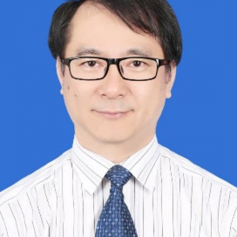

<!-- AUTO-GENERATED-BY: work/generate_obsidian_profiles.py -->

<!-- TEMPLATE: D:\workspace\信息收集整理\医生画像仓库\模板\医生画像模板.md -->

# 陈创奇

## 基础信息

| 字段 | 内容 |
|---|---|
| 姓名 | 陈创奇 |
| 医院 | 中山大学附属第一医院 |
| 科室 | 胃肠外科二科 |
| 职称/身份 | 主任医师 |
| 来源链接 | [官网原文](https://www.fahsysu.org.cn/node/745) |
| 采集日期 | 2026-08-13 |

## 简介/擅长

长期从事胃肠外科和结直肠外科临床工作。 擅长胃癌、胰腺肿瘤、结直肠肿瘤以及胃肠间质瘤的规范化手术治疗与综合治疗，推广促进术后病人的快速康复（ERAS），尤其是擅长腹腔镜/机器人胃癌根治术和结直肠癌根治术、胰十二指肠切除术； 擅长腹外疝（切口疝和腹股沟疝）、肠梗阻、消化道大出血的诊治； 擅长炎性肠病（克罗恩病和溃疡性结肠炎）并发症的外科诊治； 擅长胃肠外科手术并发症的诊治； 擅长肛瘘和痔疮的诊治。 研究方向： 1．胃肠道肿瘤的诊断及外科治疗，尤其胃癌、结直肠癌规范化外科治疗 2．胃肠间质瘤的诊断，手术治疗和辅助治疗 3．加速康复外科理念的推广和应用研究 4．腹外疝的诊治 5．急腹症的诊治 6. 肛瘘和痔疮的诊治 主要教育和工作经历： 1987.09-1993.06中山医科大学临床医疗系87级本科学习 1997.09-1999.09中山医科大学附属第一医院外科学97级硕士 1999.09-2002.06中山大学，附属第一医院外科学99级博士 2002.09-2005.04美国宾夕法尼亚大学医学院从事博士后研究 2009.01-2009.02瑞典林雪萍大学医院进修学习胃肠胰外科 1993.07-1999.12中山医科大学附属...

## 教育与进修经历

- 研究方向： 1．胃肠道肿瘤的诊断及外科治疗，尤其胃癌、结直肠癌规范化外科治疗 2．胃肠间质瘤的诊断，手术治疗和辅助治疗 3．加速康复外科理念的推广和应用研究 4．腹外疝的诊治 5．急腹症的诊治 6. 肛瘘和痔疮的诊治 主要教育和工作经历： 1987.09-1993.06中山医科大学临床医疗系87级本科学习 1997.09-1999.09中山医科大学附属第一医院外科学97级硕士 1999.09-2002.06中山大学，附属第一医院外科学99级博士 2002.09-2005.04美国宾夕法尼亚大学医学院从事博士后研究…

## 论文与学术产出

- 论著： 在省级以上杂志发表过第一作者或通讯作者的论文68篇，其中发表SCI论文9篇。

## 可包装亮点

- 研究方向： 1．胃肠道肿瘤的诊断及外科治疗，尤其胃癌、结直肠癌规范化外科治疗 2．胃肠间质瘤的诊断，手术治疗和辅助治疗 3．加速康复外科理念的推广和应用研究 4．腹外疝的诊治 5．急腹症的诊治 6. 肛瘘和痔疮的诊治 主要教育和工作经历： 1987.09-1993.06中山医科大学临床医疗系87级本科学习 1997.09-1999.09中山医科大学附属第一…

## 重点疾病/人群标签

- 慢性病：
- 肿瘤：肿瘤、癌、瘤、胃癌、肠癌、术后、康复
- 生殖疾病：
- 免疫/风湿：
- 术后恢复/康复：肿瘤、癌、瘤、胃癌、肠癌、术后、康复
- 疑难重症：

## 证据摘录

> 只摘录官网公开信息中的短句或关键字段，不复制大段原文。

- 官网身份字段：主任医师
- 官网简介/擅长：长期从事胃肠外科和结直肠外科临床工作。 擅长胃癌、胰腺肿瘤、结直肠肿瘤以及胃肠间质瘤的规范化手术治疗与综合治疗，推广促进术后病人的快速康复（ERAS），尤其是擅长腹腔镜/机器人胃癌根治术和结直肠癌根治术、胰十二指肠切除术； 擅长腹外疝（切口疝和腹股沟疝）、肠梗阻、消化道大出血的诊治； 擅长炎性肠病（克罗恩病和溃疡性结肠炎）并发症的外科诊治； 擅长胃肠外科手术并发症的诊治； 擅长肛瘘和痔疮的诊治。 研究方向： 1．胃肠道肿瘤的诊断及外科…
- 官网亮眼经历线索：研究方向： 1．胃肠道肿瘤的诊断及外科治疗，尤其胃癌、结直肠癌规范化外科治疗 2．胃肠间质瘤的诊断，手术治疗和辅助治疗 3．加速康复外科理念的推广和应用研究 4．腹外疝的诊治 5．急腹症的诊治 6. 肛瘘和痔疮的诊治 主要教育和工作经历： 1987.09-1993.06中山医科大学临床医疗系87级本科学习 1997.09-1999.09中山医科大学附属第一医院外科学97级硕士 1999.09-2002.06中山大学，附属第一医院外科学…
- 来源链接：https://www.fahsysu.org.cn/node/745

## BD 画像摘要

陈创奇医生可作为肿瘤、术后恢复/康复方向的基础画像候选。后续 BD 使用应继续以官网来源和人工复核为准，不添加疗效承诺或无来源包装。

## 合规边界

- 仅使用医院官网、官方公众号、官方小程序等公开渠道。
- 不采集私人电话、私人微信、家庭住址、患者隐私或非公开排班信息。
- 不写“保证治愈”“疗效第一”“包治疑难杂症”等无法由官网证明的表述。
