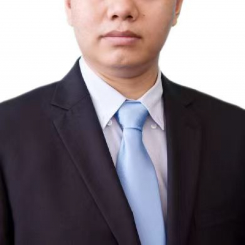

<!-- AUTO-GENERATED-BY: work/generate_obsidian_profiles.py -->

<!-- TEMPLATE: D:\workspace\信息收集整理\医生画像仓库\模板\医生画像模板.md -->

# 陈剑辉

## 基础信息

| 字段 | 内容 |
|---|---|
| 姓名 | 陈剑辉 |
| 医院 | 中山大学附属第一医院 |
| 科室 | 胃肠外科一科 |
| 职称/身份 | 主任医师 |
| 来源链接 | [官网原文](https://www.fahsysu.org.cn/node/750) |
| 采集日期 | 2026-08-13 |

## 简介/擅长

长期深耕胃肠外科临床领域，对胃癌、结直肠癌、胃肠间质瘤、炎症性肠病和肛门良性疾病（肛瘘、痔疮）的规范化诊疗有深入的研究和丰富的治疗经验，擅长腹腔镜下胃癌、结直肠癌手术，直肠癌保功能根治术及低位直肠癌保肛经验丰富。 熟练运用腹腔镜与消化道内镜技术，为患者提供微创、快速康复的诊疗服务。 秉持快速康复外科与微创外科理念，促进患者早日康复，同时注重家庭营养治疗及综合生态免疫营养的应用，全方位守护患者健康。 任国际胃癌协会(IGCA)会员、中国抗癌协会胃癌专业委员会ERAS学组委员，中国医师协会结直肠肿瘤专委会单孔腹腔镜学组委员、广东省医学会胃肠外科分会青委会副主委，广东省医师协会ERAS青委会副组长，广东省医学会消化道肿瘤学青委会副主委，广东省生物工程学会加速康复外科分会副主委，广东省基层医药学会胃肠疾病专业委员会副主任委员，广东省医学会胃肠外科分会委员兼秘书，广东省医学会加速康复外科分会委员，广东省医师协会加速康复外科分会委员，Dana-Farber Cancer Institute访问学者，Brigham and Women's Hospital访问学者。 以第一或通讯作者在在Cancer communications、C...

## 教育与进修经历

- 任国际胃癌协会(IGCA)会员、中国抗癌协会胃癌专业委员会ERAS学组委员，中国医师协会结直肠肿瘤专委会单孔腹腔镜学组委员、广东省医学会胃肠外科分会青委会副主委，广东省医师协会ERAS青委会副组长，广东省医学会消化道肿瘤学青委会副主委，广东省生物工程学会加速康复外科分会副主委，广东省基层医药学会胃肠疾病专业委员会副主任委员，广东省医学会胃肠外科分会委员兼秘书，广东省医学会加速康复外科分会委员，广东省医师协会加速康复外科分会委员，Dana-Farber Cancer Institute访问学者，Brigham an…

## 科研项目与成果

- 以第一或通讯作者在在Cancer communications、Cancer Research、JECCR、Cancer Letter、Cell Death Dis、IJC等杂志发表SCI 32篇，主持国家及省市基金10项。

## 论文与学术产出

- 以第一或通讯作者在在Cancer communications、Cancer Research、JECCR、Cancer Letter、Cell Death Dis、IJC等杂志发表SCI 32篇，主持国家及省市基金10项。

## 可包装亮点

- 任国际胃癌协会(IGCA)会员、中国抗癌协会胃癌专业委员会ERAS学组委员，中国医师协会结直肠肿瘤专委会单孔腹腔镜学组委员、广东省医学会胃肠外科分会青委会副主委，广东省医师协会ERAS青委会副组长，广东省医学会消化道肿瘤学青委会副主委，广东省生物工程学会加速康复外科分会副主委，广东省基层医药学会胃肠疾病专业委员会副主任委员，广东省医学会胃肠外科分会委员兼秘…
- 以第一或通讯作者在在Cancer communications、Cancer Research、JECCR、Cancer Letter、Cell Death Dis、IJC等杂志发表SCI 32篇，主持国家及省市基金10项。

## 重点疾病/人群标签

- 慢性病：
- 肿瘤：肿瘤、癌、瘤、胃癌、肠癌、免疫、康复、营养
- 生殖疾病：
- 免疫/风湿：肿瘤、癌、瘤、胃癌、肠癌、免疫、康复、营养
- 术后恢复/康复：肿瘤、癌、瘤、胃癌、肠癌、免疫、康复、营养
- 疑难重症：

## 证据摘录

> 只摘录官网公开信息中的短句或关键字段，不复制大段原文。

- 官网身份字段：主任医师
- 官网简介/擅长：长期深耕胃肠外科临床领域，对胃癌、结直肠癌、胃肠间质瘤、炎症性肠病和肛门良性疾病（肛瘘、痔疮）的规范化诊疗有深入的研究和丰富的治疗经验，擅长腹腔镜下胃癌、结直肠癌手术，直肠癌保功能根治术及低位直肠癌保肛经验丰富。 熟练运用腹腔镜与消化道内镜技术，为患者提供微创、快速康复的诊疗服务。 秉持快速康复外科与微创外科理念，促进患者早日康复，同时注重家庭营养治疗及综合生态免疫营养的应用，全方位守护患者健康。 任国际胃癌协会(IGCA)会员、中国…
- 官网亮眼经历线索：任国际胃癌协会(IGCA)会员、中国抗癌协会胃癌专业委员会ERAS学组委员，中国医师协会结直肠肿瘤专委会单孔腹腔镜学组委员、广东省医学会胃肠外科分会青委会副主委，广东省医师协会ERAS青委会副组长，广东省医学会消化道肿瘤学青委会副主委，广东省生物工程学会加速康复外科分会副主委，广东省基层医药学会胃肠疾病专业委员会副主任委员，广东省医学会胃肠外科分会委员兼秘书，广东省医学会加速康复外科分会委员，广东省医师协会加速康复外科分会委员，Dan…
- 来源链接：https://www.fahsysu.org.cn/node/750

## BD 画像摘要

陈剑辉医生可作为肿瘤、免疫/风湿/感染、术后恢复/康复方向的基础画像候选。后续 BD 使用应继续以官网来源和人工复核为准，不添加疗效承诺或无来源包装。

## 合规边界

- 仅使用医院官网、官方公众号、官方小程序等公开渠道。
- 不采集私人电话、私人微信、家庭住址、患者隐私或非公开排班信息。
- 不写“保证治愈”“疗效第一”“包治疑难杂症”等无法由官网证明的表述。
