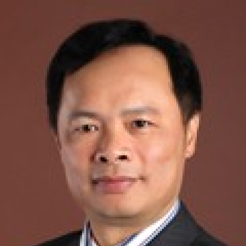

<!-- AUTO-GENERATED-BY: work/generate_obsidian_profiles.py -->

<!-- TEMPLATE: D:\workspace\信息收集整理\医生画像仓库\模板\医生画像模板.md -->

# 陈勇

## 基础信息

| 字段 | 内容 |
|---|---|
| 姓名 | 陈勇 |
| 医院 | 中山大学附属第一医院 |
| 科室 | 放射治疗科 |
| 职称/身份 | 主任医师 |
| 来源链接 | [官网原文](https://www.fahsysu.org.cn/node/5837) |
| 采集日期 | 2026-08-13 |

## 简介/擅长

1987年毕业于中山医科大学，于中山大学肿瘤防治中心从事肿瘤放疗领域近三十年，是资深临床放射治疗学专家。 擅长头颈部肿瘤（包括鼻咽癌、喉癌、下咽癌等）以及前列腺癌等多种恶性肿瘤的诊断、化学治疗和放射治疗为主的肿瘤综合治疗。 研究方向： 头颈部肿瘤（包括鼻咽癌、喉癌、下咽癌等）以及前列腺癌等多种恶性肿瘤的放化综合治疗。 主要教育和工作经历： 教育经历: 1. 1981/09 - 1987/07，中山医科大学（临床医学），学士 2. 1994/09 - 1997/12，中山医科大学（肿瘤学），硕士 工作经历: 1. 1987/07-1994/11，中山大学肿瘤防治中心/放疗科，住院医师 2. 1994/11-2002/1，中山大学肿瘤防治中心/放疗科，主治医师 3. 2002/01-2014/12，中山大学肿瘤防治中心/放疗科，副主任医师，兼任放疗门诊区长 4. 2014/12-2017/05，中山大学肿瘤防治中心/放疗科，主任医师，兼任放疗门诊区长 5.2017/05-至今，中山大学附属第一医院/放射治疗科，主任医师、科室主任 社会兼职： 广东省医师协会放射治疗医师分会常委 论著（SCI，第一作者/通信作者）： (1) ...

## 教育与进修经历

- 1987年毕业于中山医科大学，于中山大学肿瘤防治中心从事肿瘤放疗领域近三十年，是资深临床放射治疗学专家。
- 医疗特长： 1987年毕业于中山医科大学，于中山大学肿瘤防治中心从事肿瘤放疗领域近三十年，是资深临床放射治疗学专家。

## 可包装亮点

- 主要教育和工作经历： 教育经历: 1. 1981/09 - 1987/07，中山医科大学（临床医学），学士 2. 1994/09 - 1997/12，中山医科大学（肿瘤学），硕士 工作经历: 1. 1987/07-1994/11，中山大学肿瘤防治中心/放疗科，住院医师 2. 1994/11-2002/1，中山大学肿瘤防治中心/放疗科，主治医师 3. 200…

## 重点疾病/人群标签

- 慢性病：
- 肿瘤：肿瘤、癌、放疗、鼻咽癌
- 生殖疾病：
- 免疫/风湿：
- 术后恢复/康复：
- 疑难重症：

## 证据摘录

> 只摘录官网公开信息中的短句或关键字段，不复制大段原文。

- 官网身份字段：主任医师
- 官网简介/擅长：1987年毕业于中山医科大学，于中山大学肿瘤防治中心从事肿瘤放疗领域近三十年，是资深临床放射治疗学专家。 擅长头颈部肿瘤（包括鼻咽癌、喉癌、下咽癌等）以及前列腺癌等多种恶性肿瘤的诊断、化学治疗和放射治疗为主的肿瘤综合治疗。 研究方向： 头颈部肿瘤（包括鼻咽癌、喉癌、下咽癌等）以及前列腺癌等多种恶性肿瘤的放化综合治疗。 主要教育和工作经历： 教育经历: 1. 1981/09 - 1987/07，中山医科大学（临床医学），学士 2. 19…
- 官网亮眼经历线索：主要教育和工作经历： 教育经历: 1. 1981/09 - 1987/07，中山医科大学（临床医学），学士 2. 1994/09 - 1997/12，中山医科大学（肿瘤学），硕士 工作经历: 1. 1987/07-1994/11，中山大学肿瘤防治中心/放疗科，住院医师 2. 1994/11-2002/1，中山大学肿瘤防治中心/放疗科，主治医师 3. 2002/01-2014/12，中山大学肿瘤防治中心/放疗科，副主任医师，兼任放疗门诊…
- 来源链接：https://www.fahsysu.org.cn/node/5837

## BD 画像摘要

陈勇医生可作为肿瘤方向的基础画像候选。后续 BD 使用应继续以官网来源和人工复核为准，不添加疗效承诺或无来源包装。

## 合规边界

- 仅使用医院官网、官方公众号、官方小程序等公开渠道。
- 不采集私人电话、私人微信、家庭住址、患者隐私或非公开排班信息。
- 不写“保证治愈”“疗效第一”“包治疑难杂症”等无法由官网证明的表述。
