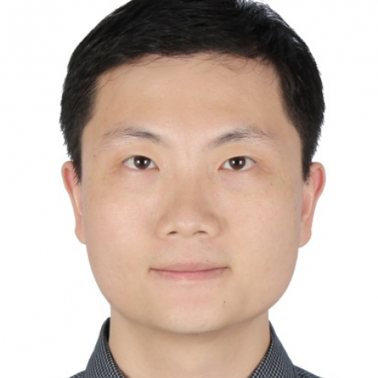

<!-- AUTO-GENERATED-BY: work/generate_obsidian_profiles.py -->

<!-- TEMPLATE: D:\workspace\信息收集整理\医生画像仓库\模板\医生画像模板.md -->

# 陈国栋

## 基础信息

| 字段 | 内容 |
|---|---|
| 姓名 | 陈国栋 |
| 医院 | 中山大学附属第一医院 |
| 科室 | 器官移植科 |
| 职称/身份 | 主任医师 |
| 来源链接 | [官网原文](https://www.fahsysu.org.cn/node/5647) |
| 采集日期 | 2026-08-13 |

## 简介/擅长

从事肾移植临床工作近20年，完成肾移植手术800余例。 擅长肾移植,腹腔镜活体供肾切取术，无缺血肾移植手术，肾移植术后急性和慢性排斥治疗,术后肾炎复发防治，术后各种机会性感染，如巨细胞病毒、BK病毒感染的防治，ABO血型不相容和高致敏肾移植患者围手术处理。 研究方向： 无缺血肾移植，ABO血型不相容肾移植，腹腔镜活体供肾切取术，免疫耐受 主要教育和工作经历：2002年中山大学学士，2005年中山大学硕士，2013年中山大学博士； 2009-2010年美国西北大学器官移植中心博士后，2008年晋升主治，2013年晋升副教授、硕士生导师，2019年晋升主任医师、博士生导师。 社会兼职：美国移植学会会员，欧洲移植学会会员，广东省泌尿生殖协会肾脏移植学分会委员，《器官移植》杂志编委 论著：近年来在国内外核心期刊发表论文60余篇，其中第一作者和通讯作者SCI论文16篇。 学术成果多次在世界移植大会、美国移植大会、欧洲移植大会和全国器官移植大会等国内外学术会议上进行发言和学术交流。 其他主要工作成绩（比如获奖情况）：主持国自然面上项目1项，国自然青年基金项目1项，省自然面上项目1项。 入选首批“广东省杰出青年医学人才”，入选中山一...

## 教育与进修经历

- 2009-2010年美国西北大学器官移植中心博士后，2008年晋升主治，2013年晋升副教授、硕士生导师，2019年晋升主任医师、博士生导师。

## 科研项目与成果

- 学术成果多次在世界移植大会、美国移植大会、欧洲移植大会和全国器官移植大会等国内外学术会议上进行发言和学术交流。
- 其他主要工作成绩（比如获奖情况）：主持国自然面上项目1项，国自然青年基金项目1项，省自然面上项目1项。

## 论文与学术产出

- 社会兼职：美国移植学会会员，欧洲移植学会会员，广东省泌尿生殖协会肾脏移植学分会委员，《器官移植》杂志编委 论著：近年来在国内外核心期刊发表论文60余篇，其中第一作者和通讯作者SCI论文16篇。

## 可包装亮点

- 2009-2010年美国西北大学器官移植中心博士后，2008年晋升主治，2013年晋升副教授、硕士生导师，2019年晋升主任医师、博士生导师。
- 社会兼职：美国移植学会会员，欧洲移植学会会员，广东省泌尿生殖协会肾脏移植学分会委员，《器官移植》杂志编委 论著：近年来在国内外核心期刊发表论文60余篇，其中第一作者和通讯作者SCI论文16篇。
- 学术成果多次在世界移植大会、美国移植大会、欧洲移植大会和全国器官移植大会等国内外学术会议上进行发言和学术交流。
- 其他主要工作成绩（比如获奖情况）：主持国自然面上项目1项，国自然青年基金项目1项，省自然面上项目1项。

## 重点疾病/人群标签

- 慢性病：慢性、生殖、免疫、感染、术后
- 肿瘤：
- 生殖疾病：慢性、生殖、免疫、感染、术后
- 免疫/风湿：慢性、生殖、免疫、感染、术后
- 术后恢复/康复：慢性、生殖、免疫、感染、术后
- 疑难重症：

## 证据摘录

> 只摘录官网公开信息中的短句或关键字段，不复制大段原文。

- 官网身份字段：主任医师
- 官网简介/擅长：从事肾移植临床工作近20年，完成肾移植手术800余例。 擅长肾移植,腹腔镜活体供肾切取术，无缺血肾移植手术，肾移植术后急性和慢性排斥治疗,术后肾炎复发防治，术后各种机会性感染，如巨细胞病毒、BK病毒感染的防治，ABO血型不相容和高致敏肾移植患者围手术处理。 研究方向： 无缺血肾移植，ABO血型不相容肾移植，腹腔镜活体供肾切取术，免疫耐受 主要教育和工作经历：2002年中山大学学士，2005年中山大学硕士，2013年中山大学博士； 20…
- 官网亮眼经历线索：2009-2010年美国西北大学器官移植中心博士后，2008年晋升主治，2013年晋升副教授、硕士生导师，2019年晋升主任医师、博士生导师。 社会兼职：美国移植学会会员，欧洲移植学会会员，广东省泌尿生殖协会肾脏移植学分会委员，《器官移植》杂志编委 论著：近年来在国内外核心期刊发表论文60余篇，其中第一作者和通讯作者SCI论文16篇。 学术成果多次在世界移植大会、美国移植大会、欧洲移植大会和全国器官移植大会等国内外学术会议上进行发言和…
- 来源链接：https://www.fahsysu.org.cn/node/5647

## BD 画像摘要

陈国栋医生可作为慢性病、生殖疾病、免疫/风湿/感染、术后恢复/康复方向的基础画像候选。后续 BD 使用应继续以官网来源和人工复核为准，不添加疗效承诺或无来源包装。

## 合规边界

- 仅使用医院官网、官方公众号、官方小程序等公开渠道。
- 不采集私人电话、私人微信、家庭住址、患者隐私或非公开排班信息。
- 不写“保证治愈”“疗效第一”“包治疑难杂症”等无法由官网证明的表述。
