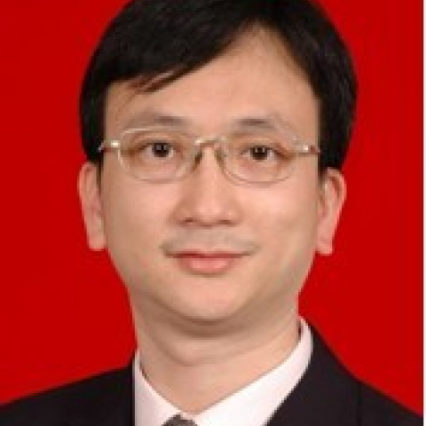

<!-- AUTO-GENERATED-BY: work/generate_obsidian_profiles.py -->

<!-- TEMPLATE: D:\workspace\信息收集整理\医生画像仓库\模板\医生画像模板.md -->

# 陈宇

## 基础信息

| 字段 | 内容 |
|---|---|
| 姓名 | 陈宇 |
| 医院 | 中山大学附属第一医院 |
| 科室 | 口腔科 |
| 职称/身份 | 副主任医师 |
| 来源链接 | [官网原文](https://www.fahsysu.org.cn/node/5708) |
| 采集日期 | 2026-08-13 |

## 简介/擅长

## 教育与进修经历

- 医疗特长（限400字内）： 1993年毕业后到我院工作至今，长期担任口腔医学临床、教学及专业研究工作，在口腔颌面部肿瘤（如舌癌、颊癌、腮腺肿瘤）的预防与治疗、先天性唇腭裂畸形序列治疗、颌面部外伤整形修复、牙种植以及牙齿美容修复……等方面有丰富的临床经验，擅长口腔颌面外科各种疑难病的诊断和治疗。
- 研究方向： 口腔肿瘤的预防与治疗、颌面整形修复、牙种植 主要教育和工作经历： 1988年就读于中山医科大学口腔系，先后取得口腔临床医学硕士和博士学位 社会兼职：中华口腔医学会口腔颌面外科专业委员会、口腔种植学会、中国抗癌协会 论著： 舌癌阴性淋巴结的微转移与临床病理及预后的分析 天然牙_种植体联合修复上前牙区多牙缺失探讨 Craniofacial fibrous dysplasia associated with McCune-Albright syndrome. PIK3CA is critical for t…

## 可包装亮点

- 医疗特长（限400字内）： 1993年毕业后到我院工作至今，长期担任口腔医学临床、教学及专业研究工作，在口腔颌面部肿瘤（如舌癌、颊癌、腮腺肿瘤）的预防与治疗、先天性唇腭裂畸形序列治疗、颌面部外伤整形修复、牙种植以及牙齿美容修复……等方面有丰富的临床经验，擅长口腔颌面外科各种疑难病的诊断和治疗。
- 研究方向： 口腔肿瘤的预防与治疗、颌面整形修复、牙种植 主要教育和工作经历： 1988年就读于中山医科大学口腔系，先后取得口腔临床医学硕士和博士学位 社会兼职：中华口腔医学会口腔颌面外科专业委员会、口腔种植学会、中国抗癌协会 论著： 舌癌阴性淋巴结的微转移与临床病理及预后的分析 天然牙_种植体联合修复上前牙区多牙缺失探讨 Craniofacial fibr…

## 重点疾病/人群标签

- 慢性病：
- 肿瘤：
- 生殖疾病：
- 免疫/风湿：
- 术后恢复/康复：
- 疑难重症：

## 证据摘录

> 只摘录官网公开信息中的短句或关键字段，不复制大段原文。

- 官网身份字段：副主任医师
- 官网亮眼经历线索：医疗特长（限400字内）： 1993年毕业后到我院工作至今，长期担任口腔医学临床、教学及专业研究工作，在口腔颌面部肿瘤（如舌癌、颊癌、腮腺肿瘤）的预防与治疗、先天性唇腭裂畸形序列治疗、颌面部外伤整形修复、牙种植以及牙齿美容修复……等方面有丰富的临床经验，擅长口腔颌面外科各种疑难病的诊断和治疗。 研究方向： 口腔肿瘤的预防与治疗、颌面整形修复、牙种植 主要教育和工作经历： 1988年就读于中山医科大学口腔系，先后取得口腔临床医学硕士和博…
- 异常提示：同名待甄别
- 来源链接：https://www.fahsysu.org.cn/node/5708

## BD 画像摘要

陈宇医生可作为中山大学附属第一医院口腔科的基础医生资料入库。当前重点方向以总底表标签为准，官网未展示的信息保持空白。

## 合规边界

- 仅使用医院官网、官方公众号、官方小程序等公开渠道。
- 不采集私人电话、私人微信、家庭住址、患者隐私或非公开排班信息。
- 不写“保证治愈”“疗效第一”“包治疑难杂症”等无法由官网证明的表述。
