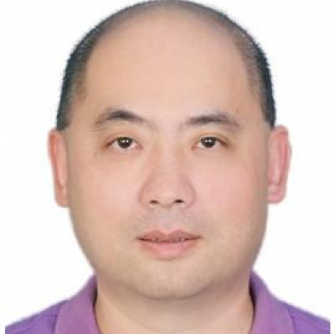

<!-- AUTO-GENERATED-BY: work/generate_obsidian_profiles.py -->

<!-- TEMPLATE: D:\workspace\信息收集整理\医生画像仓库\模板\医生画像模板.md -->

# 陈振光

## 基础信息

| 字段 | 内容 |
|---|---|
| 姓名 | 陈振光 |
| 医院 | 中山大学附属第一医院 |
| 科室 | 胸外科 |
| 职称/身份 | 主任医师 |
| 来源链接 | [官网原文](https://www.fahsysu.org.cn/node/701) |
| 采集日期 | 2026-08-13 |

## 简介/擅长

## 可包装亮点

- 2004.11-2012.11，中山大学附属一院胸外科副主任医师、硕士研究生导师、医疗秘书；
- 2012.12至今，中山大学附属一院胸外科主任医师；
- 2011.9至今，中山大学附属一院东院心胸外科科主任；
- 社会兼职： 欧洲临床肿瘤学会 (ESMO) 会员，国际肺癌研究学会（IASLC）会员，中国癌症基金会中国肿瘤防治联盟（UCOM）秘书长，中国医院协会精准医疗管理分会秘书长，中国医师协会胸外科分会委员，广东省医学会胸外科分会肺癌学组副组长，广东省医院协会第九届理事，广东省医院协会肿瘤防治管理分会秘书长及胸部肿瘤专业委员会副主任委员，广东省医学会细胞治疗学分会…

## 重点疾病/人群标签

- 慢性病：
- 肿瘤：肿瘤、癌、瘤、化疗、靶向、肺癌、免疫、重症、难治
- 生殖疾病：
- 免疫/风湿：肿瘤、癌、瘤、化疗、靶向、肺癌、免疫、重症、难治
- 术后恢复/康复：
- 疑难重症：肿瘤、癌、瘤、化疗、靶向、肺癌、免疫、重症、难治

## 证据摘录

> 只摘录官网公开信息中的短句或关键字段，不复制大段原文。

- 官网身份字段：主任医师
- 官网亮眼经历线索：2004.11-2012.11，中山大学附属一院胸外科副主任医师、硕士研究生导师、医疗秘书； 2012.12至今，中山大学附属一院胸外科主任医师； 2011.9至今，中山大学附属一院东院心胸外科科主任； 社会兼职： 欧洲临床肿瘤学会 (ESMO) 会员，国际肺癌研究学会（IASLC）会员，中国癌症基金会中国肿瘤防治联盟（UCOM）秘书长，中国医院协会精准医疗管理分会秘书长，中国医师协会胸外科分会委员，广东省医学会胸外科分会肺癌学组副组…
- 来源链接：https://www.fahsysu.org.cn/node/701

## BD 画像摘要

陈振光医生可作为肿瘤、免疫/风湿/感染、疑难重症方向的基础画像候选。后续 BD 使用应继续以官网来源和人工复核为准，不添加疗效承诺或无来源包装。

## 合规边界

- 仅使用医院官网、官方公众号、官方小程序等公开渠道。
- 不采集私人电话、私人微信、家庭住址、患者隐私或非公开排班信息。
- 不写“保证治愈”“疗效第一”“包治疑难杂症”等无法由官网证明的表述。
