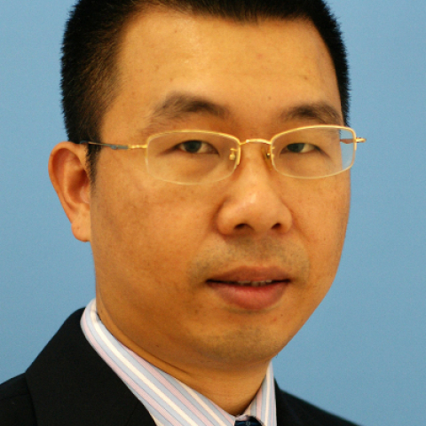

<!-- AUTO-GENERATED-BY: work/generate_obsidian_profiles.py -->

<!-- TEMPLATE: D:\workspace\信息收集整理\医生画像仓库\模板\医生画像模板.md -->

# 陈木开

## 基础信息

| 字段 | 内容 |
|---|---|
| 姓名 | 陈木开 |
| 医院 | 中山大学附属第一医院 |
| 科室 | 皮肤科 |
| 职称/身份 | 主任医师 |
| 来源链接 | [官网原文](https://www.fahsysu.org.cn/node/5735) |
| 采集日期 | 2026-08-13 |

## 简介/擅长

皮肤病、皮肤激光美容。 对各种皮肤病, 色素性疾病, 痤疮疤痕、太田痣、鲜红斑痣等美容性疾病具有丰富的临床诊治经验。 擅长各种疑难皮肤病的诊治、皮肤光动力治疗和皮肤美容激光技术。 研究方向：皮肤肿瘤、性传播疾病和皮肤激光美容 主要教育和工作经历： 1995年中山医科大学临床医学系本科毕业后，在中山大学附属第一医院从事皮肤科的临床医疗工作至今。 社会兼职： 论著： 1.Dermatoscopic findings in cutaneous Rosai-Dorfman disease and response tolow-dose thalidomide. J Dtsch Dermatol Ges. 2014 Apr; 12(4):350-2 (通信作者) 2.Persistent and acute chlamydial infections induce different structural changesin the Golgi apparatus. Int J Med Microbiol. 2014 Apr 3. (共同第一作者) 3.5-aminolevulinic acid-mediated photody...

## 教育与进修经历

- 研究方向：皮肤肿瘤、性传播疾病和皮肤激光美容 主要教育和工作经历： 1995年中山医科大学临床医学系本科毕业后，在中山大学附属第一医院从事皮肤科的临床医疗工作至今。

## 可包装亮点

- 擅长各种疑难皮肤病的诊治、皮肤光动力治疗和皮肤美容激光技术。
- 542. 专著： 其他主要工作成绩（比如获奖情况）：

## 重点疾病/人群标签

- 慢性病：
- 肿瘤：肿瘤、疑难
- 生殖疾病：
- 免疫/风湿：
- 术后恢复/康复：
- 疑难重症：肿瘤、疑难

## 证据摘录

> 只摘录官网公开信息中的短句或关键字段，不复制大段原文。

- 官网身份字段：主任医师
- 官网简介/擅长：皮肤病、皮肤激光美容。 对各种皮肤病, 色素性疾病, 痤疮疤痕、太田痣、鲜红斑痣等美容性疾病具有丰富的临床诊治经验。 擅长各种疑难皮肤病的诊治、皮肤光动力治疗和皮肤美容激光技术。 研究方向：皮肤肿瘤、性传播疾病和皮肤激光美容 主要教育和工作经历： 1995年中山医科大学临床医学系本科毕业后，在中山大学附属第一医院从事皮肤科的临床医疗工作至今。 社会兼职： 论著： 1.Dermatoscopic findings in cutaneou…
- 官网亮眼经历线索：擅长各种疑难皮肤病的诊治、皮肤光动力治疗和皮肤美容激光技术。 擅长各种疑难皮肤病的诊治、皮肤光动力治疗和皮肤美容激光技术。 542. 专著： 其他主要工作成绩（比如获奖情况）：
- 来源链接：https://www.fahsysu.org.cn/node/5735

## BD 画像摘要

陈木开医生可作为肿瘤、疑难重症方向的基础画像候选。后续 BD 使用应继续以官网来源和人工复核为准，不添加疗效承诺或无来源包装。

## 合规边界

- 仅使用医院官网、官方公众号、官方小程序等公开渠道。
- 不采集私人电话、私人微信、家庭住址、患者隐私或非公开排班信息。
- 不写“保证治愈”“疗效第一”“包治疑难杂症”等无法由官网证明的表述。
