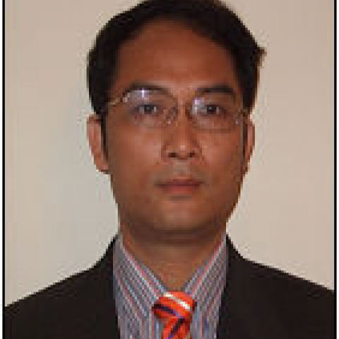

<!-- AUTO-GENERATED-BY: work/generate_obsidian_profiles.py -->

<!-- TEMPLATE: D:\workspace\信息收集整理\医生画像仓库\模板\医生画像模板.md -->

# 陈松龄

## 基础信息

| 字段 | 内容 |
|---|---|
| 姓名 | 陈松龄 |
| 医院 | 中山大学附属第一医院 |
| 科室 | 口腔科 |
| 职称/身份 | 主任医师/教授 |
| 来源链接 | [官网原文](https://www.fahsysu.org.cn/node/5701) |
| 采集日期 | 2026-08-13 |

## 简介/擅长

口腔种植，包括各种牙缺失种植，拔牙后即刻种植，即刻修复，电脑设计微创牙种植，严重颌骨萎缩的种植修复，穿颧种植术及其他疑难牙种植。 擅长头颈部肿瘤的诊治，对各种肿瘤手术和术后缺损的修复具有丰富经验。 擅长各种颅颌面畸形的诊治，包括上下颌骨前突和退缩、面部不对称性畸形。 擅长颌面部骨折的治疗，包括上下颌骨骨折、颧骨、眶骨和全面部骨折。 擅长唇腭裂治疗，包括对牙槽骨缺损和鼻畸形的整复。 擅长三叉神经痛的外科治疗。 研究方向：口腔颌面种植 ，口腔颌面部肿瘤治疗、口腔颌面创伤整复、口腔颌面部畸形整形，唇腭裂外科整复，三叉神经痛外科治疗。 主要教育和工作经历：1986年—1991年，华西医科大学，口腔医学院，硕博连读研究生/博士； 1994年—至今，中山大学，附属第一医院口腔科，副教授，教授，博士生导师，学科带头人（首席专家）。 社会兼职：兼任中华口腔医学会牙及牙槽外科专业委员会副主任委员，中华口腔医学会口腔颌面外科专业委员会委员，香港口腔种植学会副会长，国际口腔种植医师学会（International Congress of Oral Implantologists，ICOI）中国总会副会长，中国康复医学会修复重建外科专业委员会...

## 教育与进修经历

- 已培养指导硕士研究生9名，博士研究生10名, 指导博士后3名。

## 论文与学术产出

- 论著：发表中文论著100多篇，发表SCI文章29篇，均为通讯作者。
- 部分SCI文章如下： Junbing Guo, Daiyin Huang, Songling Chen, et al. Treatment of a subtype of trigeminal neuralgia with descendingpalatine neurotomy in the pterygopalatine fossa via the greater palatineforamenepterygopalatine canal approach. Journal of Cranio-Maxillo…

## 可包装亮点

- 擅长口腔种植，包括各种牙缺失种植，拔牙后即刻种植，即刻修复，电脑设计微创牙种植，严重颌骨萎缩的种植修复，穿颧种植术及其他疑难牙种植。
- 医疗特长：擅长口腔种植，包括各种牙缺失种植，拔牙后即刻种植，即刻修复，电脑设计微创牙种植，严重颌骨萎缩的种植修复，穿颧种植术及其他疑难牙种植。
- 1994年—至今，中山大学，附属第一医院口腔科，副教授，教授，博士生导师，学科带头人（首席专家）。
- 社会兼职：兼任中华口腔医学会牙及牙槽外科专业委员会副主任委员，中华口腔医学会口腔颌面外科专业委员会委员，香港口腔种植学会副会长，国际口腔种植医师学会（International Congress of Oral Implantologists，ICOI）中国总会副会长，中国康复医学会修复重建外科专业委员会颅颌面外科学组委员，广东省口腔医学会理事，广东省临床…

## 重点疾病/人群标签

- 慢性病：
- 肿瘤：肿瘤、术后、康复、疑难
- 生殖疾病：
- 免疫/风湿：
- 术后恢复/康复：肿瘤、术后、康复、疑难
- 疑难重症：肿瘤、术后、康复、疑难

## 证据摘录

> 只摘录官网公开信息中的短句或关键字段，不复制大段原文。

- 官网身份字段：主任医师/教授
- 官网简介/擅长：口腔种植，包括各种牙缺失种植，拔牙后即刻种植，即刻修复，电脑设计微创牙种植，严重颌骨萎缩的种植修复，穿颧种植术及其他疑难牙种植。 擅长头颈部肿瘤的诊治，对各种肿瘤手术和术后缺损的修复具有丰富经验。 擅长各种颅颌面畸形的诊治，包括上下颌骨前突和退缩、面部不对称性畸形。 擅长颌面部骨折的治疗，包括上下颌骨骨折、颧骨、眶骨和全面部骨折。 擅长唇腭裂治疗，包括对牙槽骨缺损和鼻畸形的整复。 擅长三叉神经痛的外科治疗。 研究方向：口腔颌面种植…
- 官网亮眼经历线索：擅长口腔种植，包括各种牙缺失种植，拔牙后即刻种植，即刻修复，电脑设计微创牙种植，严重颌骨萎缩的种植修复，穿颧种植术及其他疑难牙种植。 医疗特长：擅长口腔种植，包括各种牙缺失种植，拔牙后即刻种植，即刻修复，电脑设计微创牙种植，严重颌骨萎缩的种植修复，穿颧种植术及其他疑难牙种植。 1994年—至今，中山大学，附属第一医院口腔科，副教授，教授，博士生导师，学科带头人（首席专家）。 社会兼职：兼任中华口腔医学会牙及牙槽外科专业委员会副主任委员…
- 来源链接：https://www.fahsysu.org.cn/node/5701

## BD 画像摘要

陈松龄医生可作为肿瘤、术后恢复/康复、疑难重症方向的基础画像候选。后续 BD 使用应继续以官网来源和人工复核为准，不添加疗效承诺或无来源包装。

## 合规边界

- 仅使用医院官网、官方公众号、官方小程序等公开渠道。
- 不采集私人电话、私人微信、家庭住址、患者隐私或非公开排班信息。
- 不写“保证治愈”“疗效第一”“包治疑难杂症”等无法由官网证明的表述。
