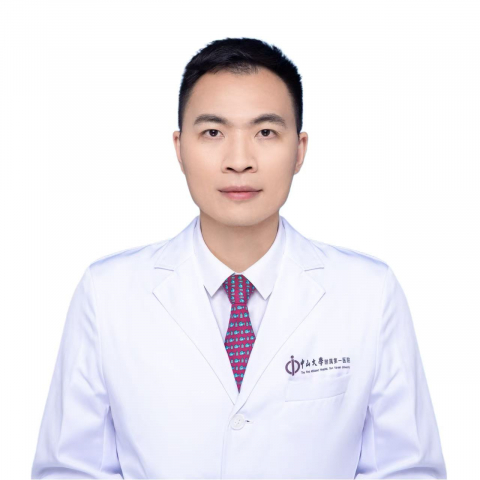

<!-- AUTO-GENERATED-BY: work/generate_obsidian_profiles.py -->

<!-- TEMPLATE: D:\workspace\信息收集整理\医生画像仓库\模板\医生画像模板.md -->

# 陈泽斌

## 基础信息

| 字段 | 内容 |
|---|---|
| 姓名 | 陈泽斌 |
| 医院 | 中山大学附属第一医院 |
| 科室 | 肝外科 |
| 职称/身份 | 副主任医师 |
| 来源链接 | [官网原文](https://www.fahsysu.org.cn/node/35583) |
| 采集日期 | 2026-08-13 |

## 简介/擅长

专注肝胆胰良恶性疾病的规范诊治，擅长开展腹腔镜、机器人微创手术及传统开放手术，诊治范围包括：（1）肝脏疾病：肝癌、肝血管瘤、肝囊肿、肝腺瘤、肝脏良性结节（FNH）； （2）胆道疾病：胆囊结石、胆管癌（肝内/肝门部/胆总管）、胆囊癌、胆管结石、胆管扩张症及囊肿； （3）胰腺疾病：胰腺癌、胰腺囊腺瘤、胰腺实性假乳头状瘤、胰腺导管内乳头状瘤等。 本硕博均毕业于中山大学，在中山一院完成外科住院医师和专科医师规范化培训。 围绕降低肝癌术后复发、减少围术期并发症开展多项研究，成果曾在国际肿瘤权威会议包括欧洲肿瘤内科学会（ESMO）、美国临床肿瘤学会（ASCO）进行口头报告，获国际认可。 现以第一作者发表SCI论文11篇，主持省部级项目4项，协助参与《外科学》、《黄家驷外科学》编写，作为团队成员获得2019年广东省科技进步奖一等奖。 专注临床教学与医师培养，现担任广东省健康管理学会肝胆病学专业委员会副秘书长、中山一院外科住培基地教学秘书、中山一院基础外科学院核心教官兼后勤组组长、中山一院执业医师技能培训组组长、广东省医学会微创外科学分会青年委员会委员。

## 教育与进修经历

- 本硕博均毕业于中山大学，在中山一院完成外科住院医师和专科医师规范化培训。
- 专注临床教学与医师培养，现担任广东省健康管理学会肝胆病学专业委员会副秘书长、中山一院外科住培基地教学秘书、中山一院基础外科学院核心教官兼后勤组组长、中山一院执业医师技能培训组组长、广东省医学会微创外科学分会青年委员会委员。

## 科研项目与成果

- 围绕降低肝癌术后复发、减少围术期并发症开展多项研究，成果曾在国际肿瘤权威会议包括欧洲肿瘤内科学会（ESMO）、美国临床肿瘤学会（ASCO）进行口头报告，获国际认可。
- 现以第一作者发表SCI论文11篇，主持省部级项目4项，协助参与《外科学》、《黄家驷外科学》编写，作为团队成员获得2019年广东省科技进步奖一等奖。

## 论文与学术产出

- 现以第一作者发表SCI论文11篇，主持省部级项目4项，协助参与《外科学》、《黄家驷外科学》编写，作为团队成员获得2019年广东省科技进步奖一等奖。

## 可包装亮点

- 围绕降低肝癌术后复发、减少围术期并发症开展多项研究，成果曾在国际肿瘤权威会议包括欧洲肿瘤内科学会（ESMO）、美国临床肿瘤学会（ASCO）进行口头报告，获国际认可。
- 现以第一作者发表SCI论文11篇，主持省部级项目4项，协助参与《外科学》、《黄家驷外科学》编写，作为团队成员获得2019年广东省科技进步奖一等奖。
- 专注临床教学与医师培养，现担任广东省健康管理学会肝胆病学专业委员会副秘书长、中山一院外科住培基地教学秘书、中山一院基础外科学院核心教官兼后勤组组长、中山一院执业医师技能培训组组长、广东省医学会微创外科学分会青年委员会委员。

## 重点疾病/人群标签

- 慢性病：
- 肿瘤：肿瘤、癌、瘤、肝癌、术后
- 生殖疾病：
- 免疫/风湿：
- 术后恢复/康复：肿瘤、癌、瘤、肝癌、术后
- 疑难重症：

## 证据摘录

> 只摘录官网公开信息中的短句或关键字段，不复制大段原文。

- 官网身份字段：副主任医师
- 官网简介/擅长：专注肝胆胰良恶性疾病的规范诊治，擅长开展腹腔镜、机器人微创手术及传统开放手术，诊治范围包括：（1）肝脏疾病：肝癌、肝血管瘤、肝囊肿、肝腺瘤、肝脏良性结节（FNH）； （2）胆道疾病：胆囊结石、胆管癌（肝内/肝门部/胆总管）、胆囊癌、胆管结石、胆管扩张症及囊肿； （3）胰腺疾病：胰腺癌、胰腺囊腺瘤、胰腺实性假乳头状瘤、胰腺导管内乳头状瘤等。 本硕博均毕业于中山大学，在中山一院完成外科住院医师和专科医师规范化培训。 围绕降低肝癌术后复发…
- 官网亮眼经历线索：围绕降低肝癌术后复发、减少围术期并发症开展多项研究，成果曾在国际肿瘤权威会议包括欧洲肿瘤内科学会（ESMO）、美国临床肿瘤学会（ASCO）进行口头报告，获国际认可。 现以第一作者发表SCI论文11篇，主持省部级项目4项，协助参与《外科学》、《黄家驷外科学》编写，作为团队成员获得2019年广东省科技进步奖一等奖。 专注临床教学与医师培养，现担任广东省健康管理学会肝胆病学专业委员会副秘书长、中山一院外科住培基地教学秘书、中山一院基础外科学…
- 来源链接：https://www.fahsysu.org.cn/node/35583

## BD 画像摘要

陈泽斌医生可作为肿瘤、术后恢复/康复方向的基础画像候选。后续 BD 使用应继续以官网来源和人工复核为准，不添加疗效承诺或无来源包装。

## 合规边界

- 仅使用医院官网、官方公众号、官方小程序等公开渠道。
- 不采集私人电话、私人微信、家庭住址、患者隐私或非公开排班信息。
- 不写“保证治愈”“疗效第一”“包治疑难杂症”等无法由官网证明的表述。
