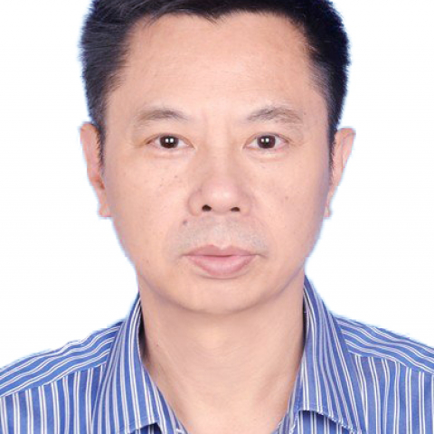

<!-- AUTO-GENERATED-BY: work/generate_obsidian_profiles.py -->

<!-- TEMPLATE: D:\workspace\信息收集整理\医生画像仓库\模板\医生画像模板.md -->

# 陈泽雄

## 基础信息

| 字段 | 内容 |
|---|---|
| 姓名 | 陈泽雄 |
| 医院 | 中山大学附属第一医院 |
| 科室 | 中医科 |
| 职称/身份 | 主任医师 |
| 来源链接 | [官网原文](https://www.fahsysu.org.cn/node/5715) |
| 采集日期 | 2026-08-13 |

## 简介/擅长

全国老中医药专家学术经验继承工作指导老师，广东省名中医，从事医教研工作35年余，对临床各科常见病、多发病及疑难复杂病例的中医诊治积累了丰富的临床经验。 擅长运用中医方法治疗肿瘤、各种结节性疾病、肝胆胰消化道疾病、代谢疾病、喘咳、失眠、眩晕及疑难复杂病症等，尤其在运用专利中药处方治疗肺结节，以及运用中药促进癌证病人术后恢复，减轻西医放化疗、靶向治疗、免疫治疗等副作用，预防复发，延长生存期方面有较深的治疗心得。 工作经历： 1987年7月至今：中山大学附属第一医院中医科 社会兼职： 广东省本科高校中医学类专业教学指导委员会：委员 中国医师协会中西医结合分会综合医院专委会：副主任委员 中国中西医结合学会肝病专业委员会：常务委员 广东省中医药学会综合医院中医药工作委员会：主任委员 广东省中西医结合学会肝病专业委员会：名誉主任委员 广东省中西医结合学会标准化专业委员会：副主任委员 广东省中医药学会养生保健专业委员会 ：副主任委员 广东省药学会中医肝病用药专家委员会：副主任委员 《中药材》、《世界华人消化杂志》：编委 科研情况： 专注于中药防治肝病、肺结节病相关研究，获国家授权发明专利3项。

## 科研项目与成果

- 擅长运用中医方法治疗肿瘤、各种结节性疾病、肝胆胰消化道疾病、代谢疾病、喘咳、失眠、眩晕及疑难复杂病症等，尤其在运用专利中药处方治疗肺结节，以及运用中药促进癌证病人术后恢复，减轻西医放化疗、靶向治疗、免疫治疗等副作用，预防复发，延长生存期方面有较深的治疗心得。
- 工作经历： 1987年7月至今：中山大学附属第一医院中医科 社会兼职： 广东省本科高校中医学类专业教学指导委员会：委员 中国医师协会中西医结合分会综合医院专委会：副主任委员 中国中西医结合学会肝病专业委员会：常务委员 广东省中医药学会综合医院中医药工作委员会：主任委员 广东省中西医结合学会肝病专业委员会：名誉主任委员 广东省中西医结合学会标准化专业委员会：副主任委员 广东省中医药学会养生保健专业委员会 ：副主任委员 广东省药学会中医肝病用药专家委员会：副主任委员 《中药材》、《世界华人消化杂志》：编委 科研情况：…

## 可包装亮点

- 全国老中医药专家学术经验继承工作指导老师，广东省名中医，从事医教研工作35年余，对临床各科常见病、多发病及疑难复杂病例的中医诊治积累了丰富的临床经验。
- 擅长运用中医方法治疗肿瘤、各种结节性疾病、肝胆胰消化道疾病、代谢疾病、喘咳、失眠、眩晕及疑难复杂病症等，尤其在运用专利中药处方治疗肺结节，以及运用中药促进癌证病人术后恢复，减轻西医放化疗、靶向治疗、免疫治疗等副作用，预防复发，延长生存期方面有较深的治疗心得。
- 医疗特长： 全国老中医药专家学术经验继承工作指导老师，广东省名中医，从事医教研工作35年余，对临床各科常见病、多发病及疑难复杂病例的中医诊治积累了丰富的临床经验。

## 重点疾病/人群标签

- 慢性病：代谢、肿瘤、癌、化疗、靶向、免疫、术后、恢复、疑难、复杂
- 肿瘤：代谢、肿瘤、癌、化疗、靶向、免疫、术后、恢复、疑难、复杂
- 生殖疾病：
- 免疫/风湿：代谢、肿瘤、癌、化疗、靶向、免疫、术后、恢复、疑难、复杂
- 术后恢复/康复：代谢、肿瘤、癌、化疗、靶向、免疫、术后、恢复、疑难、复杂
- 疑难重症：代谢、肿瘤、癌、化疗、靶向、免疫、术后、恢复、疑难、复杂

## 证据摘录

> 只摘录官网公开信息中的短句或关键字段，不复制大段原文。

- 官网身份字段：主任医师
- 官网简介/擅长：全国老中医药专家学术经验继承工作指导老师，广东省名中医，从事医教研工作35年余，对临床各科常见病、多发病及疑难复杂病例的中医诊治积累了丰富的临床经验。 擅长运用中医方法治疗肿瘤、各种结节性疾病、肝胆胰消化道疾病、代谢疾病、喘咳、失眠、眩晕及疑难复杂病症等，尤其在运用专利中药处方治疗肺结节，以及运用中药促进癌证病人术后恢复，减轻西医放化疗、靶向治疗、免疫治疗等副作用，预防复发，延长生存期方面有较深的治疗心得。 工作经历： 1987年7月…
- 官网亮眼经历线索：全国老中医药专家学术经验继承工作指导老师，广东省名中医，从事医教研工作35年余，对临床各科常见病、多发病及疑难复杂病例的中医诊治积累了丰富的临床经验。 擅长运用中医方法治疗肿瘤、各种结节性疾病、肝胆胰消化道疾病、代谢疾病、喘咳、失眠、眩晕及疑难复杂病症等，尤其在运用专利中药处方治疗肺结节，以及运用中药促进癌证病人术后恢复，减轻西医放化疗、靶向治疗、免疫治疗等副作用，预防复发，延长生存期方面有较深的治疗心得。 医疗特长： 全国老中医药专…
- 来源链接：https://www.fahsysu.org.cn/node/5715

## BD 画像摘要

陈泽雄医生可作为慢性病、肿瘤、免疫/风湿/感染、术后恢复/康复、疑难重症方向的基础画像候选。后续 BD 使用应继续以官网来源和人工复核为准，不添加疗效承诺或无来源包装。

## 合规边界

- 仅使用医院官网、官方公众号、官方小程序等公开渠道。
- 不采集私人电话、私人微信、家庭住址、患者隐私或非公开排班信息。
- 不写“保证治愈”“疗效第一”“包治疑难杂症”等无法由官网证明的表述。
