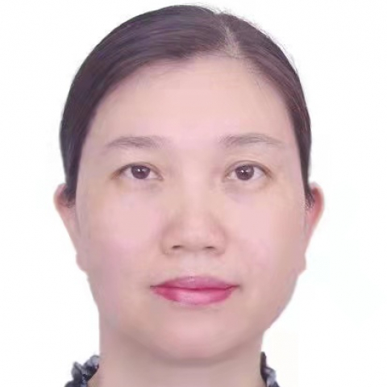

<!-- AUTO-GENERATED-BY: work/generate_obsidian_profiles.py -->

<!-- TEMPLATE: D:\workspace\信息收集整理\医生画像仓库\模板\医生画像模板.md -->

# 陈白莉

## 基础信息

| 字段 | 内容 |
|---|---|
| 姓名 | 陈白莉 |
| 医院 | 中山大学附属第一医院 |
| 科室 | 消化内科 |
| 职称/身份 | 主任医师 |
| 来源链接 | [官网原文](https://www.fahsysu.org.cn/node/793) |
| 采集日期 | 2026-08-13 |

## 简介/擅长

从事消化内科临床工作近30年，对炎症性肠病（克罗恩病、溃疡性结肠炎）、罕见病（遗传性血管性水肿、IgG4相关性疾病、家族性地中海热、糖原累积病等）及自身免疫性肠病、乳糜泻、PD-1相关免疫性肠炎、蛋白丢失性肠病、P-J综合征（黑斑息肉病）等小肠疑难疾病的诊断治疗有较丰富的经验，擅长小肠镜、胶囊内镜及超声内镜，主要研究方向为炎症性肠病、罕见病及小肠疾病。 研究方向： 炎症性肠病（克罗恩病、溃疡性结肠炎）、罕见病、小肠疾病、小肠镜诊治技术 主要教育和工作经历： 1994年毕业于中山医科大学临床医学系，毕业后一直在中山大学附属第一医院消化内科工作，2005-2006年到香港威尔斯亲王医院进修，2007年获中山大学内科学博士学位。 社会兼职： 1.中华医学会消化病学分会炎症性肠病学组心理协作组委员； 2.中华医学会消化内镜学分会胶囊内镜协作组委员； 3.广东省医学会消化病学分会炎症性肠病学组副组长； 4.广东省医师学会消化内镜学医师分会小肠内镜专业组副组长； 5.广东省医师协会消化科医师学分会委员； 6.中华炎性肠病杂志青年学术组副组长 论著： 1.Zhang SH, Chen BL (共同第一作者),Wang BM,Chen...

## 教育与进修经历

- 研究方向： 炎症性肠病（克罗恩病、溃疡性结肠炎）、罕见病、小肠疾病、小肠镜诊治技术 主要教育和工作经历： 1994年毕业于中山医科大学临床医学系，毕业后一直在中山大学附属第一医院消化内科工作，2005-2006年到香港威尔斯亲王医院进修，2007年获中山大学内科学博士学位。

## 可包装亮点

- 从事消化内科临床工作近30年，对炎症性肠病（克罗恩病、溃疡性结肠炎）、罕见病（遗传性血管性水肿、IgG4相关性疾病、家族性地中海热、糖原累积病等）及自身免疫性肠病、乳糜泻、PD-1相关免疫性肠炎、蛋白丢失性肠病、P-J综合征（黑斑息肉病）等小肠疑难疾病的诊断治疗有较丰富的经验，擅长小肠镜、胶囊内镜及超声内镜，主要研究方向为炎症性肠病、罕见病及小肠疾病。
- 医疗特长：从事消化内科临床工作近30年，对炎症性肠病（克罗恩病、溃疡性结肠炎）、罕见病（遗传性血管性水肿、IgG4相关性疾病、家族性地中海热、糖原累积病等）及自身免疫性肠病、乳糜泻、PD-1相关免疫性肠炎、蛋白丢失性肠病、P-J综合征（黑斑息肉病）等小肠疑难疾病的诊断治疗有较丰富的经验，擅长小肠镜、胶囊内镜及超声内镜，主要研究方向为炎症性肠病、罕见病及小肠…
- 研究方向： 炎症性肠病（克罗恩病、溃疡性结肠炎）、罕见病、小肠疾病、小肠镜诊治技术 主要教育和工作经历： 199...

## 重点疾病/人群标签

- 慢性病：
- 肿瘤：
- 生殖疾病：
- 免疫/风湿：免疫、疑难、罕见
- 术后恢复/康复：
- 疑难重症：免疫、疑难、罕见

## 证据摘录

> 只摘录官网公开信息中的短句或关键字段，不复制大段原文。

- 官网身份字段：主任医师
- 官网简介/擅长：从事消化内科临床工作近30年，对炎症性肠病（克罗恩病、溃疡性结肠炎）、罕见病（遗传性血管性水肿、IgG4相关性疾病、家族性地中海热、糖原累积病等）及自身免疫性肠病、乳糜泻、PD-1相关免疫性肠炎、蛋白丢失性肠病、P-J综合征（黑斑息肉病）等小肠疑难疾病的诊断治疗有较丰富的经验，擅长小肠镜、胶囊内镜及超声内镜，主要研究方向为炎症性肠病、罕见病及小肠疾病。 研究方向： 炎症性肠病（克罗恩病、溃疡性结肠炎）、罕见病、小肠疾病、小肠镜诊治技术…
- 官网亮眼经历线索：从事消化内科临床工作近30年，对炎症性肠病（克罗恩病、溃疡性结肠炎）、罕见病（遗传性血管性水肿、IgG4相关性疾病、家族性地中海热、糖原累积病等）及自身免疫性肠病、乳糜泻、PD-1相关免疫性肠炎、蛋白丢失性肠病、P-J综合征（黑斑息肉病）等小肠疑难疾病的诊断治疗有较丰富的经验，擅长小肠镜、胶囊内镜及超声内镜，主要研究方向为炎症性肠病、罕见病及小肠疾病。 医疗特长：从事消化内科临床工作近30年，对炎症性肠病（克罗恩病、溃疡性结肠炎）、罕…
- 来源链接：https://www.fahsysu.org.cn/node/793

## BD 画像摘要

陈白莉医生可作为免疫/风湿/感染、疑难重症方向的基础画像候选。后续 BD 使用应继续以官网来源和人工复核为准，不添加疗效承诺或无来源包装。

## 合规边界

- 仅使用医院官网、官方公众号、官方小程序等公开渠道。
- 不采集私人电话、私人微信、家庭住址、患者隐私或非公开排班信息。
- 不写“保证治愈”“疗效第一”“包治疑难杂症”等无法由官网证明的表述。
