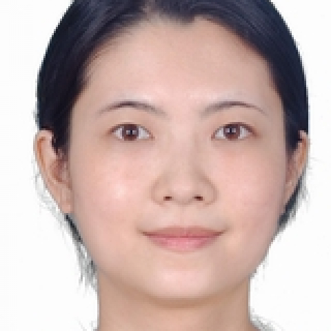

<!-- AUTO-GENERATED-BY: work/generate_obsidian_profiles.py -->

<!-- TEMPLATE: D:\workspace\信息收集整理\医生画像仓库\模板\医生画像模板.md -->

# 陈立达

## 基础信息

| 字段 | 内容 |
|---|---|
| 姓名 | 陈立达 |
| 医院 | 中山大学附属第一医院 |
| 科室 | 超声医学科 |
| 职称/身份 | 主任医师 |
| 来源链接 | [官网原文](https://www.fahsysu.org.cn/node/25889) |
| 采集日期 | 2026-08-13 |

## 简介/擅长

包括腹部和浅表器官超声诊断（血管和肌骨超声除外），擅长消化系统、泌尿系统、甲状腺、乳腺、眼科、直肠等疾病的普通超声及弹性超声诊断。 主任医师，博士导师，广东省特支计划青年拔尖人才。 擅长：a)肝纤维化、脂肪肝的分级与诊断，在院内率先开展肝脏弹性超声检查新技术； b)肝癌的早筛与诊断，结合二维超声、弹性超声和超声人工智能提高肝癌早筛的敏感性和特异性; c)直肠病变的诊断与分期，在国际上首次将经直肠超声与弹性成像联合，提高直肠癌分期的准确性; d)眼科疾病的诊断与鉴别，在院内率先开展眼科超声检查，作为肝脏、直肠癌、眼科MDT小组成员，解决临床科室疑难重症诊治需求。 以第一或通讯作者发表SCI论文20余篇，其中影像1区文章14篇，包括影像顶刊Radiology 2篇。 主持包括国家自然科学基金-面上项目，广东省自然科学基金-重点及面上项目、广东特支计划等多个项目，培养学生获得中大优秀学位论文、优秀硕士毕业生，被评为毕业后教育优秀工作者。 学术及社会兼职 广东省健康管理学会脂肪肝多学科诊治专业委员会委员 广东省临床医学学会脂肪肝专业委员会委员 中国超声医学工程学会眼科专业委员会委员 广东省抗癌协会甲状腺癌专业委员会青年委员会委...

## 教育与进修经历

- 主持包括国家自然科学基金-面上项目，广东省自然科学基金-重点及面上项目、广东特支计划等多个项目，培养学生获得中大优秀学位论文、优秀硕士毕业生，被评为毕业后教育优秀工作者。

## 科研项目与成果

- 主持包括国家自然科学基金-面上项目，广东省自然科学基金-重点及面上项目、广东特支计划等多个项目，培养学生获得中大优秀学位论文、优秀硕士毕业生，被评为毕业后教育优秀工作者。

## 论文与学术产出

- 以第一或通讯作者发表SCI论文20余篇，其中影像1区文章14篇，包括影像顶刊Radiology 2篇。
- 主持包括国家自然科学基金-面上项目，广东省自然科学基金-重点及面上项目、广东特支计划等多个项目，培养学生获得中大优秀学位论文、优秀硕士毕业生，被评为毕业后教育优秀工作者。

## 可包装亮点

- 主任医师，博士导师，广东省特支计划青年拔尖人才。
- 擅长：a)肝纤维化、脂肪肝的分级与诊断，在院内率先开展肝脏弹性超声检查新技术；
- d)眼科疾病的诊断与鉴别，在院内率先开展眼科超声检查，作为肝脏、直肠癌、眼科MDT小组成员，解决临床科室疑难重症诊治需求。
- 以第一或通讯作者发表SCI论文20余篇，其中影像1区文章14篇，包括影像顶刊Radiology 2篇。

## 重点疾病/人群标签

- 慢性病：
- 肿瘤：癌、肝癌、肠癌、疑难、重症、多学科、MDT
- 生殖疾病：
- 免疫/风湿：
- 术后恢复/康复：
- 疑难重症：癌、肝癌、肠癌、疑难、重症、多学科、MDT

## 证据摘录

> 只摘录官网公开信息中的短句或关键字段，不复制大段原文。

- 官网身份字段：主任医师
- 官网简介/擅长：包括腹部和浅表器官超声诊断（血管和肌骨超声除外），擅长消化系统、泌尿系统、甲状腺、乳腺、眼科、直肠等疾病的普通超声及弹性超声诊断。 主任医师，博士导师，广东省特支计划青年拔尖人才。 擅长：a)肝纤维化、脂肪肝的分级与诊断，在院内率先开展肝脏弹性超声检查新技术； b)肝癌的早筛与诊断，结合二维超声、弹性超声和超声人工智能提高肝癌早筛的敏感性和特异性; c)直肠病变的诊断与分期，在国际上首次将经直肠超声与弹性成像联合，提高直肠癌分期的准确…
- 官网亮眼经历线索：主任医师，博士导师，广东省特支计划青年拔尖人才。 擅长：a)肝纤维化、脂肪肝的分级与诊断，在院内率先开展肝脏弹性超声检查新技术； d)眼科疾病的诊断与鉴别，在院内率先开展眼科超声检查，作为肝脏、直肠癌、眼科MDT小组成员，解决临床科室疑难重症诊治需求。 以第一或通讯作者发表SCI论文20余篇，其中影像1区文章14篇，包括影像顶刊Radiology 2篇。
- 来源链接：https://www.fahsysu.org.cn/node/25889

## BD 画像摘要

陈立达医生可作为肿瘤、疑难重症方向的基础画像候选。后续 BD 使用应继续以官网来源和人工复核为准，不添加疗效承诺或无来源包装。

## 合规边界

- 仅使用医院官网、官方公众号、官方小程序等公开渠道。
- 不采集私人电话、私人微信、家庭住址、患者隐私或非公开排班信息。
- 不写“保证治愈”“疗效第一”“包治疑难杂症”等无法由官网证明的表述。
