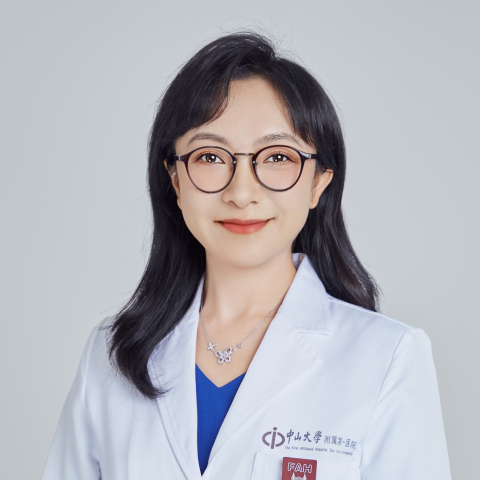

<!-- AUTO-GENERATED-BY: work/generate_obsidian_profiles.py -->

<!-- TEMPLATE: D:\workspace\信息收集整理\医生画像仓库\模板\医生画像模板.md -->

# 陈蕾

## 基础信息

| 字段 | 内容 |
|---|---|
| 姓名 | 陈蕾 |
| 医院 | 中山大学附属第一医院 |
| 科室 | 烧伤与创面修复科 |
| 职称/身份 | 主任医师 |
| 来源链接 | [官网原文](https://www.fahsysu.org.cn/node/666) |
| 采集日期 | 2026-08-13 |

## 简介/擅长

复杂难愈性创面修复； 疤痕防治； 妊娠纹修复； 面部年轻化。 研究方向： 创面及瘢痕形成及修复机制、皮肤老化演变机制、软组织修复材料研发； 主要教育和工作经历： 1.2022/05至今，中山大学附属第一医院，主任医师 2.2018/11-2019/11，美国施莱纳斯儿童医院加尔维斯顿分院，国家公派交流访问学者 2.2017/01-2022/05, 中山大学附属第一医院，副主任医师 3.2012/07-2016/12，中山大学附属第一医院，主治医师 4.2007/09-2012/06，中山大学附属第一医院，外科学，博士 5.2010/09-2012/04，美国杜克大学医学中心，国家公派联合培养博士生 6.2002/09-2007/06，中南大学湘雅医学院，临床医学，学士 其他主要工作成绩（比如获奖情况）： 1. 广东省自然科学杰出青年人才 2. 广东特支计划领军人才 3. 广东省杰出青年医学人才 论著： Zhanpeng Li#, Yahui Xiong#, Xiaogang Liu# , Xiaoxiang Wang, Fan Bie, Fan Yang, Shuying Chen, Zhaoqiang Zhang, ...

## 教育与进修经历

- 主要教育和工作经历： 1.2022/05至今，中山大学附属第一医院，主任医师 2.2018/11-2019/11，美国施莱纳斯儿童医院加尔维斯顿分院，国家公派交流访问学者 2.2017/01-2022/05, 中山大学附属第一医院，副主任医师 3.2012/07-2016/12，中山大学附属第一医院，主治医师 4.2007/09-2012/06，中山大学附属第一医院，外科学，博士 5.2010/09-2012/04，美国杜克大学医学中心，国家公派联合培养博士生 6.2002/09-2007/06，中南大学湘雅医学…

## 可包装亮点

- 主要教育和工作经历： 1.2022/05至今，中山大学附属第一医院，主任医师 2.2018/11-2019/11，美国施莱纳斯儿童医院加尔维斯顿分院，国家公派交流访问学者 2.2017/01-2022/05, 中山大学附属第一医院，副主任医师 3.2012/07-2016/12，中山大学附属第一医院，主治医师 4.2007/09-2012/06，中山大学附…

## 重点疾病/人群标签

- 慢性病：
- 肿瘤：
- 生殖疾病：
- 免疫/风湿：
- 术后恢复/康复：创面、烧伤、复杂
- 疑难重症：创面、烧伤、复杂

## 证据摘录

> 只摘录官网公开信息中的短句或关键字段，不复制大段原文。

- 官网身份字段：主任医师
- 官网简介/擅长：复杂难愈性创面修复； 疤痕防治； 妊娠纹修复； 面部年轻化。 研究方向： 创面及瘢痕形成及修复机制、皮肤老化演变机制、软组织修复材料研发； 主要教育和工作经历： 1.2022/05至今，中山大学附属第一医院，主任医师 2.2018/11-2019/11，美国施莱纳斯儿童医院加尔维斯顿分院，国家公派交流访问学者 2.2017/01-2022/05, 中山大学附属第一医院，副主任医师 3.2012/07-2016/12，中山大学附属第一医…
- 官网亮眼经历线索：主要教育和工作经历： 1.2022/05至今，中山大学附属第一医院，主任医师 2.2018/11-2019/11，美国施莱纳斯儿童医院加尔维斯顿分院，国家公派交流访问学者 2.2017/01-2022/05, 中山大学附属第一医院，副主任医师 3.2012/07-2016/12，中山大学附属第一医院，主治医师 4.2007/09-2012/06，中山大学附属第一医院，外科学，博士 5.2010/09-2012/04，美国杜克大学医学中…
- 来源链接：https://www.fahsysu.org.cn/node/666

## BD 画像摘要

陈蕾医生可作为术后恢复/康复、疑难重症方向的基础画像候选。后续 BD 使用应继续以官网来源和人工复核为准，不添加疗效承诺或无来源包装。

## 合规边界

- 仅使用医院官网、官方公众号、官方小程序等公开渠道。
- 不采集私人电话、私人微信、家庭住址、患者隐私或非公开排班信息。
- 不写“保证治愈”“疗效第一”“包治疑难杂症”等无法由官网证明的表述。
