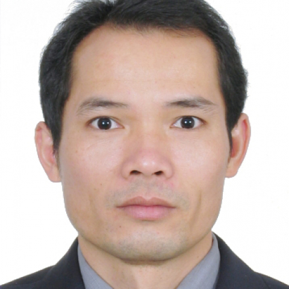

<!-- AUTO-GENERATED-BY: work/generate_obsidian_profiles.py -->

<!-- TEMPLATE: D:\workspace\信息收集整理\医生画像仓库\模板\医生画像模板.md -->

# 陈锡林

## 基础信息

| 字段 | 内容 |
|---|---|
| 姓名 | 陈锡林 |
| 医院 | 中山大学附属第一医院 |
| 科室 | 特需三科 |
| 职称/身份 | 副主任医师 |
| 来源链接 | [官网原文](https://www.fahsysu.org.cn/node/657) |
| 采集日期 | 2026-08-13 |

## 简介/擅长

1995年毕业于中山医科大学临床医学系，分配在中山医科大学（现中山大学）附属第一医院从事普通外科学临床工作。 2004年获临床医学硕士学位，2008年获肝胆外科专业医学博士学位。 对肝胆外科常见病，如原发性肝癌、胆管癌、胆囊癌、胰腺癌、肝内外胆管结石、胆管囊性扩张症、门脉高压症等有较丰富的经验，对外科急腹症诊积累了丰富的临床经验。 研究方向：肝胆肿瘤基础与临床研究； 信号通路与肝癌生物学特点。 主要教育和工作经历： 教育经历： 2005年-2008年，中山大学，附属第一医院肝胆外科，博士研究生 2001年-2004年，中山大学，附属第一医院外科，硕士研究生 1990年-1995年，中山医科大学临床医学系，大学本科 工作经历： 2008年-现在，中山大学附属第一医院，副主任医师，专注肝胆外科临床工作； 2000年-2008年，中山大学附属第一医院普通外科，主治医师； 1995年-2000年，中山大学附属第一医院普通外科，医师，经过规范化住院医师培训。 社会兼职：《中华普通外科学文献（电子版）》编委 论著：（近3年在国外杂志发表SCI收录文章） 1.Chen XL, et al. Expression of sonic h...

## 教育与进修经历

- 1995年毕业于中山医科大学临床医学系，分配在中山医科大学（现中山大学）附属第一医院从事普通外科学临床工作。
- 2004年获临床医学硕士学位，2008年获肝胆外科专业医学博士学位。
- 医疗特长：1995年毕业于中山医科大学临床医学系，分配在中山医科大学（现中山大学）附属第一医院从事普通外科学临床工作。
- 1995年-2000年，中山大学附属第一医院普通外科，医师，经过规范化住院医师培训。

## 论文与学术产出

- 社会兼职：《中华普通外科学文献（电子版）》编委 论著：（近3年在国外杂志发表SCI收录文章） 1.Chen XL, et al. Expression of sonic hedgehog signaling components in hepatocellular carcinoma and cyclopamine-induced apoptosis through Bcl-2 downregulation in vitro. Arch Med Res. 2010;
- 41(5):315-323. 2. Chen X, et al. Resistance of leukemic stem-like cells in AML cell line KG1a to natural killer cell-mediated cytotoxicity. Cancer Lett. 2011 Dec 21. [Epub ahead of print] 专著：参编《中国脾脏学》第六章

## 可包装亮点

- 主要教育和工作经历： 教育经历： 2005年-2008年，中山大学，附属第一医院肝胆外科，博士研究生 2001年-2004年，中山大学，附属第一医院外科，硕士研究生 1990年-1995年，中山医科大学临床医学系，大学本科 工作经历： 2008年-现在，中山大学附属第一医院，副主任医师，专注肝胆外科临床工作；
- 社会兼职：《中华普通外科学文献（电子版）》编委 论著：（近3年在国外杂志发表SCI收录文章） 1.Chen XL, et al. Expression of sonic hedgehog signaling components in hepatocellular carcinoma and cyclopamine-induced apoptosis th…

## 重点疾病/人群标签

- 慢性病：
- 肿瘤：肿瘤、癌、肝癌
- 生殖疾病：
- 免疫/风湿：
- 术后恢复/康复：
- 疑难重症：

## 证据摘录

> 只摘录官网公开信息中的短句或关键字段，不复制大段原文。

- 官网身份字段：副主任医师
- 官网简介/擅长：1995年毕业于中山医科大学临床医学系，分配在中山医科大学（现中山大学）附属第一医院从事普通外科学临床工作。 2004年获临床医学硕士学位，2008年获肝胆外科专业医学博士学位。 对肝胆外科常见病，如原发性肝癌、胆管癌、胆囊癌、胰腺癌、肝内外胆管结石、胆管囊性扩张症、门脉高压症等有较丰富的经验，对外科急腹症诊积累了丰富的临床经验。 研究方向：肝胆肿瘤基础与临床研究； 信号通路与肝癌生物学特点。 主要教育和工作经历： 教育经历： 200…
- 官网亮眼经历线索：主要教育和工作经历： 教育经历： 2005年-2008年，中山大学，附属第一医院肝胆外科，博士研究生 2001年-2004年，中山大学，附属第一医院外科，硕士研究生 1990年-1995年，中山医科大学临床医学系，大学本科 工作经历： 2008年-现在，中山大学附属第一医院，副主任医师，专注肝胆外科临床工作； 社会兼职：《中华普通外科学文献（电子版）》编委 论著：（近3年在国外杂志发表SCI收录文章） 1.Chen XL, et al…
- 来源链接：https://www.fahsysu.org.cn/node/657

## BD 画像摘要

陈锡林医生可作为肿瘤方向的基础画像候选。后续 BD 使用应继续以官网来源和人工复核为准，不添加疗效承诺或无来源包装。

## 合规边界

- 仅使用医院官网、官方公众号、官方小程序等公开渠道。
- 不采集私人电话、私人微信、家庭住址、患者隐私或非公开排班信息。
- 不写“保证治愈”“疗效第一”“包治疑难杂症”等无法由官网证明的表述。
