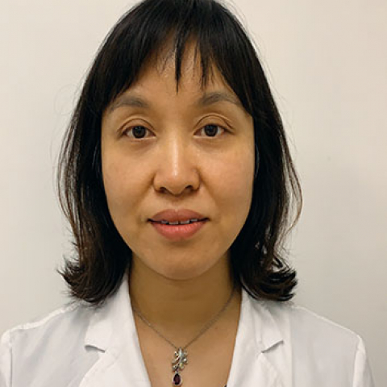

<!-- AUTO-GENERATED-BY: work/generate_obsidian_profiles.py -->

<!-- TEMPLATE: D:\workspace\信息收集整理\医生画像仓库\模板\医生画像模板.md -->

# 陈雪梅（曾用名：陈咏冲）

## 基础信息

| 字段 | 内容 |
|---|---|
| 姓名 | 陈雪梅（曾用名：陈咏冲） |
| 医院 | 中山大学附属第一医院 |
| 科室 | 眼科 |
| 职称/身份 | 副主任医师 |
| 来源链接 | [官网原文](https://www.fahsysu.org.cn/node/5750) |
| 采集日期 | 2026-08-13 |

## 简介/擅长

从事眼科临床教育工作30年，对眼科常见病多发症的诊治有丰富的临床经验，特别是 斜视弱视、屈光不正及视疲劳的诊治； 低视力的康复； 青少年近视的防控等。 研究方向：儿童视功能的发育、低视力患者的视觉康复 主要教育和工作经历：从事眼科临床及教学工作近20年 社会兼职：广东省低视力康复技术指导中心副主任 广东省视光学会眼屈光学及隐形眼镜专业委员会委员，低视力康复专业委员会常委。 论著：发表学术论文近20篇

## 论文与学术产出

- 论著：发表学术论文近20篇

## 可包装亮点

- 研究方向：儿童视功能的发育、低视力患者的视觉康复 主要教育和工作经历：从事眼科临床及教学工作近20年 社会兼职：广东省低视力康复技术指导中心副主任 广东省视光学会眼屈光学及隐形眼镜专业委员会委员，低视力康复专业委员会常委。
- 论著：发表学术论文近20篇

## 重点疾病/人群标签

- 慢性病：
- 肿瘤：
- 生殖疾病：
- 免疫/风湿：
- 术后恢复/康复：
- 疑难重症：

## 证据摘录

> 只摘录官网公开信息中的短句或关键字段，不复制大段原文。

- 官网身份字段：副主任医师
- 官网简介/擅长：从事眼科临床教育工作30年，对眼科常见病多发症的诊治有丰富的临床经验，特别是 斜视弱视、屈光不正及视疲劳的诊治； 低视力的康复； 青少年近视的防控等。 研究方向：儿童视功能的发育、低视力患者的视觉康复 主要教育和工作经历：从事眼科临床及教学工作近20年 社会兼职：广东省低视力康复技术指导中心副主任 广东省视光学会眼屈光学及隐形眼镜专业委员会委员，低视力康复专业委员会常委。 论著：发表学术论文近20篇
- 官网亮眼经历线索：研究方向：儿童视功能的发育、低视力患者的视觉康复 主要教育和工作经历：从事眼科临床及教学工作近20年 社会兼职：广东省低视力康复技术指导中心副主任 广东省视光学会眼屈光学及隐形眼镜专业委员会委员，低视力康复专业委员会常委。 论著：发表学术论文近20篇
- 异常提示：非医生页面或姓名异常
- 来源链接：https://www.fahsysu.org.cn/node/5750

## BD 画像摘要

陈雪梅（曾用名：陈咏冲）医生可作为中山大学附属第一医院眼科的基础医生资料入库。当前重点方向以总底表标签为准，官网未展示的信息保持空白。

## 合规边界

- 仅使用医院官网、官方公众号、官方小程序等公开渠道。
- 不采集私人电话、私人微信、家庭住址、患者隐私或非公开排班信息。
- 不写“保证治愈”“疗效第一”“包治疑难杂症”等无法由官网证明的表述。
