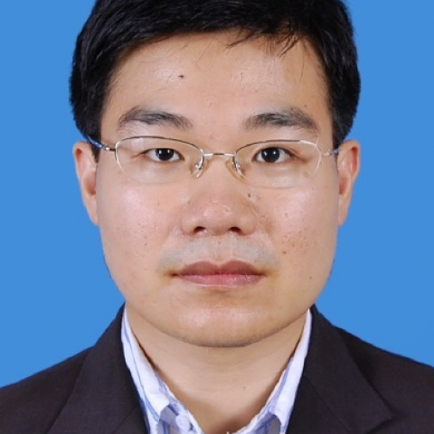

<!-- AUTO-GENERATED-BY: work/generate_obsidian_profiles.py -->

<!-- TEMPLATE: D:\workspace\信息收集整理\医生画像仓库\模板\医生画像模板.md -->

# 陈颖华

## 基础信息

| 字段 | 内容 |
|---|---|
| 姓名 | 陈颖华 |
| 医院 | 中山大学附属第一医院 |
| 科室 | 器官移植科 |
| 职称/身份 | 副主任医师 |
| 来源链接 | [官网原文](https://www.fahsysu.org.cn/node/5659) |
| 采集日期 | 2026-08-13 |

## 简介/擅长

2007年中山大学外科学博士毕业，一直从事肝脏外科、肝移植与乙肝肝硬化及肝癌肝移植相关治疗临床工作。 擅长肝癌、乙型病毒性肝炎肝硬化等终末期肝病的肝移植手术治疗与综合治疗并进行深入系统研究。 对肝移植手术治疗、肝移植围手术期及术后中长期管理、肝癌综合治疗及乙肝肝硬化、门静脉高压、肝功能衰竭等危急重症救治丰富的临床经验。 研究方向： 1. 肝移植； 2.肝癌； 3. 乙肝肝硬化、肝纤维化。 主要教育和工作经历： 1997、09～2002、06 广州医学院 医疗系本科（学士） 2002、09～2004、06 中山大学附属第一医院 外科学硕士 2004、09～2007、06 中山大学附属第三医院 外科学博士 2007、07～2008、12 中山大学附属第三医院肝移植中心住院医师 2008、12～2012、09 中山大学附属第三医院肝移植中心主治医师 2012、10～2014、12 中山大学附属第一医院器官移植科 主治医师 2014、12至今 中山大学附属第一医院器官移植科 副主任医师 社会兼职：广东省肝病学会肝衰竭与人工肝专业委员会委员。 论著：在国内外核心期刊发表论文40余篇，其中SCI论文5篇。 专著：参与编写《移植肝脏...

## 教育与进修经历

- 2007年中山大学外科学博士毕业，一直从事肝脏外科、肝移植与乙肝肝硬化及肝癌肝移植相关治疗临床工作。
- 医疗特长： 2007年中山大学外科学博士毕业，一直从事肝脏外科、肝移植与乙肝肝硬化及肝癌肝移植相关治疗临床工作。

## 科研项目与成果

- 其他主要工作成绩：主持国家自然科学基金一项，广东省科技计划项目一项，广东省医学科研基金一项，中山大学青年教师基金一项，参与国家自然科学基金2项，广东省科技计划项目3项。

## 论文与学术产出

- 论著：在国内外核心期刊发表论文40余篇，其中SCI论文5篇。

## 可包装亮点

- 主要教育和工作经历： 1997、09～2002、06 广州医学院 医疗系本科（学士） 2002、09～2004、06 中山大学附属第一医院 外科学硕士 2004、09～2007、06 中山大学附属第三医院 外科学博士 2007、07～2008、12 中山大学附属第三医院肝移植中心住院医师 2008、12～2012、09 中山大学附属第三医院肝移植中心主治医…
- 论著：在国内外核心期刊发表论文40余篇，其中SCI论文5篇。
- 其他主要工作成绩：主持国家自然科学基金一项，广东省科技计划项目一项，广东省医学科研基金一项，中山大学青年教师基金一项，参与国家自然科学基金2项，广东省科技计划项目3项。

## 重点疾病/人群标签

- 慢性病：
- 肿瘤：肝癌、术后、重症
- 生殖疾病：
- 免疫/风湿：
- 术后恢复/康复：肝癌、术后、重症
- 疑难重症：肝癌、术后、重症

## 证据摘录

> 只摘录官网公开信息中的短句或关键字段，不复制大段原文。

- 官网身份字段：副主任医师
- 官网简介/擅长：2007年中山大学外科学博士毕业，一直从事肝脏外科、肝移植与乙肝肝硬化及肝癌肝移植相关治疗临床工作。 擅长肝癌、乙型病毒性肝炎肝硬化等终末期肝病的肝移植手术治疗与综合治疗并进行深入系统研究。 对肝移植手术治疗、肝移植围手术期及术后中长期管理、肝癌综合治疗及乙肝肝硬化、门静脉高压、肝功能衰竭等危急重症救治丰富的临床经验。 研究方向： 1. 肝移植； 2.肝癌； 3. 乙肝肝硬化、肝纤维化。 主要教育和工作经历： 1997、09～2002…
- 官网亮眼经历线索：主要教育和工作经历： 1997、09～2002、06 广州医学院 医疗系本科（学士） 2002、09～2004、06 中山大学附属第一医院 外科学硕士 2004、09～2007、06 中山大学附属第三医院 外科学博士 2007、07～2008、12 中山大学附属第三医院肝移植中心住院医师 2008、12～2012、09 中山大学附属第三医院肝移植中心主治医师 2012、10～2014、12 中山大学附属第一医院器官移植科 主治医师 2…
- 来源链接：https://www.fahsysu.org.cn/node/5659

## BD 画像摘要

陈颖华医生可作为肿瘤、术后恢复/康复、疑难重症方向的基础画像候选。后续 BD 使用应继续以官网来源和人工复核为准，不添加疗效承诺或无来源包装。

## 合规边界

- 仅使用医院官网、官方公众号、官方小程序等公开渠道。
- 不采集私人电话、私人微信、家庭住址、患者隐私或非公开排班信息。
- 不写“保证治愈”“疗效第一”“包治疑难杂症”等无法由官网证明的表述。
