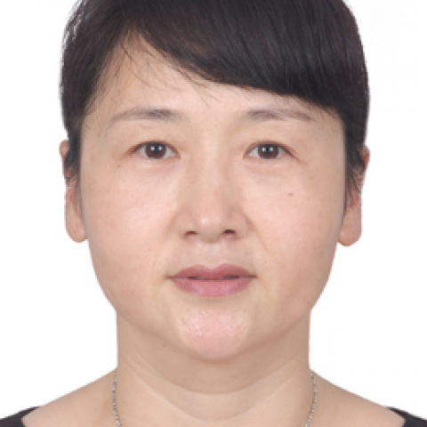

<!-- AUTO-GENERATED-BY: work/generate_obsidian_profiles.py -->

<!-- TEMPLATE: D:\workspace\信息收集整理\医生画像仓库\模板\医生画像模板.md -->

# 陶玉倩

## 基础信息

| 字段 | 内容 |
|---|---|
| 姓名 | 陶玉倩 |
| 医院 | 中山大学附属第一医院 |
| 科室 | 神经二科（脑血管病专科） |
| 职称/身份 | 主任医师/教授 |
| 来源链接 | [官网原文](https://www.fahsysu.org.cn/node/899) |
| 采集日期 | 2026-08-13 |

## 简介/擅长

1987年从中山医科大学毕业后一直在中山一院神经内科工作，受到严格正规的神经科训练，师从国内几大著名的神经科老专家的言传身教，基础理论基本技能过硬，通过临床医学博士的学习过程，更加增加了本学科及相关学科的知识面，长期工作在临床第一线，如病房、门诊、急诊、神经科重症监护室，神经电生理室等，临床经验丰富，救治无数危重病人。 熟练掌握神经科常见疾病的诊断和治疗，尤其专长治疗脑血管疾病（包括脑梗塞、脑出血、蛛网膜下腔出血）、头晕、头痛、晕厥； 老年性疾病； 周围神经病； 帕金森病； 脊髓病； 多发性硬化； 重症肌无力及睡眠障碍。 研究方向： 脑血管疾病及老年性疾病 主要教育和工作经历： 1981年9月至1987年7月 就读于中山医科大学医疗系 1987年7月至1993年10月 任中山医科大学附属第一医院神经科住院医师 1992年9月至1995年11月 攻读中山医科大学博士研究生 1993年11月至1999年10月 任中山医科大学附属第一医院神经科主治医师 1999年11月至今 任中山大学附属第一医院神经科副教授、副主任医师 社会兼职： 无 论著： 1、重组人Semaphorin3A诱导体外培养的大鼠大脑皮层神经元轴突损伤的实验...

## 教育与进修经历

- 1987年从中山医科大学毕业后一直在中山一院神经内科工作，受到严格正规的神经科训练，师从国内几大著名的神经科老专家的言传身教，基础理论基本技能过硬，通过临床医学博士的学习过程，更加增加了本学科及相关学科的知识面，长期工作在临床第一线，如病房、门诊、急诊、神经科重症监护室，神经电生理室等，临床经验丰富，救治无数危重病人。
- 医疗特长： 1987年从中山医科大学毕业后一直在中山一院神经内科工作，受到严格正规的神经科训练，师从国内几大著名的神经科老专家的言传身教，基础理论基本技能过硬，通过临床医学博士的学习过程，更加增加了本学科及相关学科的知识面，长期工作在临床第一线，如病房、门诊、急诊、神经科重症监护室，神经电生理室等，临床经验丰富，救治无数危重病人。

## 科研项目与成果

- 其他主要工作成绩（比如获奖情况）： 广东省教育厅、广东省卫生厅颁发的“抗高血压治疗预防脑卒中的实验研究”科技成果二等奖，广东省人民政府颁发的“脑梗死的血管损害病历机制及治疗新概念”科技成果二等奖的参与者。

## 可包装亮点

- 1987年从中山医科大学毕业后一直在中山一院神经内科工作，受到严格正规的神经科训练，师从国内几大著名的神经科老专家的言传身教，基础理论基本技能过硬，通过临床医学博士的学习过程，更加增加了本学科及相关学科的知识面，长期工作在临床第一线，如病房、门诊、急诊、神经科重症监护室，神经电生理室等，临床经验丰富，救治无数危重病人。
- 医疗特长： 1987年从中山医科大学毕业后一直在中山一院神经内科工作，受到严格正规的神经科训练，师从国内几大著名的神经科老专家的言传身教，基础理论基本技能过硬，通过临床医学博士的学习过程，更加增加了本学科及相关学科的知识面，长期工作在临床第一线，如病房、门诊、急诊、神经科重症监护室，神经电生理室等，临床经验丰富，救治无数危重病人。
- 研究方向： 脑血管疾病及老年性疾病 主要教育和工作经历： 1981年9月至1987年7月 就读于中山医科大学医疗系 1987年7月至1993年10月 任中山医科大学附属第一医院神...

## 重点疾病/人群标签

- 慢性病：高血压、动脉粥样硬化、康复、危重、重症
- 肿瘤：
- 生殖疾病：
- 免疫/风湿：
- 术后恢复/康复：高血压、动脉粥样硬化、康复、危重、重症
- 疑难重症：高血压、动脉粥样硬化、康复、危重、重症

## 证据摘录

> 只摘录官网公开信息中的短句或关键字段，不复制大段原文。

- 官网身份字段：主任医师/教授
- 官网简介/擅长：1987年从中山医科大学毕业后一直在中山一院神经内科工作，受到严格正规的神经科训练，师从国内几大著名的神经科老专家的言传身教，基础理论基本技能过硬，通过临床医学博士的学习过程，更加增加了本学科及相关学科的知识面，长期工作在临床第一线，如病房、门诊、急诊、神经科重症监护室，神经电生理室等，临床经验丰富，救治无数危重病人。 熟练掌握神经科常见疾病的诊断和治疗，尤其专长治疗脑血管疾病（包括脑梗塞、脑出血、蛛网膜下腔出血）、头晕、头痛、晕厥…
- 官网亮眼经历线索：1987年从中山医科大学毕业后一直在中山一院神经内科工作，受到严格正规的神经科训练，师从国内几大著名的神经科老专家的言传身教，基础理论基本技能过硬，通过临床医学博士的学习过程，更加增加了本学科及相关学科的知识面，长期工作在临床第一线，如病房、门诊、急诊、神经科重症监护室，神经电生理室等，临床经验丰富，救治无数危重病人。 医疗特长： 1987年从中山医科大学毕业后一直在中山一院神经内科工作，受到严格正规的神经科训练，师从国内几大著名的神…
- 来源链接：https://www.fahsysu.org.cn/node/899

## BD 画像摘要

陶玉倩医生可作为慢性病、术后恢复/康复、疑难重症方向的基础画像候选。后续 BD 使用应继续以官网来源和人工复核为准，不添加疗效承诺或无来源包装。

## 合规边界

- 仅使用医院官网、官方公众号、官方小程序等公开渠道。
- 不采集私人电话、私人微信、家庭住址、患者隐私或非公开排班信息。
- 不写“保证治愈”“疗效第一”“包治疑难杂症”等无法由官网证明的表述。
