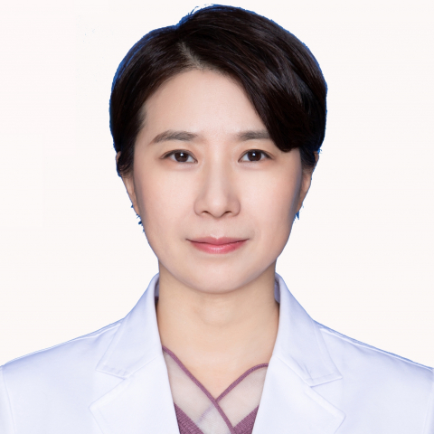

<!-- AUTO-GENERATED-BY: work/generate_obsidian_profiles.py -->

<!-- TEMPLATE: D:\workspace\信息收集整理\医生画像仓库\模板\医生画像模板.md -->

# 隋昳

## 基础信息

| 字段 | 内容 |
|---|---|
| 姓名 | 隋昳 |
| 医院 | 中山大学附属第一医院 |
| 科室 | 临床营养科 |
| 职称/身份 | 副研究员 |
| 来源链接 | [官网原文](https://www.fahsysu.org.cn/node/29817) |
| 采集日期 | 2026-08-13 |

## 简介/擅长

营养相关疾病的诊治。 研究方向：代谢性疾病及营养相关疾病的发病机理和治疗。 主要教育和工作经历： 内分泌代谢学硕士，内科学博士、博士后，中山大学“百人计划”引进人才，临床营养科主任、学术带头人、博导。 社会兼职： 广东省临床营养质控中心主任、中国营养学会青年组副组长 论著： [1] Sui Y, Hu W, Zhang W, Li D, Zhu H, You Q, Zhu R, Yi Q, Tang T, Gao L, Zhu S, Yang T: Insights into homeobox B9: a propeller for metastasis in dormant prostate cancer progenitor cells. Br J Cancer 2021, 125:1003-15. [2] Sui Y, Zhang W, Zhu R, Gao L, Cao T, Chen C, Gong M, Zhu H, Tang T, Yu B, Yang T: Roles of NANOGP8 in cancer metastasis and cancer stem cell invasion during...

## 教育与进修经历

- 主要教育和工作经历： 内分泌代谢学硕士，内科学博士、博士后，中山大学“百人计划”引进人才，临床营养科主任、学术带头人、博导。

## 可包装亮点

- 主要教育和工作经历： 内分泌代谢学硕士，内科学博士、博士后，中山大学“百人计划”引进人才，临床营养科主任、学术带头人、博导。
- 社会兼职： 广东省临床营养质控中心主任、中国营养学会青年组副组长 论著： [1] Sui Y, Hu W, Zhang W, Li D, Zhu H, You Q, Zhu R, Yi Q, Tang T, Gao L, Zhu S, Yang T: Insights into homeobox B9: a propeller for metastasis…

## 重点疾病/人群标签

- 慢性病：代谢、营养
- 肿瘤：
- 生殖疾病：
- 免疫/风湿：
- 术后恢复/康复：代谢、营养
- 疑难重症：

## 证据摘录

> 只摘录官网公开信息中的短句或关键字段，不复制大段原文。

- 官网身份字段：副研究员
- 官网简介/擅长：营养相关疾病的诊治。 研究方向：代谢性疾病及营养相关疾病的发病机理和治疗。 主要教育和工作经历： 内分泌代谢学硕士，内科学博士、博士后，中山大学“百人计划”引进人才，临床营养科主任、学术带头人、博导。 社会兼职： 广东省临床营养质控中心主任、中国营养学会青年组副组长 论著： [1] Sui Y, Hu W, Zhang W, Li D, Zhu H, You Q, Zhu R, Yi Q, Tang T, Gao L, Zhu S,…
- 官网亮眼经历线索：主要教育和工作经历： 内分泌代谢学硕士，内科学博士、博士后，中山大学“百人计划”引进人才，临床营养科主任、学术带头人、博导。 社会兼职： 广东省临床营养质控中心主任、中国营养学会青年组副组长 论著： [1] Sui Y, Hu W, Zhang W, Li D, Zhu H, You Q, Zhu R, Yi Q, Tang T, Gao L, Zhu S, Yang T: Insights into homeobox B9: a p…
- 来源链接：https://www.fahsysu.org.cn/node/29817

## BD 画像摘要

隋昳医生可作为慢性病、术后恢复/康复方向的基础画像候选。后续 BD 使用应继续以官网来源和人工复核为准，不添加疗效承诺或无来源包装。

## 合规边界

- 仅使用医院官网、官方公众号、官方小程序等公开渠道。
- 不采集私人电话、私人微信、家庭住址、患者隐私或非公开排班信息。
- 不写“保证治愈”“疗效第一”“包治疑难杂症”等无法由官网证明的表述。
