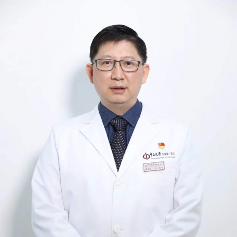

<!-- AUTO-GENERATED-BY: work/generate_obsidian_profiles.py -->

<!-- TEMPLATE: D:\workspace\信息收集整理\医生画像仓库\模板\医生画像模板.md -->

# 雷文斌

## 基础信息

| 字段 | 内容 |
|---|---|
| 姓名 | 雷文斌 |
| 医院 | 中山大学附属第一医院 |
| 科室 | 咽喉专科 |
| 职称/身份 | 主任医师/教授 |
| 来源链接 | [官网原文](https://www.fahsysu.org.cn/node/5697) |
| 采集日期 | 2026-08-13 |

## 简介/擅长

从事耳鼻咽喉科工作近三十年，擅长咽喉头颈恶性肿瘤手术切除、功能重建及各种转移皮瓣单独或联合修复术，年收治咽喉癌患者300余例，年完成喉癌、下咽癌、食道上段癌等咽喉头颈恶性肿瘤复杂手术近200台，四级手术率达60%； 同时对咽喉头颈恶性肿瘤免疫治疗具有丰富的临床经验。 擅长显微CO2激光微创技术：早期咽喉恶性肿瘤、复发性喉癌、复发性呼吸道乳头状瘤和嗓音微创手术等。 擅长成人及儿童睡眠呼吸障碍的诊断与治疗。 主要教育和工作经历： 1991.9-1996.6 中山医科大学 临床医学本科 1996.7-2001.12 中山大学附属第一医院耳鼻咽喉科 住院医师 1999.9-2004.6 中山大学附属第一医院耳鼻咽喉科 硕博连读 2002.1-2007.12 中山大学附属第一医院耳鼻咽喉科 主治医师 2002.6-2002.11 德国科隆大学耳鼻咽喉头颈外科 客座研究员 2008.1-2012.12 中山大学附属第一医院耳鼻咽喉科 副主任医师 2008.8-2009.7 香港大学医学中心玛丽医院咽喉科 客座研究员 2011.4-2011.10 美国纽约Memorial Sloan-Kettering癌症中心头颈外科 客座研究员 ...

## 教育与进修经历

- 专注耳鼻咽喉微创模拟培训体系及头颈肿瘤、鼾症等数字化专病研究平台研创及智慧管理；

## 科研项目与成果

- 主持国家重点研发计划项目子课题1项、国自然3项，省/市重点项目5项及国家课程等20余项，在研经费900余万，主编人卫《咽喉微创手术策略与技巧》、《头颈外科疑难病例解析》等专著6本，主编《耳鼻咽喉头颈外科学》获“十四五”高等教育规划教材立项；
- 申请国际发明3项，国家专利6项，授权2项，软著4项，以第一/通讯作者发表SCI论著近50篇。
- 获中山大学研究生教育教学成果一等奖；
- 获广东省柯麟教育基金会临床教学杰出贡献奖等

## 论文与学术产出

- 主持国家重点研发计划项目子课题1项、国自然3项，省/市重点项目5项及国家课程等20余项，在研经费900余万，主编人卫《咽喉微创手术策略与技巧》、《头颈外科疑难病例解析》等专著6本，主编《耳鼻咽喉头颈外科学》获“十四五”高等教育规划教材立项；
- 申请国际发明3项，国家专利6项，授权2项，软著4项，以第一/通讯作者发表SCI论著近50篇。

## 可包装亮点

- 主要教育和工作经历： 1991.9-1996.6 中山医科大学 临床医学本科 1996.7-2001.12 中山大学附属第一医院耳鼻咽喉科 住院医师 1999.9-2004.6 中山大学附属第一医院耳鼻咽喉科 硕博连读 2002.1-2007.12 中山大学附属第一医院耳鼻咽喉科 主治医师 2002.6-2002.11 德国科隆大学耳鼻咽喉头颈外科 客座研…

## 重点疾病/人群标签

- 慢性病：
- 肿瘤：肿瘤、癌、瘤、免疫、康复、疑难、危重、复杂
- 生殖疾病：
- 免疫/风湿：肿瘤、癌、瘤、免疫、康复、疑难、危重、复杂
- 术后恢复/康复：肿瘤、癌、瘤、免疫、康复、疑难、危重、复杂
- 疑难重症：肿瘤、癌、瘤、免疫、康复、疑难、危重、复杂

## 证据摘录

> 只摘录官网公开信息中的短句或关键字段，不复制大段原文。

- 官网身份字段：主任医师/教授
- 官网简介/擅长：从事耳鼻咽喉科工作近三十年，擅长咽喉头颈恶性肿瘤手术切除、功能重建及各种转移皮瓣单独或联合修复术，年收治咽喉癌患者300余例，年完成喉癌、下咽癌、食道上段癌等咽喉头颈恶性肿瘤复杂手术近200台，四级手术率达60%； 同时对咽喉头颈恶性肿瘤免疫治疗具有丰富的临床经验。 擅长显微CO2激光微创技术：早期咽喉恶性肿瘤、复发性喉癌、复发性呼吸道乳头状瘤和嗓音微创手术等。 擅长成人及儿童睡眠呼吸障碍的诊断与治疗。 主要教育和工作经历： 1991…
- 官网亮眼经历线索：主要教育和工作经历： 1991.9-1996.6 中山医科大学 临床医学本科 1996.7-2001.12 中山大学附属第一医院耳鼻咽喉科 住院医师 1999.9-2004.6 中山大学附属第一医院耳鼻咽喉科 硕博连读 2002.1-2007.12 中山大学附属第一医院耳鼻咽喉科 主治医师 2002.6-2002.11 德国科隆大学耳鼻咽喉头颈外科 客座研究员 2008.1-2012.12 中山大学附属第一医院耳鼻咽喉科 副主任医师…
- 来源链接：https://www.fahsysu.org.cn/node/5697

## BD 画像摘要

雷文斌医生可作为肿瘤、免疫/风湿/感染、术后恢复/康复、疑难重症方向的基础画像候选。后续 BD 使用应继续以官网来源和人工复核为准，不添加疗效承诺或无来源包装。

## 合规边界

- 仅使用医院官网、官方公众号、官方小程序等公开渠道。
- 不采集私人电话、私人微信、家庭住址、患者隐私或非公开排班信息。
- 不写“保证治愈”“疗效第一”“包治疑难杂症”等无法由官网证明的表述。
