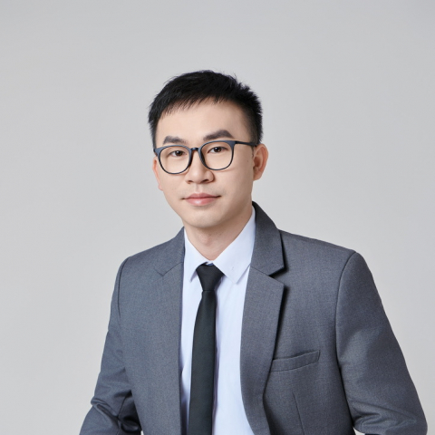

<!-- AUTO-GENERATED-BY: work/generate_obsidian_profiles.py -->

<!-- TEMPLATE: D:\workspace\信息收集整理\医生画像仓库\模板\医生画像模板.md -->

# 韦广滟

## 基础信息

| 字段 | 内容 |
|---|---|
| 姓名 | 韦广滟 |
| 医院 | 中山大学附属第一医院 |
| 科室 | 放射治疗科 |
| 职称/身份 | 副主任医师 |
| 来源链接 | [官网原文](https://www.fahsysu.org.cn/node/38114) |
| 采集日期 | 2026-08-13 |

## 简介/擅长

长期从事恶性肿瘤综合治疗的临床与研究工作，聚焦肝癌、胆道肿瘤及胰腺癌等消化系统恶性肿瘤的规范化与精准化治疗。 擅长综合运用放射治疗、化疗、靶向治疗及免疫治疗等手段，制定个体化综合治疗方案； 在复杂病例决策、治疗时序优化及治疗相关不良反应的规范化管理方面具有较为丰富的临床经验。 要教育和工作经历： 2009.09至 2014.06 中南大学湘雅医学院，临床医学，学士 2014.09至 2019.06 中山大学附属第一医院，硕博连读，博士 2016.05至 2018.05 美国哈佛医学院贝斯以色列女执事医疗中心，访问学者 2016.12 美国梅奥医学中心，访问学者 2019.07至2024.12 中山大学附属第一医院放射治疗科 住院医生 2022.12至今 中山大学附属第一医院放射治疗科 助理研究员 2024.12至2025.12 中山大学附属第一医院放射治疗科 主治医师 2025.12至今 中山大学附属第一医院放射治疗科 副主任医师 科研经历： 发表SCI论文11篇，包括J Hepatol（IF:33）、JAMA Oncol (IF:20.1)、Hepatol（ IF: 15.8）、Nat Commun（IF: 15.7...

## 教育与进修经历

- 要教育和工作经历： 2009.09至 2014.06 中南大学湘雅医学院，临床医学，学士 2014.09至 2019.06 中山大学附属第一医院，硕博连读，博士 2016.05至 2018.05 美国哈佛医学院贝斯以色列女执事医疗中心，访问学者 2016.12 美国梅奥医学中心，访问学者 2019.07至2024.12 中山大学附属第一医院放射治疗科 住院医生 2022.12至今 中山大学附属第一医院放射治疗科 助理研究员 2024.12至2025.12 中山大学附属第一医院放射治疗科 主治医师 2025.12至…
- 主持国自然青年项目、中国博士后面上项目，中山大学附属第一医院柯麟新星人才、第九批“广东特支计划”青年拔尖人才。

## 科研项目与成果

- 主持国自然青年项目、中国博士后面上项目，中山大学附属第一医院柯麟新星人才、第九批“广东特支计划”青年拔尖人才。

## 可包装亮点

- 长期从事恶性肿瘤综合治疗的临床与研究工作，聚焦肝癌、胆道肿瘤及胰腺癌等消化系统恶性肿瘤的规范化与精准化治疗。
- 医疗特长：长期从事恶性肿瘤综合治疗的临床与研究工作，聚焦肝癌、胆道肿瘤及胰腺癌等消化系统恶性肿瘤的规范化与精准化治疗。
- 要教育和工作经历： 2009.09至 2014.06 中南大学湘雅医学院，临床医学，学士 2014.09至 2019.06 中山大学附属第一医院，硕博连读，博士 2016.05至 2018.05 美国哈佛医学院贝斯以色列女执事医疗中心，访问学者 2016.12 美国梅奥医学中心，访问学者 2019.07至2024.12 中山大学附属第一医院放射治疗科 住院…

## 重点疾病/人群标签

- 慢性病：
- 肿瘤：肿瘤、癌、化疗、靶向、肝癌、免疫、复杂
- 生殖疾病：
- 免疫/风湿：肿瘤、癌、化疗、靶向、肝癌、免疫、复杂
- 术后恢复/康复：
- 疑难重症：肿瘤、癌、化疗、靶向、肝癌、免疫、复杂

## 证据摘录

> 只摘录官网公开信息中的短句或关键字段，不复制大段原文。

- 官网身份字段：副主任医师
- 官网简介/擅长：长期从事恶性肿瘤综合治疗的临床与研究工作，聚焦肝癌、胆道肿瘤及胰腺癌等消化系统恶性肿瘤的规范化与精准化治疗。 擅长综合运用放射治疗、化疗、靶向治疗及免疫治疗等手段，制定个体化综合治疗方案； 在复杂病例决策、治疗时序优化及治疗相关不良反应的规范化管理方面具有较为丰富的临床经验。 要教育和工作经历： 2009.09至 2014.06 中南大学湘雅医学院，临床医学，学士 2014.09至 2019.06 中山大学附属第一医院，硕博连读，博士…
- 官网亮眼经历线索：长期从事恶性肿瘤综合治疗的临床与研究工作，聚焦肝癌、胆道肿瘤及胰腺癌等消化系统恶性肿瘤的规范化与精准化治疗。 医疗特长：长期从事恶性肿瘤综合治疗的临床与研究工作，聚焦肝癌、胆道肿瘤及胰腺癌等消化系统恶性肿瘤的规范化与精准化治疗。 要教育和工作经历： 2009.09至 2014.06 中南大学湘雅医学院，临床医学，学士 2014.09至 2019.06 中山大学附属第一医院，硕博连读，博士 2016.05至 2018.05 美国哈佛医学…
- 来源链接：https://www.fahsysu.org.cn/node/38114

## BD 画像摘要

韦广滟医生可作为肿瘤、免疫/风湿/感染、疑难重症方向的基础画像候选。后续 BD 使用应继续以官网来源和人工复核为准，不添加疗效承诺或无来源包装。

## 合规边界

- 仅使用医院官网、官方公众号、官方小程序等公开渠道。
- 不采集私人电话、私人微信、家庭住址、患者隐私或非公开排班信息。
- 不写“保证治愈”“疗效第一”“包治疑难杂症”等无法由官网证明的表述。
