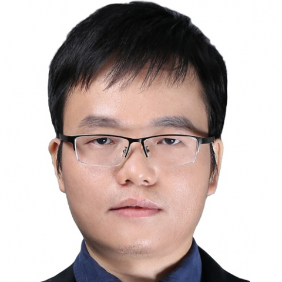

<!-- AUTO-GENERATED-BY: work/generate_obsidian_profiles.py -->

<!-- TEMPLATE: D:\workspace\信息收集整理\医生画像仓库\模板\医生画像模板.md -->

# 韦锦焕

## 基础信息

| 字段 | 内容 |
|---|---|
| 姓名 | 韦锦焕 |
| 医院 | 中山大学附属第一医院 |
| 科室 | 泌尿外科 |
| 职称/身份 | 副主任医师 |
| 来源链接 | [官网原文](https://www.fahsysu.org.cn/node/25418) |
| 采集日期 | 2026-08-13 |

## 简介/擅长

## 教育与进修经历

- 主要教育和工作经历： 2010年本科毕业于武汉大学。
- 2010年至2015年在中山大学附属第一医院获得博士学位（硕博连读）。
- 2015年获外科学博士学位后于中山大学附属第一医院工作至今。

## 科研项目与成果

- 社会兼职：无 论著： 肾癌精准诊疗研究成果发表于《柳叶刀肿瘤》杂志（Lancet oncology），第一/共一、通讯/共同通讯作者身份发表泌尿系统肿瘤基础及临床研究的SCI论著10余篇。

## 论文与学术产出

- 社会兼职：无 论著： 肾癌精准诊疗研究成果发表于《柳叶刀肿瘤》杂志（Lancet oncology），第一/共一、通讯/共同通讯作者身份发表泌尿系统肿瘤基础及临床研究的SCI论著10余篇。

## 可包装亮点

- 研究方向： 泌尿系统肿瘤（肾癌、前列腺癌、膀胱癌、肾盂输尿管癌）精准诊疗的基础与临床研究。
- 2013年至2014年美国德州大学西南医学中心泌尿外科出国访学。
- 社会兼职：无 论著： 肾癌精准诊疗研究成果发表于《柳叶刀肿瘤》杂志（Lancet oncology），第一/共一、通讯/共同通讯作者身份发表泌尿系统肿瘤基础及临床研究的SCI论著10余篇。
- 专著：无 其他主要工作成绩（比如获奖情况）：广东特支计划科技创新青年拔尖人才，中山大学附属第一医院柯麟新锐人才

## 重点疾病/人群标签

- 慢性病：
- 肿瘤：肿瘤、癌
- 生殖疾病：
- 免疫/风湿：
- 术后恢复/康复：
- 疑难重症：

## 证据摘录

> 只摘录官网公开信息中的短句或关键字段，不复制大段原文。

- 官网身份字段：副主任医师
- 官网亮眼经历线索：研究方向： 泌尿系统肿瘤（肾癌、前列腺癌、膀胱癌、肾盂输尿管癌）精准诊疗的基础与临床研究。 2013年至2014年美国德州大学西南医学中心泌尿外科出国访学。 社会兼职：无 论著： 肾癌精准诊疗研究成果发表于《柳叶刀肿瘤》杂志（Lancet oncology），第一/共一、通讯/共同通讯作者身份发表泌尿系统肿瘤基础及临床研究的SCI论著10余篇。 专著：无 其他主要工作成绩（比如获奖情况）：广东特支计划科技创新青年拔尖人才，中山大学附属…
- 来源链接：https://www.fahsysu.org.cn/node/25418

## BD 画像摘要

韦锦焕医生可作为肿瘤方向的基础画像候选。后续 BD 使用应继续以官网来源和人工复核为准，不添加疗效承诺或无来源包装。

## 合规边界

- 仅使用医院官网、官方公众号、官方小程序等公开渠道。
- 不采集私人电话、私人微信、家庭住址、患者隐私或非公开排班信息。
- 不写“保证治愈”“疗效第一”“包治疑难杂症”等无法由官网证明的表述。
