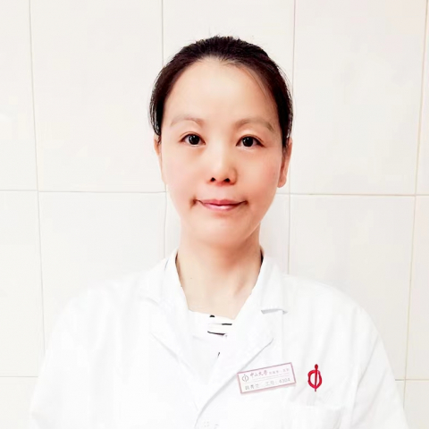

<!-- AUTO-GENERATED-BY: work/generate_obsidian_profiles.py -->

<!-- TEMPLATE: D:\workspace\信息收集整理\医生画像仓库\模板\医生画像模板.md -->

# 韩秀兰

## 基础信息

| 字段 | 内容 |
|---|---|
| 姓名 | 韩秀兰 |
| 医院 | 中山大学附属第一医院 |
| 科室 | 康复医学科 |
| 职称/身份 | 副主任技师 |
| 来源链接 | [官网原文](https://www.fahsysu.org.cn/node/36160) |
| 采集日期 | 2026-08-13 |

## 简介/擅长

## 科研项目与成果

- 社会兼职： 广东省康复医学会作业治疗分会 副会长 广东省康复医学会围产康复分会 常务理事 “健康儿童行动—儿童健康知识普及计划”国家卫生健康公益项目专家委员会委员 广州市残疾预防及综合干预专家库成员 科研情况： 研究方向为上肢创伤康复治疗；
- 获国家专利3项；
- 主持广东省医学基金等课题3项；
- 参与国家自然科学基金2项。

## 论文与学术产出

- 近年来以第一/共一作者身份发表骨科康复和下肢生物力学方向论文十余篇；

## 可包装亮点

- 社会兼职： 广东省康复医学会作业治疗分会 副会长 广东省康复医学会围产康复分会 常务理事 “健康儿童行动—儿童健康知识普及计划”国家卫生健康公益项目专家委员会委员 广州市残疾预防及综合干预专家库成员 科研情况： 研究方向为上肢创伤康复治疗；
- 近年来以第一/共一作者身份发表骨科康复和下肢生物力学方向论文十余篇；
- 获国家专利3项；
- 参与国家自然科学基金2项。

## 重点疾病/人群标签

- 慢性病：
- 肿瘤：
- 生殖疾病：
- 免疫/风湿：
- 术后恢复/康复：康复、功能障碍
- 疑难重症：

## 证据摘录

> 只摘录官网公开信息中的短句或关键字段，不复制大段原文。

- 官网身份字段：副主任技师
- 官网亮眼经历线索：社会兼职： 广东省康复医学会作业治疗分会 副会长 广东省康复医学会围产康复分会 常务理事 “健康儿童行动—儿童健康知识普及计划”国家卫生健康公益项目专家委员会委员 广州市残疾预防及综合干预专家库成员 科研情况： 研究方向为上肢创伤康复治疗； 近年来以第一/共一作者身份发表骨科康复和下肢生物力学方向论文十余篇； 获国家专利3项； 参与国家自然科学基金2项。
- 来源链接：https://www.fahsysu.org.cn/node/36160

## BD 画像摘要

韩秀兰医生可作为术后恢复/康复方向的基础画像候选。后续 BD 使用应继续以官网来源和人工复核为准，不添加疗效承诺或无来源包装。

## 合规边界

- 仅使用医院官网、官方公众号、官方小程序等公开渠道。
- 不采集私人电话、私人微信、家庭住址、患者隐私或非公开排班信息。
- 不写“保证治愈”“疗效第一”“包治疑难杂症”等无法由官网证明的表述。
