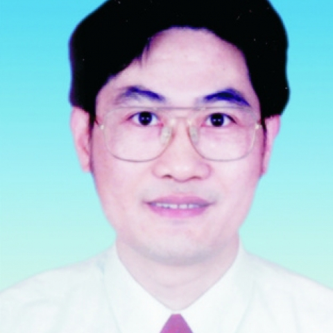

<!-- AUTO-GENERATED-BY: work/generate_obsidian_profiles.py -->

<!-- TEMPLATE: D:\workspace\信息收集整理\医生画像仓库\模板\医生画像模板.md -->

# 顾立强

## 基础信息

| 字段 | 内容 |
|---|---|
| 姓名 | 顾立强 |
| 医院 | 中山大学附属第一医院 |
| 科室 | 显微创伤外手科 |
| 职称/身份 | 主任医师/教授 |
| 来源链接 | [官网原文](https://www.fahsysu.org.cn/node/5635) |
| 采集日期 | 2026-08-13 |

## 简介/擅长

1984年本科毕业后，一直在医科大学附属医院从事骨科、显微外科临床工作。 专业方向：创伤骨科，显微外科，手外科，周围神经及臂丛损伤修复。 擅长周围神经及臂丛损伤的修复与功能重建，四肢骨折、关节及骨盆损伤的诊治、骨折微创内固定手术，多发伤的救治，手外伤、断肢(指)再植、足趾移植再造手指，肢体血管、肌肉、皮肤软组织严重创伤与缺损的显微外科修复与功能重建，手部及四肢畸形的矫形、骨延长与显微重建。 在国内率先开展全臂丛根性撕脱、重建手握持功能的新术式——早期双重股薄肌移植联合神经移位术，开展健侧颈7神经经椎体前路移位直接修复下干联合股薄肌移植功能重建术治疗全臂丛根性撕脱伤。 在臂丛损伤的显微外科修复与功能重建研究方面已形成了自己的特色，在国内外有一定影响。 2004年10月应邀出席日本重建显微外科学会第31届学术年会，作招待演讲。 在国内较早开展四肢骨折微创内固定手术，如AO微创内固定系统(LISS)治疗膝关节周围骨折。 研究方向： 创伤骨科，显微外科，手外科：周围神经及臂丛损伤，肢体严重创伤、开放性骨折与组织缺损的显微外科修复与微创治疗技术 主要教育和工作经历 1979.09-1984.07 第一军医大学军医系（临床医学专业...

## 教育与进修经历

- 1984年本科毕业后，一直在医科大学附属医院从事骨科、显微外科临床工作。
- 医疗特长： 1984年本科毕业后，一直在医科大学附属医院从事骨科、显微外科临床工作。
- 研究方向： 创伤骨科，显微外科，手外科：周围神经及臂丛损伤，肢体严重创伤、开放性骨折与组织缺损的显微外科修复与微创治疗技术 主要教育和工作经历 1979.09-1984.07 第一军医大学军医系（临床医学专业），获医学学士学位 1984.08-1987.08 第一军医大学南方医院骨科医师 1987.09-1992.07 中山医科大学附一院骨科、显微外科硕士、博士研究生， 获医学博士学位(导师朱家恺教授) 992.08-1994.11 第一军医大学南方医院骨科讲师、主治医师 1994.12-1997.02 第一军医…

## 可包装亮点

- 在国内率先开展全臂丛根性撕脱、重建手握持功能的新术式——早期双重股薄肌移植联合神经移位术，开展健侧颈7神经经椎体前路移位直接修复下干联合股薄肌移植功能重建术治疗全臂丛根性撕脱伤。
- 2004年10月应邀出席日本重建显微外科学会第31届学术年会，作招待演讲。

## 重点疾病/人群标签

- 慢性病：
- 肿瘤：
- 生殖疾病：
- 免疫/风湿：
- 术后恢复/康复：康复
- 疑难重症：

## 证据摘录

> 只摘录官网公开信息中的短句或关键字段，不复制大段原文。

- 官网身份字段：主任医师/教授
- 官网简介/擅长：1984年本科毕业后，一直在医科大学附属医院从事骨科、显微外科临床工作。 专业方向：创伤骨科，显微外科，手外科，周围神经及臂丛损伤修复。 擅长周围神经及臂丛损伤的修复与功能重建，四肢骨折、关节及骨盆损伤的诊治、骨折微创内固定手术，多发伤的救治，手外伤、断肢(指)再植、足趾移植再造手指，肢体血管、肌肉、皮肤软组织严重创伤与缺损的显微外科修复与功能重建，手部及四肢畸形的矫形、骨延长与显微重建。 在国内率先开展全臂丛根性撕脱、重建手握持功能…
- 官网亮眼经历线索：在国内率先开展全臂丛根性撕脱、重建手握持功能的新术式——早期双重股薄肌移植联合神经移位术，开展健侧颈7神经经椎体前路移位直接修复下干联合股薄肌移植功能重建术治疗全臂丛根性撕脱伤。 2004年10月应邀出席日本重建显微外科学会第31届学术年会，作招待演讲。 在国内率先开展全臂丛根性撕脱、重建手握持功能的新术式——早期双重股薄肌移植联合神经移位术，开展健侧颈7神经经椎体前路移位直接修复下干联合股薄肌移植功能重建术治疗全臂丛根性撕脱伤。 2…
- 来源链接：https://www.fahsysu.org.cn/node/5635

## BD 画像摘要

顾立强医生可作为术后恢复/康复方向的基础画像候选。后续 BD 使用应继续以官网来源和人工复核为准，不添加疗效承诺或无来源包装。

## 合规边界

- 仅使用医院官网、官方公众号、官方小程序等公开渠道。
- 不采集私人电话、私人微信、家庭住址、患者隐私或非公开排班信息。
- 不写“保证治愈”“疗效第一”“包治疑难杂症”等无法由官网证明的表述。
