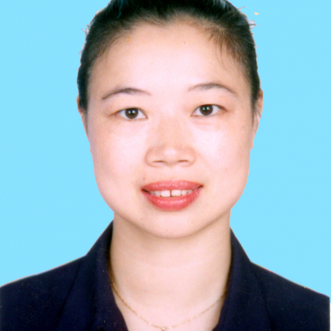

<!-- AUTO-GENERATED-BY: work/generate_obsidian_profiles.py -->

<!-- TEMPLATE: D:\workspace\信息收集整理\医生画像仓库\模板\医生画像模板.md -->

# 马华梅

## 基础信息

| 字段 | 内容 |
|---|---|
| 姓名 | 马华梅 |
| 医院 | 中山大学附属第一医院 |
| 科室 | 儿科二科 |
| 职称/身份 | 主任医师 |
| 来源链接 | [官网原文](https://www.fahsysu.org.cn/node/859) |
| 采集日期 | 2026-08-13 |

## 简介/擅长

## 科研项目与成果

- 其他主要工作成绩（比如获奖情况）： 1．广东省高等学校“千百十工程”校级培养对象 2．主持国家级继续医学教育项目《小儿正常和异常生长发育知识新进展》

## 论文与学术产出

- 论著：第一/通讯作者在国内外核心期刊共发表论著近27篇，其中SCI 3篇。
- 专著：副主编：《儿科疾病临床诊断与治疗方案》，参编：《青春期内分泌学》。

## 可包装亮点

- 主要教育和工作经历： 1．教育 1985－1991年原中山医科大学医学系临床医学专业 本科 1996－1999年原中山医科大学 儿科学 硕士（小儿内分泌） 2002－2005年中山大学 儿科学 博士（小儿内分泌） 2．工作 1991年起 中山大学附属第一医院 住院医师 1998年起 中山大学附属第一医院 主治医师 2001年起 中山大学附属第一医院 讲师…
- 中华医学会广东省儿科学分会中青年委员；
- 中华医学会广东省儿科学分会内分泌代谢学组秘书；
- 中国医师协会青春期医学专家委员会委员；

## 重点疾病/人群标签

- 慢性病：代谢、罕见
- 肿瘤：
- 生殖疾病：
- 免疫/风湿：
- 术后恢复/康复：
- 疑难重症：代谢、罕见

## 证据摘录

> 只摘录官网公开信息中的短句或关键字段，不复制大段原文。

- 官网身份字段：主任医师
- 官网亮眼经历线索：主要教育和工作经历： 1．教育 1985－1991年原中山医科大学医学系临床医学专业 本科 1996－1999年原中山医科大学 儿科学 硕士（小儿内分泌） 2002－2005年中山大学 儿科学 博士（小儿内分泌） 2．工作 1991年起 中山大学附属第一医院 住院医师 1998年起 中山大学附属第一医院 主治医师 2001年起 中山大学附属第一医院 讲师 2005年起 中山大学附属第一医院 副教授 社会兼职：中华医学会儿科学分会内分泌…
- 来源链接：https://www.fahsysu.org.cn/node/859

## BD 画像摘要

马华梅医生可作为慢性病、疑难重症方向的基础画像候选。后续 BD 使用应继续以官网来源和人工复核为准，不添加疗效承诺或无来源包装。

## 合规边界

- 仅使用医院官网、官方公众号、官方小程序等公开渠道。
- 不采集私人电话、私人微信、家庭住址、患者隐私或非公开排班信息。
- 不写“保证治愈”“疗效第一”“包治疑难杂症”等无法由官网证明的表述。
