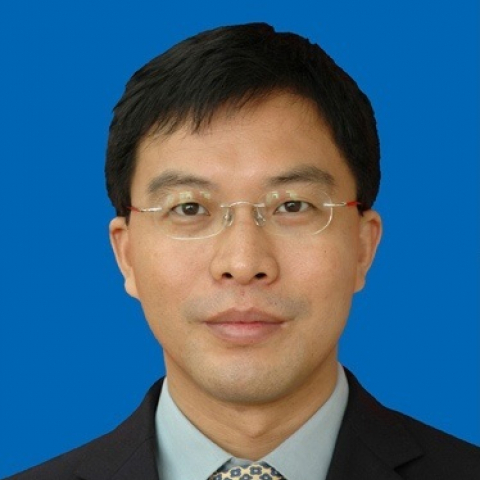

<!-- AUTO-GENERATED-BY: work/generate_obsidian_profiles.py -->

<!-- TEMPLATE: D:\workspace\信息收集整理\医生画像仓库\模板\医生画像模板.md -->

# 马毅

## 基础信息

| 字段 | 内容 |
|---|---|
| 姓名 | 马毅 |
| 医院 | 中山大学附属第一医院 |
| 科室 | 器官移植科 |
| 职称/身份 | 主任医师/教授 |
| 来源链接 | [官网原文](https://www.fahsysu.org.cn/node/5652) |
| 采集日期 | 2026-08-13 |

## 简介/擅长

肝胆胰外科、肝脏移植和胰腺移植的手术治疗。 具有丰富的肝胆胰各种疑难疾病的诊治经验，对外科治疗肝胆胰疾病有较深的造诣。 包括：①肝脏、胆道、胰腺肿瘤的诊断与手术治疗； 肝脏肿瘤肝移植治疗。 ②胆囊疾病、肝胆管结石的诊断和治疗。 ③肝硬化门脉高压症的外科治疗和终末期肝硬化肝移植手术治疗。 研究方向： 终末期肝病肝移植，肝癌的外科治疗； 肝胆胰良性、恶性疾病的外科治疗； 肝硬化门脉高压症的外科治疗和肝硬化失代偿期的肝移植治疗。 主要教育和工作经历： 1991年临床医学系本科毕业，先后就读中山大学外科学硕士和博士研究生，2003年获医学博士学位。 已从事普通外科、肝移植外科的临床工作20年。 擅长肝脏外科、肝脏移植和胰腺移植的手术治疗； 熟练掌握普通外科常见病、多发病的诊断和治疗。 论著： 至2010年已在国内外核心期刊发表专业论文30余篇，其中SCI论著16篇（第一作者）。 专著： 参加编写外科专著3部，其中《多器官移植与联合器官移植》和《腹部外科手术技巧》。 其他主要工作成绩（比如获奖情况）： 2009年度“腹部器官移植的技术创新及基础研究”获得中华医学科技奖二等奖； 2010年度“腹部器官簇移植及器官联合移植的基础与临...

## 教育与进修经历

- 主要教育和工作经历： 1991年临床医学系本科毕业，先后就读中山大学外科学硕士和博士研究生，2003年获医学博士学位。

## 论文与学术产出

- 论著： 至2010年已在国内外核心期刊发表专业论文30余篇，其中SCI论著16篇（第一作者）。

## 可包装亮点

- 具有丰富的肝胆胰各种疑难疾病的诊治经验，对外科治疗肝胆胰疾病有较深的造诣。
- 论著： 至2010年已在国内外核心期刊发表专业论文30余篇，其中SCI论著16篇（第一作者）。
- 其他主要工作成绩（比如获奖情况）： 2009年度“腹部器官移植的技术创新及基础研究”获得中华医学科技奖二等奖；

## 重点疾病/人群标签

- 慢性病：
- 肿瘤：肿瘤、肝癌、疑难
- 生殖疾病：
- 免疫/风湿：
- 术后恢复/康复：
- 疑难重症：肿瘤、肝癌、疑难

## 证据摘录

> 只摘录官网公开信息中的短句或关键字段，不复制大段原文。

- 官网身份字段：主任医师/教授
- 官网简介/擅长：肝胆胰外科、肝脏移植和胰腺移植的手术治疗。 具有丰富的肝胆胰各种疑难疾病的诊治经验，对外科治疗肝胆胰疾病有较深的造诣。 包括：①肝脏、胆道、胰腺肿瘤的诊断与手术治疗； 肝脏肿瘤肝移植治疗。 ②胆囊疾病、肝胆管结石的诊断和治疗。 ③肝硬化门脉高压症的外科治疗和终末期肝硬化肝移植手术治疗。 研究方向： 终末期肝病肝移植，肝癌的外科治疗； 肝胆胰良性、恶性疾病的外科治疗； 肝硬化门脉高压症的外科治疗和肝硬化失代偿期的肝移植治疗。 主要教育和…
- 官网亮眼经历线索：具有丰富的肝胆胰各种疑难疾病的诊治经验，对外科治疗肝胆胰疾病有较深的造诣。 具有丰富的肝胆胰各种疑难疾病的诊治经验，对外科治疗肝胆胰疾病有较深的造诣。 论著： 至2010年已在国内外核心期刊发表专业论文30余篇，其中SCI论著16篇（第一作者）。 其他主要工作成绩（比如获奖情况）： 2009年度“腹部器官移植的技术创新及基础研究”获得中华医学科技奖二等奖；
- 来源链接：https://www.fahsysu.org.cn/node/5652

## BD 画像摘要

马毅医生可作为肿瘤、疑难重症方向的基础画像候选。后续 BD 使用应继续以官网来源和人工复核为准，不添加疗效承诺或无来源包装。

## 合规边界

- 仅使用医院官网、官方公众号、官方小程序等公开渠道。
- 不采集私人电话、私人微信、家庭住址、患者隐私或非公开排班信息。
- 不写“保证治愈”“疗效第一”“包治疑难杂症”等无法由官网证明的表述。
