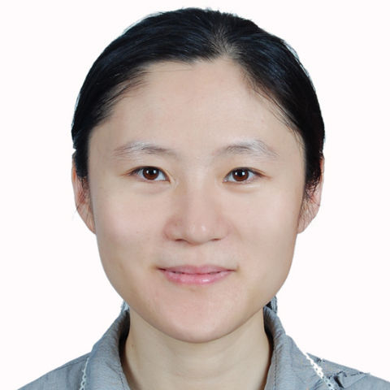

<!-- AUTO-GENERATED-BY: work/generate_obsidian_profiles.py -->

<!-- TEMPLATE: D:\workspace\信息收集整理\医生画像仓库\模板\医生画像模板.md -->

# 高军

## 基础信息

| 字段 | 内容 |
|---|---|
| 姓名 | 高军 |
| 医院 | 中山大学附属第一医院 |
| 科室 | 生殖医学中心 |
| 职称/身份 | 副主任医师 |
| 来源链接 | [官网原文](https://www.fahsysu.org.cn/node/607) |
| 采集日期 | 2026-08-13 |

## 简介/擅长

从事生殖医学临床工作十余年，对多囊卵巢综合征患者代谢综合征的诊治，促排卵治疗具有丰富的临床经验； 擅长卵巢储备功能低下患者的助孕治疗，帮助多位早发性卵巢功能不全患者获得临床妊娠。 对各种促排卵方案适应症的掌握均具有独到之处，对辅助生殖治疗各种疑难病症的诊治具有丰富的诊疗经验。 研究方向：生殖内分泌，月经病，不孕症，多囊卵巢综合征 论著：发表论著二十余篇，以第一作者在专业核心期刊《Fertility and Sterility》，《Human Reproduction Open》发表论著，作为骨干成员参与多项国家级及省部级科研项目。 社会兼职： 中华医学会生殖医学分会第五届委员会青年委员会委员，广东省医学会生殖医学分会第三届委员会秘书，广东省医学会生殖医学分会第三届委员会青年委员会副主任委员，广东省医学会生殖医学分会第四届委员。 广州市医学会医疗事故技术鉴定和医疗损害鉴定专家库成员

## 科研项目与成果

- 研究方向：生殖内分泌，月经病，不孕症，多囊卵巢综合征 论著：发表论著二十余篇，以第一作者在专业核心期刊《Fertility and Sterility》，《Human Reproduction Open》发表论著，作为骨干成员参与多项国家级及省部级科研项目。

## 论文与学术产出

- 研究方向：生殖内分泌，月经病，不孕症，多囊卵巢综合征 论著：发表论著二十余篇，以第一作者在专业核心期刊《Fertility and Sterility》，《Human Reproduction Open》发表论著，作为骨干成员参与多项国家级及省部级科研项目。

## 可包装亮点

- 对各种促排卵方案适应症的掌握均具有独到之处，对辅助生殖治疗各种疑难病症的诊治具有丰富的诊疗经验。
- 研究方向：生殖内分泌，月经病，不孕症，多囊卵巢综合征 论著：发表论著二十余篇，以第一作者在专业核心期刊《Fertility and Sterility》，《Human Reproduction Open》发表论著，作为骨干成员参与多项国家级及省部级科研项目。
- 社会兼职： 中华医学会生殖医学分会第五届委员会青年委员会委员，广东省医学会生殖医学分会第三届委员会秘书，广东省医学会生殖医学分会第三届委员会青年委员会副主任委员，广东省医学会生殖医学分会第四届委员。

## 重点疾病/人群标签

- 慢性病：代谢、生殖、不孕、卵巢、辅助生殖、多囊、月经、疑难
- 肿瘤：
- 生殖疾病：代谢、生殖、不孕、卵巢、辅助生殖、多囊、月经、疑难
- 免疫/风湿：
- 术后恢复/康复：
- 疑难重症：代谢、生殖、不孕、卵巢、辅助生殖、多囊、月经、疑难

## 证据摘录

> 只摘录官网公开信息中的短句或关键字段，不复制大段原文。

- 官网身份字段：副主任医师
- 官网简介/擅长：从事生殖医学临床工作十余年，对多囊卵巢综合征患者代谢综合征的诊治，促排卵治疗具有丰富的临床经验； 擅长卵巢储备功能低下患者的助孕治疗，帮助多位早发性卵巢功能不全患者获得临床妊娠。 对各种促排卵方案适应症的掌握均具有独到之处，对辅助生殖治疗各种疑难病症的诊治具有丰富的诊疗经验。 研究方向：生殖内分泌，月经病，不孕症，多囊卵巢综合征 论著：发表论著二十余篇，以第一作者在专业核心期刊《Fertility and Sterility》，《Hu…
- 官网亮眼经历线索：对各种促排卵方案适应症的掌握均具有独到之处，对辅助生殖治疗各种疑难病症的诊治具有丰富的诊疗经验。 对各种促排卵方案适应症的掌握均具有独到之处，对辅助生殖治疗各种疑难病症的诊治具有丰富的诊疗经验。 研究方向：生殖内分泌，月经病，不孕症，多囊卵巢综合征 论著：发表论著二十余篇，以第一作者在专业核心期刊《Fertility and Sterility》，《Human Reproduction Open》发表论著，作为骨干成员参与多项国家级及…
- 来源链接：https://www.fahsysu.org.cn/node/607

## BD 画像摘要

高军医生可作为慢性病、生殖疾病、疑难重症方向的基础画像候选。后续 BD 使用应继续以官网来源和人工复核为准，不添加疗效承诺或无来源包装。

## 合规边界

- 仅使用医院官网、官方公众号、官方小程序等公开渠道。
- 不采集私人电话、私人微信、家庭住址、患者隐私或非公开排班信息。
- 不写“保证治愈”“疗效第一”“包治疑难杂症”等无法由官网证明的表述。
