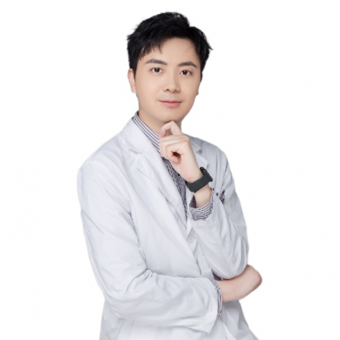

<!-- AUTO-GENERATED-BY: work/generate_obsidian_profiles.py -->

<!-- TEMPLATE: D:\workspace\信息收集整理\医生画像仓库\模板\医生画像模板.md -->

# 高文翔

## 基础信息

| 字段 | 内容 |
|---|---|
| 姓名 | 高文翔 |
| 医院 | 中山大学附属第一医院 |
| 科室 | 鼻专科 |
| 职称/身份 | 副主任医师 |
| 来源链接 | [官网原文](https://www.fahsysu.org.cn/node/31087) |
| 采集日期 | 2026-08-13 |

## 简介/擅长

鼻窦炎、过敏性鼻炎、小儿鼾症、鼻颅底肿瘤的诊疗及鼻内镜手术治疗。 尤其在慢性鼻窦炎、鼻息肉、鼻腔鼻窦良恶性肿瘤、腺样体、扁桃体肥大的内镜微创手术有很好的治疗经验及效果。 曾在美国匹兹堡颅底外科医学中心进行访问学习，对鼻颅底的手术解剖有一定的造诣。 同时擅长颈深部脓肿的治疗，参与编写全国首个《颈深部脓肿专家诊断与治疗共识2022》。 研究方向:鼻窦炎手术后的快速康复； 过敏性鼻炎的发病机制； 鼻颅底手术的解剖与入路； 颈深部脓肿的诊断与治疗。 主要教育和工作经历:2011年毕业于中山大学中山医学院临床五年制； 2016取得中山大学附属第一医院 耳鼻咽喉科临床医学博士学位并留院工作; 工作后多次获得科内年度优秀称号； 2015年在美国匹兹堡大学颅底外科中心访问学习，以第一/通讯作者发表论文多篇。 主持国家自然科学基金1项，广东省自然科学基金1项，广州市科技计划1项及广东省医学科研基金1项。 主要参与编写全国《颈深部脓肿诊断与治疗专家共识（2022）》 社会兼职: 广东省健康管理学会耳鼻咽喉头颈外科分会 秘书长 广东省抗癌协会头颈肿瘤及整形修复外科分会 常委

## 教育与进修经历

- 主要教育和工作经历:2011年毕业于中山大学中山医学院临床五年制；
- 2016取得中山大学附属第一医院 耳鼻咽喉科临床医学博士学位并留院工作;

## 科研项目与成果

- 主持国家自然科学基金1项，广东省自然科学基金1项，广州市科技计划1项及广东省医学科研基金1项。

## 论文与学术产出

- 2015年在美国匹兹堡大学颅底外科中心访问学习，以第一/通讯作者发表论文多篇。

## 可包装亮点

- 曾在美国匹兹堡颅底外科医学中心进行访问学习，对鼻颅底的手术解剖有一定的造诣。
- 2015年在美国匹兹堡大学颅底外科中心访问学习，以第一/通讯作者发表论文多篇。
- 主持国家自然科学基金1项，广东省自然科学基金1项，广州市科技计划1项及广东省医学科研基金1项。

## 重点疾病/人群标签

- 慢性病：慢性、肿瘤、癌、术后、康复
- 肿瘤：慢性、肿瘤、癌、术后、康复
- 生殖疾病：
- 免疫/风湿：
- 术后恢复/康复：慢性、肿瘤、癌、术后、康复
- 疑难重症：

## 证据摘录

> 只摘录官网公开信息中的短句或关键字段，不复制大段原文。

- 官网身份字段：副主任医师
- 官网简介/擅长：鼻窦炎、过敏性鼻炎、小儿鼾症、鼻颅底肿瘤的诊疗及鼻内镜手术治疗。 尤其在慢性鼻窦炎、鼻息肉、鼻腔鼻窦良恶性肿瘤、腺样体、扁桃体肥大的内镜微创手术有很好的治疗经验及效果。 曾在美国匹兹堡颅底外科医学中心进行访问学习，对鼻颅底的手术解剖有一定的造诣。 同时擅长颈深部脓肿的治疗，参与编写全国首个《颈深部脓肿专家诊断与治疗共识2022》。 研究方向:鼻窦炎手术后的快速康复； 过敏性鼻炎的发病机制； 鼻颅底手术的解剖与入路； 颈深部脓肿的诊断与…
- 官网亮眼经历线索：曾在美国匹兹堡颅底外科医学中心进行访问学习，对鼻颅底的手术解剖有一定的造诣。 曾在美国匹兹堡颅底外科医学中心进行访问学习，对鼻颅底的手术解剖有一定的造诣。 2015年在美国匹兹堡大学颅底外科中心访问学习，以第一/通讯作者发表论文多篇。 主持国家自然科学基金1项，广东省自然科学基金1项，广州市科技计划1项及广东省医学科研基金1项。
- 来源链接：https://www.fahsysu.org.cn/node/31087

## BD 画像摘要

高文翔医生可作为慢性病、肿瘤、术后恢复/康复方向的基础画像候选。后续 BD 使用应继续以官网来源和人工复核为准，不添加疗效承诺或无来源包装。

## 合规边界

- 仅使用医院官网、官方公众号、官方小程序等公开渠道。
- 不采集私人电话、私人微信、家庭住址、患者隐私或非公开排班信息。
- 不写“保证治愈”“疗效第一”“包治疑难杂症”等无法由官网证明的表述。
