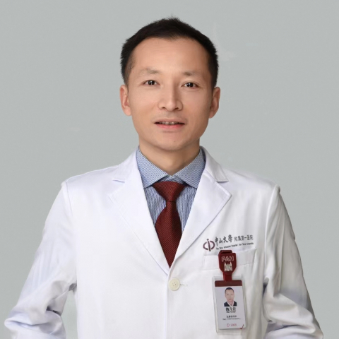

<!-- AUTO-GENERATED-BY: work/generate_obsidian_profiles.py -->

<!-- TEMPLATE: D:\workspace\信息收集整理\医生画像仓库\模板\医生画像模板.md -->

# 魏凡钦

## 基础信息

| 字段 | 内容 |
|---|---|
| 姓名 | 魏凡钦 |
| 医院 | 中山大学附属第一医院 |
| 科室 | 耳专科 |
| 职称/身份 | 副主任医师 |
| 来源链接 | [官网原文](https://www.fahsysu.org.cn/node/5685) |
| 采集日期 | 2026-08-13 |

## 简介/擅长

●听觉重建手术：中耳炎、胆脂瘤、耳硬化症、单侧聋及重度聋等; 擅长内镜微创中内耳手术。 ●侧颅底手术：听神经瘤、颈静脉球瘤、外/中耳癌、颞骨良性肿瘤、岩骨胆脂瘤等； 曾赴全球著名的Fisch耳-颅底显微外科中心，进行为期1年的耳显微-耳神经外科、颅底外科临床及研究Fellowship。 开展院内第一例不移位面神经的颞下窝A型径路颈静脉副神经节瘤切除术； 践行外耳道癌的规范化诊断和治疗、成功实施多例听神经瘤、岩骨胆脂瘤手术。 主要教育和工作经历： 08年始进入中山医接受正规的科研及临床培养，获得专业型硕士及博士学位，顺利完成专科医师规范化培训。 曾赴瑞士苏黎世大学、香港大学等国际著名学府进行研究和临床学习。 学术任职： 中华医学会耳鼻咽喉头颈外科分会听力学组委员、广东省医学会耳鼻咽喉头颈外科分会小儿学组副组长、中国医疗保健国际交流促进会颅底外科分会委员、广东省临床医学学会耳内镜专委会常务委员、广东省生物医学工程学会耳鼻咽喉科分会委员、广东省健康管理委员会耳鼻咽喉头颈病学专业委员会委员、广东省自然科学基金评审专家成员、广东省高层次人才评审专家成员、国际耳内科医师协会（IAPA）成员、《中华耳科学杂志》编委等 科研情况： 发...

## 教育与进修经历

- 主要教育和工作经历： 08年始进入中山医接受正规的科研及临床培养，获得专业型硕士及博士学位，顺利完成专科医师规范化培训。

## 科研项目与成果

- 主要教育和工作经历： 08年始进入中山医接受正规的科研及临床培养，获得专业型硕士及博士学位，顺利完成专科医师规范化培训。
- 学术任职： 中华医学会耳鼻咽喉头颈外科分会听力学组委员、广东省医学会耳鼻咽喉头颈外科分会小儿学组副组长、中国医疗保健国际交流促进会颅底外科分会委员、广东省临床医学学会耳内镜专委会常务委员、广东省生物医学工程学会耳鼻咽喉科分会委员、广东省健康管理委员会耳鼻咽喉头颈病学专业委员会委员、广东省自然科学基金评审专家成员、广东省高层次人才评审专家成员、国际耳内科医师协会（IAPA）成员、《中华耳科学杂志》编委等 科研情况： 发表论著约30篇，单篇最高影响因子12.658；
- 主持国家自然科学基金等5项科研项目；
- 获得国家专利2项；

## 论文与学术产出

- 学术任职： 中华医学会耳鼻咽喉头颈外科分会听力学组委员、广东省医学会耳鼻咽喉头颈外科分会小儿学组副组长、中国医疗保健国际交流促进会颅底外科分会委员、广东省临床医学学会耳内镜专委会常务委员、广东省生物医学工程学会耳鼻咽喉科分会委员、广东省健康管理委员会耳鼻咽喉头颈病学专业委员会委员、广东省自然科学基金评审专家成员、广东省高层次人才评审专家成员、国际耳内科医师协会（IAPA）成员、《中华耳科学杂志》编委等 科研情况： 发表论著约30篇，单篇最高影响因子12.658；

## 可包装亮点

- 学术任职： 中华医学会耳鼻咽喉头颈外科分会听力学组委员、广东省医学会耳鼻咽喉头颈外科分会小儿学组副组长、中国医疗保健国际交流促进会颅底外科分会委员、广东省临床医学学会耳内镜专委会常务委员、广东省生物医学工程学会耳鼻咽喉科分会委员、广东省健康管理委员会耳鼻咽喉头颈病学专业委员会委员、广东省自然科学基金评审专家成员、广东省高层次人才评审专家成员、国际耳内科医师…
- 主持国家自然科学基金等5项科研项目；
- 获得国家专利2项；
- 科研方向：老年性耳聋的精准防治。

## 重点疾病/人群标签

- 慢性病：
- 肿瘤：肿瘤、癌、瘤
- 生殖疾病：
- 免疫/风湿：
- 术后恢复/康复：
- 疑难重症：

## 证据摘录

> 只摘录官网公开信息中的短句或关键字段，不复制大段原文。

- 官网身份字段：副主任医师
- 官网简介/擅长：●听觉重建手术：中耳炎、胆脂瘤、耳硬化症、单侧聋及重度聋等; 擅长内镜微创中内耳手术。 ●侧颅底手术：听神经瘤、颈静脉球瘤、外/中耳癌、颞骨良性肿瘤、岩骨胆脂瘤等； 曾赴全球著名的Fisch耳-颅底显微外科中心，进行为期1年的耳显微-耳神经外科、颅底外科临床及研究Fellowship。 开展院内第一例不移位面神经的颞下窝A型径路颈静脉副神经节瘤切除术； 践行外耳道癌的规范化诊断和治疗、成功实施多例听神经瘤、岩骨胆脂瘤手术。 主要教育和…
- 官网亮眼经历线索：学术任职： 中华医学会耳鼻咽喉头颈外科分会听力学组委员、广东省医学会耳鼻咽喉头颈外科分会小儿学组副组长、中国医疗保健国际交流促进会颅底外科分会委员、广东省临床医学学会耳内镜专委会常务委员、广东省生物医学工程学会耳鼻咽喉科分会委员、广东省健康管理委员会耳鼻咽喉头颈病学专业委员会委员、广东省自然科学基金评审专家成员、广东省高层次人才评审专家成员、国际耳内科医师协会（IAPA）成员、《中华耳科学杂志》编委等 科研情况： 发表论著约30篇，单…
- 来源链接：https://www.fahsysu.org.cn/node/5685

## BD 画像摘要

魏凡钦医生可作为肿瘤方向的基础画像候选。后续 BD 使用应继续以官网来源和人工复核为准，不添加疗效承诺或无来源包装。

## 合规边界

- 仅使用医院官网、官方公众号、官方小程序等公开渠道。
- 不采集私人电话、私人微信、家庭住址、患者隐私或非公开排班信息。
- 不写“保证治愈”“疗效第一”“包治疑难杂症”等无法由官网证明的表述。
