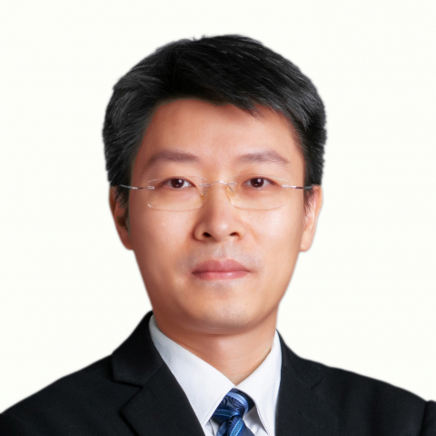

<!-- AUTO-GENERATED-BY: work/generate_obsidian_profiles.py -->

<!-- TEMPLATE: D:\workspace\信息收集整理\医生画像仓库\模板\医生画像模板.md -->

# 黄力

## 基础信息

| 字段 | 内容 |
|---|---|
| 姓名 | 黄力 |
| 医院 | 中山大学附属第一医院 |
| 科室 | 胆胰外科 |
| 职称/身份 | 副主任医师 |
| 来源链接 | [官网原文](https://www.fahsysu.org.cn/node/717) |
| 采集日期 | 2026-08-13 |

## 简介/擅长

对肝胆胰外科常见疾病如肝内外胆管结石、原发性肝癌、胆道恶性肿瘤(肝内胆管癌、胆囊癌、肝门部胆管癌及胆总管下段癌)、肝硬化合并门脉高压症、壶腹周围癌、胰腺良、恶性肿瘤及急性、慢性胰腺炎的临床诊断与外科手术治疗，对肝胆胰恶性肿瘤合并血管切除重建等复杂手术积累了较丰富的临床经验； 能熟练运用腹腔镜、胆道镜、ERCP及术中超声对肝胆胰外科常见疾病进行微创外科治疗。 擅长领域： 中山医七年制临床医学本硕连读、国家公派联合培养临床医学博士，师从我国著名肝胆胰外科专家梁力建教授，2013年参与完成中山一院首例“联合肝脏离断和门静脉结扎的二步肝切除术（ALPPS手术）”治疗原发性肝癌； 2021年完成国际首例吲哚菁绿（ICG）荧光导航腹腔镜联合胰腺坏死组织清除术治疗重症急性胰腺炎合并感染性胰腺坏死。 主持国家自然科学基金、国家自然科学基金-深圳机器人基础研究中心重点项目（子课题负责人)、广东省自然科学基金、广东省医学科研基金共4项； 第一作者/通讯作者发表SCI论著9篇。 研究方向: 原发性肝癌、胆道恶性肿瘤、胰腺恶性肿瘤、重症急性胰腺炎的外科治疗与临床基础研究 主要教育和工作经历： 教育经历：2001年中山大学中山医学院七年制临床医...

## 科研项目与成果

- 主持国家自然科学基金、国家自然科学基金-深圳机器人基础研究中心重点项目（子课题负责人)、广东省自然科学基金、广东省医学科研基金共4项；

## 论文与学术产出

- 第一作者/通讯作者发表SCI论著9篇。

## 可包装亮点

- 主持国家自然科学基金、国家自然科学基金-深圳机器人基础研究中心重点项目（子课题负责人)、广东省自然科学基金、广东省医学科研基金共4项；
- 第一作者/通讯作者发表SCI论著9篇。
- 2008年中山大学附属第一医院肝胆外科临床医学博士（美国Texas A&M大学附属Scott & White医院消化疾病中心国家公派联合培养临床医学博士） 工作经历：2011年起，任中山大学附属第一医院肝胆外科住院医师、主治医师；
- 2017年起，任中山大学附属第一医院胆胰外科副主任医师。

## 重点疾病/人群标签

- 慢性病：慢性、肿瘤、癌、肝癌、感染、营养、重症、复杂、多学科、MDT
- 肿瘤：慢性、肿瘤、癌、肝癌、感染、营养、重症、复杂、多学科、MDT
- 生殖疾病：
- 免疫/风湿：慢性、肿瘤、癌、肝癌、感染、营养、重症、复杂、多学科、MDT
- 术后恢复/康复：慢性、肿瘤、癌、肝癌、感染、营养、重症、复杂、多学科、MDT
- 疑难重症：慢性、肿瘤、癌、肝癌、感染、营养、重症、复杂、多学科、MDT

## 证据摘录

> 只摘录官网公开信息中的短句或关键字段，不复制大段原文。

- 官网身份字段：副主任医师
- 官网简介/擅长：对肝胆胰外科常见疾病如肝内外胆管结石、原发性肝癌、胆道恶性肿瘤(肝内胆管癌、胆囊癌、肝门部胆管癌及胆总管下段癌)、肝硬化合并门脉高压症、壶腹周围癌、胰腺良、恶性肿瘤及急性、慢性胰腺炎的临床诊断与外科手术治疗，对肝胆胰恶性肿瘤合并血管切除重建等复杂手术积累了较丰富的临床经验； 能熟练运用腹腔镜、胆道镜、ERCP及术中超声对肝胆胰外科常见疾病进行微创外科治疗。 擅长领域： 中山医七年制临床医学本硕连读、国家公派联合培养临床医学博士，师从我…
- 官网亮眼经历线索：主持国家自然科学基金、国家自然科学基金-深圳机器人基础研究中心重点项目（子课题负责人)、广东省自然科学基金、广东省医学科研基金共4项； 第一作者/通讯作者发表SCI论著9篇。 2008年中山大学附属第一医院肝胆外科临床医学博士（美国Texas A&M大学附属Scott & White医院消化疾病中心国家公派联合培养临床医学博士） 工作经历：2011年起，任中山大学附属第一医院肝胆外科住院医师、主治医师； 2017年起，任中山大学附属第…
- 来源链接：https://www.fahsysu.org.cn/node/717

## BD 画像摘要

黄力医生可作为慢性病、肿瘤、免疫/风湿/感染、术后恢复/康复、疑难重症方向的基础画像候选。后续 BD 使用应继续以官网来源和人工复核为准，不添加疗效承诺或无来源包装。

## 合规边界

- 仅使用医院官网、官方公众号、官方小程序等公开渠道。
- 不采集私人电话、私人微信、家庭住址、患者隐私或非公开排班信息。
- 不写“保证治愈”“疗效第一”“包治疑难杂症”等无法由官网证明的表述。
